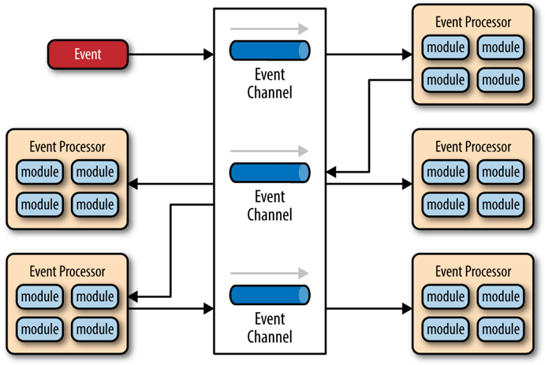

# 凤凰架构

## 演进中的架构

架构并不是被发明出来的，而是持续演进的结果，本章我们暂且放下代码与技术，借讨论历史之名，来梳理软件架构发展历程中出现过的名词术语，以全局的视角，从这些概念的起源去分析它们是什么、它们取代了什么，以及它们为什么能够在竞争中取得成功，为什么变得不可或缺，又或者它们为什么会失败，在斗争中被淘汰，逐渐湮灭于历史的烟尘当中。

### 原始分布式时代

>**UNIX 的分布式设计哲学**
>
>Simplicity of both the interface and the implementation are more important than any other attributes of the system — including correctness, consistency, and completeness
>
>保持接口与实现的简单性，比系统的任何其他属性，包括准确性、一致性和完整性，都来得更加重要。
>
><div align = "right">
> —— [Richard P. Gabriel](https://en.wikipedia.org/wiki/Richard_P._Gabriel)，[The Rise of 'Worse is Better'](https://en.wikipedia.org/wiki/Worse_is_better)，1991
></div> 																

可能与绝大多数人心中的认知会有差异，“使用多个独立的分布式服务共同构建一个更大型系统”的设想与实际尝试，反而要比今天大家所了解的大型单体系统出现的时间更早。

在 20 世纪 70 年代末期到 80 年代初，计算机科学刚经历了从以大型机为主向以微型机为主的蜕变，计算机逐渐从一种存在于研究机构、实验室当中的科研设备，转变为存在于商业企业中的生产设备，甚至是面向家庭、个人用户的娱乐设备。此时的微型计算机系统通常具有 16 位寻址能力、不足 5MHz 时钟频率的处理器和 128KB 左右的内存地址空间。譬如著名的英特尔处理器的鼻祖，[Intel 8086 处理器](https://zh.wikipedia.org/zh-tw/Intel_8086)就是在 1978 年研制成功，流行于 80 年代中期，甚至一直持续到 90 年代初期仍有生产销售。

>**原始分布式时代的教训**
>
>Just because something **can** be distributed doesn’t mean it **should** be distributed. Trying to make a distributed call act like a local call always ends in tears
>
>某个功能**能够**进行分布式，并不意味着它就**应该**进行分布式，强行追求透明的分布式操作，只会自寻苦果
>
><div align = "right">
>—— [Kyle Brown](https://en.wikipedia.org/wiki/Kyle_Brown_(computer_scientist))，IBM Fellow，[Beyond Buzzwords: A Brief History of Microservices Patterns](https://developer.ibm.com/technologies/microservices/articles/cl-evolution-microservices-patterns/)，2016
></div>

当时计算机硬件局促的运算处理能力，已直接妨碍到了在单台计算机上信息系统软件能够达到的最大规模。为突破硬件算力的限制，各个高校、研究机构、软硬件厂商开始分头探索，寻找使用多台计算机共同协作来支撑同一套软件系统运行的可行方案。这一阶段是对分布式架构最原始的探索，从结果来看，历史局限决定了它不可能一蹴而就地解决分布式的难题，但仅从过程来看，这个阶段的探索称得上成绩斐然。研究过程的很多中间成果都对今天计算机科学的诸多领域产生了深远的影响，直接牵引了后续软件架构的演化进程。譬如，惠普公司（及后来被惠普收购的 Apollo）提出的[网络运算架构](https://en.wikipedia.org/wiki/Network_Computing_System)（Network Computing Architecture，NCA）是未来远程服务调用的雏形；卡内基·梅隆大学提出的[AFS 文件系统](https://en.wikipedia.org/wiki/Andrew_File_System)（Andrew File System）是日后分布式文件系统的最早实现（Andrew 意为纪念 Andrew Carnegie 和 Andrew Mellon）；麻省理工学院提出的[Kerberos 协议](https://en.wikipedia.org/wiki/Kerberos_(protocol))是服务认证和访问控制的基础性协议，是分布式服务安全性的重要支撑，目前仍被用于实现包括 Windows 和 MacOS 在内众多操作系统的登录、认证功能，等等。

简单来说就是因为最初的计算机计算能力的局限性妨碍了计算机信息系统的开发。

20 世纪 80 年代正是[摩尔定律](https://zh.wikipedia.org/wiki/摩尔定律)开始稳定发挥作用的黄金时期，微型计算机的性能以每两年即增长一倍的惊人速度提升，硬件算力束缚软件规模的链条很快变得松动，信息系统进入了以单台或少量几台计算机即可作为服务器来支撑大型信息系统运作的单体时代，且在很长的一段时间内，单体都将是软件架构的绝对主流。尽管如此，对于另外一条路径，即对分布式计算、远程服务调用的探索也从未有过中断。关于远程服务调用这个关键问题的历史、发展与现状，笔者还会在稍后的“[远程服务调用](https://icyfenix.cn/architect-perspective/general-architecture/api-style/rpc.html)”中，以现代 RPC 和 RESTful 为主角来进行更详细的讲述。那些在原始分布式时代中遭遇到的各种分布式问题，也还会在软件架构演进后面几个时代里被人们反复提起。

Unix DCE 提出的分布式服务的设计主旨：“让开发人员不必关心服务是远程还是本地，都能够透明地调用服务或者访问资源”。

### 单体系统时代

>**单体架构（Monolithic）**
>
>“单体”只是表明系统中主要的过程调用都是进程内调用，不会发生进程间通信，仅此而已。

单体架构是今天绝大多数软件开发者都学习、实践过的一种软件架构，许多介绍微服务的书籍和技术资料中也常把这种架构风格的应用称作“[巨石系统](https://en.wikipedia.org/wiki/Monolithic_application)”（Monolithic Application）。“单体架构”在整个软件架构演进的历史进程里，是出现时间最早、应用范围最广、使用人数最多、统治历史最长的一种架构风格，但“单体”这个名称，却是在微服务开始流行之后才“事后追认”所形成的概念。此前，并没有多少人将“单体”视作一种架构来看待，如果你去查找软件架构的开发资料，可以轻而易举地找出大量以微服务为主题的书籍和文章，却很难找出专门教你如何开发单体系统的任何形式的材料，这一方面体现了单体架构本身的简单性，另一方面，也体现出在相当长的时间尺度里，大家都已经习惯了软件架构就应该是单体这种样子。

从纵向角度来看，笔者从未见过实际生产环境里有哪个大型的现代信息系统是完全不分层的。分层架构（Layered Architecture）已是现在几乎所有信息系统建设中都普遍认可、采用的软件设计方法，无论是单体还是微服务，抑或是其他架构风格，都会对代码进行纵向层次划分，收到的外部请求在各层之间以不同形式的数据结构进行流转传递，触及最末端的数据库后按相反的顺序回馈响应，如图 1-1 所示。对于这个意义上的“可拆分”，单体架构完全不会展露出丝毫的弱势，反而可能会因更容易开发、部署、测试而获得一些便捷性上的好处。


<div align = "center">
图 1-1 分层架构示意</br>
图片来自 O'Reilly 的开放文档《[Software Architecture Patterns](https://www.oreilly.com/programming/free/files/software-architecture-patterns.pdf)》
</div>
从横向角度来看，单体架构也可以支持按照技术、功能、职责等维度，将软件拆分为各种模块，以便重用和管理代码。单体系统并不意味着只能有一个整体的程序封装形式，如果需要，它完全可以由多个 JAR、WAR、DLL、Assembly 或者其他模块格式来构成。即使是以横向扩展（Scale Horizontally）的角度来衡量，在负载均衡器之后同时部署若干个相同的单体系统副本，以达到分摊流量压力的效果，也是非常常见的需求。

在“拆分”这方面，单体系统的真正缺陷不在如何拆分，而在拆分之后的隔离与自治能力上的欠缺。由于所有代码都运行在同一个进程空间之内，所有模块、方法的调用都无须考虑网络分区、对象复制这些麻烦的事和性能损失。获得了进程内调用的简单、高效等好处的同时，也意味着如果任何一部分代码出现了缺陷，过度消耗了进程空间内的资源，所造成的影响也是全局性的、难以隔离的。譬如内存泄漏、线程爆炸、阻塞、死循环等问题，都将会影响整个程序，而不仅仅是影响某一个功能、模块本身的正常运作。如果消耗的是某些更高层次的公共资源，譬如端口号或者数据库连接池泄漏，影响还将会波及整台机器，甚至是集群中其他单体副本的正常工作。

同样，由于所有代码都共享着同一个进程空间，不能隔离，也就无法（其实还是有办法的，譬如使用 OSGi 这种运行时模块化框架，但是很别扭、很复杂）做到单独停止、更新、升级某一部分代码，因为不可能有“停掉半个进程，重启 1/4 个程序”这样不合逻辑的操作，所以从可维护性来说，单体系统也是不占优势的。程序升级、修改缺陷往往需要制定专门的停机更新计划，做灰度发布、A/B 测试也相对更复杂。

如果说共享同一进程获得简单、高效的代价是同时损失了各个功能模块的自治、隔离能力，那这两者孰轻孰重呢？这个问题的潜台词似乎是在比较微服务、单体架构哪种更好用、更优秀？笔者认为“好用和优秀”不会是放之四海皆准的，这点不妨举一个浅显的例子加以说明。譬如，沃尔玛将超市分为仓储部、采购部、安保部、库存管理部、巡检部、质量管理部、市场营销部等，可以划清职责，明确边界，让管理能力能支持企业的成长规模；但如果你家楼下开的小卖部，爸、妈加儿子，再算上看家的中华田园犬小黄一共也就只有四名员工，再去追求“先进管理”，划分仓储部、采购部、库存管理部……那纯粹是给自己找麻烦。单体架构下，哪怕是信息系统中两个相互毫无关联的子系统，也依然会部署在同一个进程中。当系统规模小的时候，这是优势，但当系统规模大，或程序需要修改的时候，其部署的成本、技术升级的迁移成本都会变得更为昂贵。继续以前面的例子来比喻，当公司小时，让安保部和质检部两个不相干的部门在同一栋大楼中办公是节约资源，但当公司人数增加，办公室已经拥挤不堪，最多只能在楼顶加盖新楼层（相当于增强硬件性能）来解决办公问题，而不能让安保、质检分开地方办公，这便是缺陷所在。

不过，以上列举的这些问题都还不是今天以微服务取代单体系统成为潮流趋势的根本原因，笔者认为最重要的理由是：单体系统很难兼容“[Phoenix](https://icyfenix.cn/introduction/about-the-fenix-project.html#架构的演进)”的特性。这种架构风格潜在的观念是希望系统的每一个部件，每一处代码都尽量可靠，靠不出或少出缺陷来构建可靠系统。然而战术层面再优秀，也很难弥补战略层面的不足，单体靠高质量来保证高可靠性的思路，在小规模软件上还能运作良好，但系统规模越大，交付一个可靠的单体系统就变得越来越具有挑战性。如本书的前言开篇《[什么是"凤凰架构"](https://icyfenix.cn/introduction/about-the-fenix-project.html)》所说，正是随着软件架构演进，构筑可靠系统从**“追求尽量不出错”，到正视“出错是必然”**的观念转变，才是微服务架构得以挑战并逐步开始取代运作了数十年的单体架构的底气所在。

为了允许程序出错，为了获得隔离、自治的能力，为了可以技术异构等目标，是继为了性能与算力之后，让程序再次选择分布式的理由。然而，开发分布式程序也并不意味着一定要依靠今天的微服务架构才能实现。在新旧世纪之交，人们曾经探索过几种服务拆分方法，将一个大的单体系统拆分为若干个更小的、不运行在同一个进程的独立服务，这些服务拆分方法后来导致了[面向服务架构](https://en.wikipedia.org/wiki/Service-oriented_architecture)（Service-Oriented Architecture）的一段兴盛期，我们称其为“[SOA 时代](https://icyfenix.cn/architecture/architect-history/soa.html)”。

**总结：**由于电脑的快速发展，使用单体架构就可以解决大多数问题，所以以前大多数时间都是使用该方式。但由于单体架构的代码是运行在同一进程空间的，所以导致系统出错会影响整个项目。系统不可能永远不出错，从而演变成面向服务架构也就是SOA，解决系统可以出错，为了获得隔离、自治的能力，为了可以技术异构等目标。

### SOA 时代

>SOA 架构（Service-Oriented Architecture）
>
>面向服务的架构是一次具体地、系统性地成功解决分布式服务主要问题的架构模式。

为了对大型的单体系统进行拆分，让每一个子系统都能独立地部署、运行、更新，开发者们曾经尝试过多种方案，这里列举以下三种较有代表性的架构模式，具体如下。

- [烟囱式架构](https://en.wikipedia.org/wiki/Information_silo)（Information Silo Architecture）：信息烟囱又名信息孤岛（Information Island），使用这种架构的系统也被称为孤岛式信息系统或者烟囱式信息系统。它指的是一种完全不与其他相关信息系统进行互操作或者协调工作的设计模式。这样的系统其实并没有什么“架构设计”可言。接着上一节中企业与部门的例子来说，如果两个部门真的完全不会发生任何交互，就并没有什么理由强迫它们必须在一栋楼里办公；两个不发生交互的信息系统，让它们使用独立的数据库和服务器即可实现拆分，而唯一的问题，也是致命的问题是，企业中真的存在完全不发生交互的部门吗？对于两个信息系统来说，哪怕真的毫无业务往来关系，但系统的人员、组织、权限等主数据，会是完全独立、没有任何重叠的吗？这样“独立拆分”“老死不相往来”的系统，显然不可能是企业所希望见到的。

- [微内核架构](https://en.wikipedia.org/wiki/Microkernel)（Microkernel Architecture）：微内核架构也被称为插件式架构（Plug-in Architecture）。既然在烟囱式架构中，没有业务往来关系的系统也可能需要共享人员、组织、权限等一些的公共的主数据，那不妨就将这些主数据，连同其他可能被各子系统使用到的公共服务、数据、资源集中到一块，成为一个被所有业务系统共同依赖的核心（Kernel，也称为 Core System），具体的业务系统以插件模块（Plug-in Modules）的形式存在，这样也可提供可扩展的、灵活的、天然隔离的功能特性，即微内核架构，如图 1-2 所示。
  这种模式很适合桌面应用程序，也经常在 Web 应用程序中使用。任何计算机系统都是由各种软件互相配合工作来实现具体功能的，本节列举的不同架构实现的软件，都可视作整个系统的某种插件。对于平台型应用来说，如果我们希望将新特性或者新功能及时加入系统，微内核架构会是一种不错的方案。微内核架构也可以嵌入到其他的架构模式之中，通过插件的方式来提供新功能的定制开发能力，如果你准备实现一个能够支持二次开发的软件系统，微内核也会是一种良好的选择。
  不过，微内核架构也有它的局限和使用前提，它假设系统中各个插件模块之间是互不认识，不可预知系统将安装哪些模块，因此这些插件可以访问内核中一些公共的资源，但不会直接交互。可是，无论是企业信息系统还是互联网应用，这一前提假设在许多场景中都并不成立，我们必须找到办法，既能拆分出独立的系统，也能让拆分后的子系统之间顺畅地互相调用通信。


<div align = "center">
图 1-2 微内核架构示意</br>
图片来自 O'Reilly 的开放文档《Software Architecture Patterns》
</div>
- [事件驱动架构](https://en.wikipedia.org/wiki/Event-driven_architecture)（Event-Driven Architecture）：为了能让子系统互相通信，一种可行的方案是在子系统之间建立一套事件队列管道（Event Queues），来自系统外部的消息将以事件的形式发送至管道中，各个子系统从管道里获取自己感兴趣、能够处理的事件消息，也可以为事件新增或者修改其中的附加信息，甚至可以自己发布一些新的事件到管道队列中去，如此，每一个消息的处理者都是独立的，高度解耦的，但又能与其他处理者（如果存在该消息处理者的话）通过事件管道进行互动，如图 1-3 所示。（相当于消息队列）

<div align = "center">
图 1-3 事件驱动架构示意</br>
图片来自 O'Reilly 的开放文档《Software Architecture Patterns》
</div>

当系统演化至事件驱动架构时，[原始分布式时代](https://icyfenix.cn/architecture/architect-history/primitive-distribution.html)结尾中提到的第二条通往更大规模软件的路径，即仍在并行发展的远程服务调用也迎来了 SOAP 协议的诞生（详见[远程服务调用](https://icyfenix.cn/architect-perspective/general-architecture/api-style/rpc.html)一文），此时“面向服务的架构”（Service Oriented Architecture，SOA）已经有了它登上软件架构舞台所需要的全部前置条件。

淘汰的原因：SOA 在 21 世纪最初的十年里曾经盛行一时，有 IBM 等一众行业巨头厂商为其呐喊冲锋，吸引了不少软件开发商、尤其是企业级软件的开发商的跟随，最终却还是偃旗息鼓，沉寂了下去。在稍后的[远程服务调用](https://icyfenix.cn/architect-perspective/general-architecture/api-style/rpc.html)一节，笔者会提到 SOAP 协议被逐渐边缘化的本质原因：过于严格的规范定义带来过度的复杂性。而构建在 SOAP 基础之上的 ESB、BPM、SCA、SDO 等诸多上层建筑，进一步加剧了这种复杂性。开发信息系统毕竟不是作八股文章，过于精密的流程和理论也需要懂得复杂概念的专业人员才能够驾驭。SOA 诞生的那一天起，就已经注定了它只能是少数系统阳春白雪式的精致奢侈品，它可以实现多个异构大型系统之间的复杂集成交互，却很难作为一种具有广泛普适性的软件架构风格来推广。SOA 最终没有获得成功的致命伤与当年的[EJB](https://zh.wikipedia.org/wiki/EJB)如出一辙，尽管有 Sun Microsystems 和 IBM 等一众巨头在背后力挺，EJB 仍然败于以 Spring、Hibernate 为代表的“草根框架”，可见一旦脱离人民群众，终究会淹没在群众的海洋之中，连信息技术也不曾例外过。

### 微服务时代

>**微服务架构（Microservices）**
>
>微服务是一种通过多个小型服务组合来构建单个应用的架构风格，这些服务围绕业务能力而非特定的技术标准来构建。各个服务可以采用不同的编程语言，不同的数据存储技术，运行在不同的进程之中。服务采取轻量级的通信机制和自动化的部署机制实现通信与运维。

不过，在这十年时间里，微服务本身也在思考蜕变。2012 年，在波兰克拉科夫举行的“33rd Degree Conference”大会上，Thoughtworks 首席咨询师 James Lewis 做了题为《[Microservices - Java, the Unix Way](http://2012.33degree.org/talk/show/67)》的主题演讲，其中提到了单一服务职责、[康威定律](https://en.wikipedia.org/wiki/Conway's_law)、自动扩展、领域驱动设计等原则，却只字未提 SOA，反而号召应该重拾 Unix 的设计哲学（As Well Behaved Unix Services），这点仿佛与笔者在前一节所说的“初心与自省”遥相呼应。微服务已经迫不及待地要脱离 SOA 的附庸，成为一种独立的架构风格，也许，未来还将会是 SOA 的革命者。

微服务真正的崛起是在 2014 年，相信阅读此文的大多数读者，也是从 Martin Fowler 与 James Lewis 合写的文章《[Microservices: A Definition of This New Architectural Term](https://martinfowler.com/articles/microservices.html)》中首次了解到微服务的。这并不是指各位一定读过这篇文章，应该准确地说——今天大家所了解的“微服务”是这篇文章中定义的“微服务”。在此文中，首先给出了现代微服务的概念：“**微服务是一种通过多个小型服务组合来构建单个应用的架构风格，这些服务围绕业务能力而非特定的技术标准来构建。各个服务可以采用不同的编程语言，不同的数据存储技术，运行在不同的进程之中。服务采取轻量级的通信机制和自动化的部署机制实现通信与运维**。”此外，文中列举了微服务的九个核心的业务与技术特征，下面将其一一列出并解读。

- **围绕业务能力构建**（Organized around Business Capability）。这里再次强调了康威定律的重要性，有怎样结构、规模、能力的团队，就会产生出对应结构、规模、能力的产品。这个结论不是某个团队、某个公司遇到的巧合，而是必然的演化结果。如果本应该归属同一个产品内的功能被划分在不同团队中，必然会产生大量的跨团队沟通协作，跨越团队边界无论在管理、沟通、工作安排上都有更高昂的成本，高效的团队自然会针对其进行改进，当团队、产品磨合调节稳定之后，团队与产品就会拥有一致的结构。
- **分散治理**（Decentralized Governance）。这是要表达“谁家孩子谁来管”的意思，服务对应的开发团队有直接对服务运行质量负责的责任，也应该有着不受外界干预地掌控服务各个方面的权力，譬如选择与其他服务异构的技术来实现自己的服务。这一点在真正实践时多少存有宽松的处理余地，大多数公司都不会在某一个服务使用 Java，另一个用 Python，下一个用 Golang，而是通常会有统一的主流语言，乃至统一的技术栈或专有的技术平台。微服务不提倡也并不反对这种“统一”，只要负责提供和维护基础技术栈的团队，有被各方依赖的觉悟，要有“经常被凌晨 3 点的闹钟吵醒”的心理准备就好。微服务更加强调的是确实有必要技术异构时，应能够有选择“不统一”的权利，譬如不应该强迫 Node.js 去开发报表页面，要做人工智能训练模型时，应该可以选择 Python，等等。
- **通过服务来实现独立自治的组件**（Componentization via Services）。之所以强调通过“服务”（Service）而不是“类库”（Library）来构建组件，是因为类库在编译期静态链接到程序中，通过本地调用来提供功能，而服务是进程外组件，通过远程调用来提供功能。前面的文章里我们已经分析过，尽管远程服务有更高昂的调用成本，但这是为组件带来隔离与自治能力的必要代价。
- **产品化思维**（Products not Projects）。避免把软件研发视作要去完成某种功能，而是视作一种持续改进、提升的过程。譬如，不应该把运维只看作运维团队的事，把开发只看作开发团队的事，团队应该为软件产品的整个生命周期负责，开发者不仅应该知道软件如何开发，还应该知道它如何运作，用户如何反馈，乃至售后支持工作是怎样进行的。注意，这里服务的用户不一定是最终用户，也可能是消费这个服务的另外一个服务。以前在单体架构下，程序的规模决定了无法让全部人员都关注完整的产品，组织中会有开发、运维、支持等细致的分工的成员，各人只关注于自己的一块工作，但在微服务下，要求开发团队中每个人都具有产品化思维，关心整个产品的全部方面是具有可行性的。
- **数据去中心化**（Decentralized Data Management）。微服务明确地提倡数据应该按领域分散管理、更新、维护、存储，在单体服务中，一个系统的各个功能模块通常会使用同一个数据库，诚然中心化的存储天生就更容易避免一致性问题，但是，同一个数据实体在不同服务的视角里，它的抽象形态往往也是不同的。譬如，Bookstore 应用中的书本，在销售领域中关注的是价格，在仓储领域中关注的库存数量，在商品展示领域中关注的是书籍的介绍信息，如果作为中心化的存储，所有领域都必须修改和映射到同一个实体之中，这便使得不同的服务很可能会互相产生影响而丧失掉独立性。尽管在分布式中要处理好一致性的问题也相当困难，很多时候都没法使用传统的事务处理来保证，但是两害相权取其轻，有一些必要的代价仍是值得付出的。
- **强终端弱管道**（Smart Endpoint and Dumb Pipe）。弱管道（Dumb Pipe）几乎算是直接指名道姓地反对 SOAP 和 ESB 的那一堆复杂的通信机制。ESB 可以处理消息的编码加工、业务规则转换等；BPM 可以集中编排企业业务服务；SOAP 有几十个 WS-*协议族在处理事务、一致性、认证授权等一系列工作，这些构筑在通信管道上的功能也许对某个系统中的某一部分服务是有必要的，但对于另外更多的服务则是强加进来的负担。如果服务需要上面的额外通信能力，就应该在服务自己的 Endpoint 上解决，而不是在通信管道上一揽子处理。微服务提倡类似于经典 UNIX 过滤器那样简单直接的通信方式，RESTful 风格的通信在微服务中会是更加合适的选择。
- **容错性设计**（Design for Failure）。不再虚幻地追求服务永远稳定，而是接受服务总会出错的现实，要求在微服务的设计中，有自动的机制对其依赖的服务能够进行快速故障检测，在持续出错的时候进行隔离，在服务恢复的时候重新联通。所以“断路器”这类设施，对实际生产环境的微服务来说并不是可选的外围组件，而是一个必须的支撑点，如果没有容错性的设计，系统很容易就会被因为一两个服务的崩溃所带来的雪崩效应淹没。可靠系统完全可能由会出错的服务组成，这是微服务最大的价值所在，也是这部开源文档标题“凤凰架构”的含义。
- **演进式设计**（Evolutionary Design）。容错性设计承认服务会出错，演进式设计则是承认服务会被报废淘汰。一个设计良好的服务，应该是能够报废的，而不是期望得到长存永生。假如系统中出现不可更改、无可替代的服务，这并不能说明这个服务是多么的优秀、多么的重要，反而是一种系统设计上脆弱的表现，微服务所追求的独立、自治，也是反对这种脆弱性的表现。
- **基础设施自动化**（Infrastructure Automation）。基础设施自动化，如 CI/CD 的长足发展，显著减少了构建、发布、运维工作的复杂性。由于微服务下运维的对象比起单体架构要有数量级的增长，使用微服务的团队更加依赖于基础设施的自动化，人工是很难支撑成百上千乃至成千上万级别的服务的。

从以上微服务的定义和特征中，你应该可以明显地感觉到微服务追求的是更加自由的架构风格，摒弃了几乎所有 SOA 里可以抛弃的约束和规定，提倡以“实践标准”代替“规范标准”。可是，如果没有了统一的规范和约束，以前 SOA 所解决的那些分布式服务的问题，不也就一下子都重新出现了吗？的确如此，服务的注册发现、跟踪治理、负载均衡、故障隔离、认证授权、伸缩扩展、传输通信、事务处理，等等，这些问题，在微服务中不再会有统一的解决方案，即使只讨论 Java 范围内会使用到的微服务，光一个服务间远程调用问题，可以列入解决方案的候选清单的就有：RMI（Sun/Oracle）、Thrift（Facebook）、Dubbo（阿里巴巴）、gRPC（Google）、Motan2（新浪）、Finagle（Twitter）、brpc（百度）、Arvo（Hadoop）、JSON-RPC、REST，等等；光一个服务发现问题，可以选择的就有：Eureka（Netflix）、Consul（HashiCorp）、Nacos（阿里巴巴）、ZooKeeper（Apache）、Etcd（CoreOS）、CoreDNS（CNCF），等等。其他领域的情况也是与此类似，总之，完全是八仙过海，各显神通的局面。

**总结：**微服务的出现就是为了摈弃soa复杂的约束和规范，已经形成了自己理论基础。但是就是因为没有了统一的规范，服务的注册发现、跟踪治理、负载均衡、故障隔离、认证授权、伸缩扩展、传输通信、事务处理，等等，这些问题。可以采用的解决方案就会有太多，增添了架构难度。如果有下一个时代，笔者希望是信息系统能同时拥有微服务的自由权利，围绕业务能力构建自己的服务而不受技术规范管束，但同时又不必以承担自行解决分布式的问题的责任为代价。管他什么利弊权衡！小孩子才做选择题，成年人全部都要！

### 后微服务时代

>**后微服务时代（Cloud Native）**
>
>从软件层面独力应对微服务架构问题，发展到软、硬一体，合力应对架构问题的时代，此即为“后微服务时代”。

上节提到的分布式架构中出现的问题，如注册发现、跟踪治理、负载均衡、传输通信等，其实在 SOA 时代甚至可以说从原始分布式时代起就已经存在了，只要是分布式架构的系统，就无法完全避免，但我们不妨换个思路来想一下，这些问题一定要由软件系统自己来解决吗？

如果不局限于采用软件的方式，这些问题几乎都有对应的硬件解决方案。譬如，某个系统需要伸缩扩容，通常会购买新的服务器，部署若干副本实例来分担压力；如果某个系统需要解决负载均衡问题，通常会布置负载均衡器，选择恰当的均衡算法来分流；如果需要解决传输安全问题，通常会布置 TLS 传输链路，配置好 CA 证书以保证通信不被窃听篡改；如果需要解决服务发现问题，通常会设置 DNS 服务器，让服务访问依赖稳定的记录名而不是易变的 IP 地址，等等。经过计算机科学多年的发展，这些问题大多有了专职化的基础设施去解决，而之所以微服务时代，人们选择在软件的代码层面而不是硬件的基础设施层面去解决这些分布式问题，很大程度上是因为由硬件构成的基础设施，跟不上由软件构成的应用服务的灵活性的无奈之举。软件可以只使用键盘命令就能拆分出不同的服务，只通过拷贝、启动就能够伸缩扩容服务，硬件难道就不可以通过敲键盘就变出相应的应用服务器、负载均衡器、DNS 服务器、网络链路这些设施吗？

行文至此，估计大家已经听出下面要说的是[虚拟化](https://en.wikipedia.org/wiki/Virtualization)技术和[容器化](https://en.wikipedia.org/wiki/OS-level_virtualization)技术了。微服务时代所取得的成就，本身就离不开以 Docker 为代表的早期容器化技术的巨大贡献。在此之前，笔者从来没有提起过“容器”二字，这并不是刻意冷落，而是早期的容器只被简单地视为一种可快速启动的服务运行环境，目的是方便程序的分发部署，这个阶段针对单个应用进行封装的容器并未真正参与到分布式问题的解决之中。尽管 2014 年微服务开始崛起的时候，Docker Swarm（2013 年）和 Apache Mesos（2012 年）就已经存在，更早之前也出现了[软件定义网络](https://en.wikipedia.org/wiki/Software-defined_networking)（Software-Defined Networking，SDN）、[软件定义存储](https://en.wikipedia.org/wiki/Software-defined_storage)（Software-Defined Storage，SDS）等技术，但是，被业界广泛认可、普遍采用的通过虚拟化基础设施去解决分布式架构问题的开端，应该要从 2017 年 Kubernetes 赢得容器战争的胜利开始算起。

<div align="center">
表 1-1 传统 Spring Cloud 与 Kubernetes 提供的解决方案对比
</div>

|          | Kubernetes              | Spring Cloud          |
| -------- | ----------------------- | --------------------- |
| 弹性伸缩 | Autoscaling             | N/A                   |
| 服务发现 | KubeDNS / CoreDNS       | Spring Cloud Eureka   |
| 配置中心 | ConfigMap / Secret      | Spring Cloud Config   |
| 服务网关 | Ingress Controller      | Spring Cloud Zuul     |
| 负载均衡 | Load Balancer           | Spring Cloud Ribbon   |
| 服务安全 | RBAC API                | Spring Cloud Security |
| 跟踪监控 | Metrics API / Dashboard | Spring Cloud Turbine  |
| 降级熔断 | N/A                     | Spring Cloud Hystrix  |

“前途广阔”不仅仅是一句恭维赞赏的客气话，当虚拟化的基础设施从单个服务的容器扩展至由多个容器构成的服务集群、通信网络和存储设施时，软件与硬件的界限便已经模糊。一旦虚拟化的硬件能够跟上软件的灵活性，那些与业务无关的技术性问题便有可能从软件层面剥离，悄无声息地解决于硬件基础设施之内，让软件得以只专注业务，真正“围绕业务能力构建”团队与产品。现在常被媒体冠以“云原生”这个颇为抽象的名字加以宣传。云原生时代与此前微服务时代中追求的目标并没有本质改变，在服务架构演进的历史进程中，笔者更愿意称其为“后微服务时代”。

Kubernetes 成为容器战争胜利者标志着后微服务时代的开端，但 Kubernetes 仍然没有能够完美解决全部的分布式问题——“不完美”的意思是，仅从功能上看，单纯的 Kubernetes 反而不如之前的 Spring Cloud 方案。这是因为有一些问题处于应用系统与基础设施的边缘，使得完全在基础设施层面中确实很难精细化地处理。举个例子，微服务 A 调用了微服务 B 的两个服务，称为 B1和 B2，假设 B1表现正常但 B2出现了持续的 500 错，那在达到一定阈值之后就应该对 B2进行熔断，以避免产生[雪崩效应](https://en.wikipedia.org/wiki/Snowball_effect)。如果仅在基础设施层面来处理，这会遇到一个两难问题，切断 A 到 B 的网络通路则会影响到 B1的正常调用，不切断的话则持续受 B2的错误影响。

**注：**仅仅通过基础设施来实现，无法进行细致化的管理。

为了解决这一类问题，虚拟化的基础设施很快完成了第二次进化，引入了今天被称为“[服务网格](https://en.wikipedia.org/wiki/Service_mesh)”（Service Mesh）的“边车代理模式”（Sidecar Proxy），如图 1-5 所示。所谓的“边车”是一种带垮斗的三轮摩托，我小时候还算常见，现在基本就只在影视剧中才会看到了。这个场景里指的具体含义是由系统自动在服务容器（通常是指 Kubernetes 的 Pod）中注入一个通信代理服务器，相当于那个挎斗，以类似网络安全里中间人攻击的方式进行流量劫持，在应用毫无感知的情况下，悄然接管应用所有对外通信。这个代理除了实现正常的服务间通信外（称为数据平面通信），还接收来自控制器的指令（称为控制平面通信），根据控制平面中的配置，对数据平面通信的内容进行分析处理，以实现熔断、认证、度量、监控、负载均衡等各种附加功能。这样便实现了既不需要在应用层面加入额外的处理代码，也提供了几乎不亚于程序代码的精细管理能力。


很难从概念上判定清楚一个与应用系统运行于同一资源容器之内的代理服务到底应该算软件还是算基础设施，但它对应用是透明的，不需要改动任何软件代码就可以实现服务治理，这便足够了。服务网格(Istio )在 2018 年才火起来，今天它仍然是个新潮的概念，仍然未完全成熟，甚至连 Kubernetes 也还算是个新生事物。但笔者相信，未来 Kubernetes 将会成为服务器端标准的运行环境，如同现在 Linux 系统；服务网格将会成为微服务之间通信交互的主流模式，把“选择什么通信协议”、“怎样调度流量”、“如何认证授权”之类的技术问题隔离于程序代码之外，取代今天 Spring Cloud 全家桶中大部分组件的功能，微服务只需要考虑业务本身的逻辑，这才是最理想的[Smart Endpoints](https://martinfowler.com/articles/microservices.html#SmartEndpointsAndDumbPipes)解决方案。

上帝的归上帝，凯撒的归凯撒，业务与技术完全分离，远程与本地完全透明，也许这就是最好的时代了吧？

**总结：**上节由于采用微服务的分布式架构就不得不面临如注册发现、跟踪治理、负载均衡、传输通信等问题。但是可以通过转换思维将解决方式从软件系统演变到基础设施来处理。随着docker和k8s的容器化和虚拟化技术的快速发展，微服务的大多数问题都可以被解决所以出现了istio。

### 无服务时代

>**无服务架构（Serverless）**
>
>如果说微服务架构是分布式系统这条路的极致，那无服务架构，也许就是“不分布式”的云端系统这条路的起点。

人们研究分布式架构，最初是由于单台机器的性能无法满足系统的运行需要，尽管在后来架构演进过程中，容错能力、技术异构、职责划分等各方面因素都成为架构需要考虑的问题，但其中获得更好性能的需求在架构设计中依然占很大的比重。对软件研发而言，不去做分布式无疑才是最简单的，如果单台服务器的性能可以是无限的，那架构演进的结果肯定会与今天有很大的差别，分布式也好，容器化也好，微服务也好，恐怕都未必会如期出现，最起码不必一定是像今天这个样子。

绝对意义上的无限性能必然是不存在的，但在云计算落地已有十年时间的今日，相对意义的无限性能已经成为了现实。在工业界，2012 年，[Iron.io 公司](https://www.iron.io/)率先提出了“无服务”（Serverless，应该翻译为“无服务器”才合适，但现在称“无服务”已形成习惯了）的概念，2014 年开始，亚马逊发布了名为 Lambda 的商业化无服务应用，并在后续的几年里逐步得到开发者认可，发展成目前世界上最大的无服务的运行平台；到了 2018 年，中国的阿里云、腾讯云等厂商也开始跟进，发布了旗下的无服务的产品，“无服务”已成了近期技术圈里的“新网红”之一。

无服务现在还没有一个特别权威的“官方”定义，但它的概念并没有前面各种架构那么复杂，本来无服务也是以“简单”为主要卖点的，它只涉及两块内容：后端设施（Backend）和函数（Function）。

- **后端设施**是指数据库、消息队列、日志、存储，等等这一类用于支撑业务逻辑运行，但本身无业务含义的技术组件，这些后端设施都运行在云中，无服务中称其为“后端即服务”（Backend as a Service，BaaS）。
- **函数**是指业务逻辑代码，这里函数的概念与粒度，都已经很接近于程序编码角度的函数了，其区别是无服务中的函数运行在云端，不必考虑算力问题，不必考虑容量规划（从技术角度可以不考虑，从计费的角度你的钱包够不够用还是要掂量一下的），无服务中称其为“函数即服务”（Function as a Service，FaaS）。

无服务的愿景是让开发者只需要纯粹地关注业务，不需要考虑技术组件，后端的技术组件是现成的，可以直接取用，没有采购、版权和选型的烦恼；不需要考虑如何部署，部署过程完全是托管到云端的，工作由云端自动完成；不需要考虑算力，有整个数据中心支撑，算力可以认为是无限的；也不需要操心运维，维护系统持续平稳运行是云计算服务商的责任而不再是开发者的责任。在 UC Berkeley 的论文中，把无服务架构下开发者不再关心这些技术层面的细节，类比成当年软件开发从汇编语言踏进高级语言的发展过程，开发者可以不去关注寄存器、信号、中断等与机器底层相关的细节，从而令生产力得到极大地解放。

服务架构对一些适合的应用确实能够降低开发和运维环节的成本，譬如不需要交互的离线大规模计算，又譬如多数 Web 资讯类网站、小程序、公共 API 服务、移动应用服务端等都契合于无服务架构所擅长的短链接、无状态、适合事件驱动的交互形式；但另一方面，对于那些信息管理系统、网络游戏等应用，又或者说所有具有业务逻辑复杂，依赖服务端状态，响应速度要求较高，需要长链接等这些特征的应用，至少目前是相对并不适合的。这是因为无服务天生“无限算力”的假设决定了它必须要按使用量（函数运算的时间和占用的内存）计费以控制消耗算力的规模，因而函数不会一直以活动状态常驻服务器，请求到了才会开始运行，这导致了函数不便依赖服务端状态，也导致了函数会有冷启动时间，响应的性能不可能太好（目前无服务的冷启动过程大概是在数十到百毫秒级别，对于 Java 这类启动性能差的应用，甚至能到接近秒的级别）。

总结：serveless更像是未来的云计算的主要形式，但目前并不适合现在大环境。虽然在顺序上作者将“无服务”安排到了“微服务”和“云原生”时代之后，但它们两者并没有继承替代关系，强调这点是为了避免有读者从两者的名称与安排的顺序中产生“无服务就会比微服务更加先进”的错误想法。以后，无论是通过物理机、虚拟机、容器，抑或是无服务云函数，都会是微服务实现方案的候选项之一。

## 架构师的视角

### 远程服务调用

远程服务将计算机程序的工作范围从单机扩展到网络，从本地延伸至远程，是构建分布式系统的首要基础。而远程服务又不仅仅是为了分布式系统服务的，在网络时代，浏览器、移动设备、桌面应用和服务端的程序，普遍都有跟其他设备交互的需求，所以今天已经很难找到没有开发和使用过远程服务的程序员了，但是没有正确理解远程服务的程序员却仍比比皆是。

#### 进程间通信(IPC )

尽管今天的大多数 RPC 技术已经不再追求这个目标了，但无可否认，RPC 出现的最初目的，就是**为了让计算机能够跟调用本地方法一样去调用远程方法**。所以，我们先来看一下本地方法调用时，计算机是如何处理的。笔者通过以下这段 Java 风格的伪代码，来定义几个稍后要用到的概念：

```java
// Caller    :  调用者，代码里的main()
// Callee    ： 被调用者，代码里的println()
// Call Site ： 调用点，即发生方法调用的指令流位置
// Parameter ： 参数，由Caller传递给Callee的数据，即“hello world”
// Retval    ： 返回值，由Callee传递给Caller的数据。以下代码中如果方法能够正常结束，它是void，如果方法异常完成，它是对应的异常
public static void main(String[] args) {
	System.out.println(“hello world”);
}
```

在完全不考虑编译器优化的前提下，程序运行至调用`println()`方法输出`hello world`这行时，计算机（物理机或者虚拟机）要完成以下几项工作。

1. **传递方法参数**：将字符串`helloworld`的引用地址压栈。
2. **确定方法版本**：根据`println()`方法的签名，确定其执行版本。这其实并不是一个简单的过程，不论是编译时静态解析也好，是运行时动态分派也好，总之必须根据某些语言规范中明确定义原则，找到明确的`Callee`，“明确”是指唯一的一个`Callee`，或者有严格优先级的多个`Callee`，譬如不同的重载版本。笔者曾在《[深入理解 Java 虚拟机](https://book.douban.com/subject/34907497/)》中用一整章篇幅介绍该过程，有兴趣的读者可以参考，这里就不赘述了。
3. **执行被调方法**：从栈中弹出`Parameter`的值或引用，以此为输入，执行`Callee`内部的逻辑；这里我们只关心方法如何调用的，不关心方法内部具体是如何执行的。
4. **返回执行结果**：将`Callee`的执行结果压栈，并将程序的指令流恢复到`Call Site`的下一条指令，继续向下执行。

如果`println()`方法不在当前进程的内存地址空间中,会产生两个问题 ，第一如果`Caller`与`Callee`分属不同的进程，就不会拥有相同的栈内存，将参数在`Caller`进程的内存中压栈，对于 Callee 进程的执行毫无意义。其次如果`Caller`与`Callee`使用不同的语言规则定义。

为了简化讨论，我们暂时忽略第二个障碍，假设`Caller`与`Callee`是使用同一种语言实现的，先来解决两个进程之间如何交换数据的问题，这件事情在计算机科学中被称为“[进程间通信](https://en.wikipedia.org/wiki/Inter-process_communication)”（Inter-Process Communication，IPC）。可以考虑的办法有以下几种。

- **管道**（Pipe）或者**具名管道**（Named Pipe）：管道类似于两个进程间的桥梁，可通过管道在进程间传递少量的字符流或字节流。普通管道只用于有亲缘关系进程（由一个进程启动的另外一个进程）间的通信，具名管道摆脱了普通管道没有名字的限制，除具有管道所有的功能外，它还允许无亲缘关系进程间的通信。管道典型的应用就是命令行中的`|`操作符，譬如：

  ```bash
  ps -ef | grep java
  ```

  `ps`与`grep`都有独立的进程，以上命令就通过管道操作符`|`将`ps`命令的标准输出连接到`grep`命令的标准输入上。

- **信号**（Signal）：信号用于通知目标进程有某种事件发生，除了用于进程间通信外，进程还可以发送信号给进程自身。信号的典型应用是`kill`命令，譬如：

  ```bash
  kill -9 pid
  ```

  以上就是由 Shell 进程向指定 PID 的进程发送 SIGKILL 信号。

- **信号量**（Semaphore）：信号量用于两个进程之间同步协作手段，它相当于操作系统提供的一个特殊变量，程序可以在上面进行`wait()`和`notify()`操作。

- **消息队列**（Message Queue）：以上三种方式只适合传递传递少量信息，POSIX 标准中定义了消息队列用于进程间数据量较多的通信。进程可以向队列添加消息，被赋予读权限的进程则可以从队列消费消息。消息队列克服了信号承载信息量少，管道只能用于无格式字节流以及缓冲区大小受限等缺点，但实时性相对受限。

- **共享内存**（Shared Memory）：允许多个进程访问同一块公共的内存空间，这是效率最高的进程间通信形式。原本每个进程的内存地址空间都是相互隔离的，但操作系统提供了让进程主动创建、映射、分离、控制某一块内存的程序接口。当一块内存被多进程共享时，各个进程往往会与其它通信机制，譬如信号量结合使用，来达到进程间同步及互斥的协调操作。

- **套接字接口**（Socket）：以上两种方式只适合单机多进程间的通信，套接字接口是更为普适的进程间通信机制，可用于不同机器之间的进程通信。套接字（Socket）起初是由 UNIX 系统的 BSD 分支开发出来的，现在已经移植到所有主流的操作系统上。出于效率考虑，当仅限于本机进程间通信时，套接字接口是被优化过的，不会经过网络协议栈，不需要打包拆包、计算校验和、维护序号和应答等操作，只是简单地将应用层数据从一个进程拷贝到另一个进程，这种进程间通信方式有个专名的名称：UNIX Domain Socket，又叫做 IPC Socket。

#### 通信的成本

RPC 作为 IPC 的一种特例来看待的，这个观点在今天，仅分类上这么说也仍然合理，只是到具体操作手段上不会这么做了。

1987 年，在“透明的 RPC 调用”一度成为主流范式的时候，Andrew Tanenbaum 教授曾发表了论文《[A Critique of The Remote Procedure Call Paradigm](https://www.cs.vu.nl/~ast/Publications/Papers/euteco-1988.pdf)》，对这种透明的 RPC 范式提出了一系列质问：

- 两个进程通信，谁作为服务端，谁作为客户端？
- 怎样进行异常处理？异常该如何让调用者获知？
- 服务端出现多线程竞争之后怎么办？
- 如何提高网络利用的效率，譬如连接是否可被多个请求复用以减少开销？是否支持多播？
- 参数、返回值如何表示？应该有怎样的字节序？
- 如何保证网络的可靠性？譬如调用期间某个链接忽然断开了怎么办？
- 发送的请求服务端收不到回复该怎么办？
- ……

论文的中心观点是：本地调用与远程调用当做一样处理，这是犯了方向性的错误，把系统间的调用做成透明，反而会增加程序员工作的复杂度。

最终，到 1994 年至 1997 年间，由 ACM 和 Sun 院士[Peter Deutsch](https://en.wikipedia.org/wiki/L._Peter_Deutsch)、套接字接口发明者[Bill Joy](https://en.wikipedia.org/wiki/Bill_Joy)、Java 之父[James Gosling](https://en.wikipedia.org/wiki/James_Gosling)等一众在 Sun Microsystems 工作的大佬们共同总结了[通过网络进行分布式运算的八宗罪](https://en.wikipedia.org/wiki/Fallacies_of_distributed_computing)（8 Fallacies of Distributed Computing）：

1. The network is reliable —— 网络是可靠的。
2. Latency is zero —— 延迟是不存在的。
3. Bandwidth is infinite —— 带宽是无限的。
4. The network is secure —— 网络是安全的。
5. Topology doesn't change —— 拓扑结构是一成不变的。
6. There is one administrator —— 总会有一个管理员。
7. Transport cost is zero —— 不必考虑传输成本。
8. The network is homogeneous —— 网络是同质化的。

#### 三个基本问题

- **如何表示数据**：这里数据包括了传递给方法的参数，以及方法执行后的返回值。无论是将参数传递给另外一个进程，还是从另外一个进程中取回执行结果，都涉及到它们应该如何表示。进程内的方法调用，使用程序语言预置的和程序员自定义的数据类型，就很容易解决数据表示问题，远程方法调用则完全可能面临交互双方各自使用不同程序语言的情况；即使只支持一种程序语言的 RPC 协议，在不同硬件指令集、不同操作系统下，同样的数据类型也完全可能有不一样表现细节，譬如数据宽度、字节序的差异等等。有效的做法是将交互双方所涉及的数据转换为某种事先约定好的中立数据流格式来进行传输，将数据流转换回不同语言中对应的数据类型来进行使用，这个过程说起来拗口，但相信大家一定很熟悉，就是序列化与反序列化。每种 RPC 协议都应该要有对应的序列化协议，譬如：
  - Java RMI 的[Java Remote Message Protocol](https://docs.oracle.com/javase/8/docs/platform/rmi/spec/rmi-protocol3.html)（JRMP，也支持[RMI-IIOP](https://zh.wikipedia.org/w/index.php?title=RMI-IIOP&action=edit&redlink=1)）
  - CORBA 的[Internet Inter ORB Protocol](https://en.wikipedia.org/wiki/General_Inter-ORB_Protocol)（IIOP，是 GIOP 协议在 IP 协议上的实现版本）
  - DDS 的[Real Time Publish Subscribe Protocol](https://en.wikipedia.org/wiki/Data_Distribution_Service)（RTPS）
  - Web Service 的[Simple Object Access Protocol](https://en.wikipedia.org/wiki/SOAP)（SOAP）
  - 如果要求足够简单，双方都是 HTTP Endpoint，直接使用 HTTP 协议也是可以的（如 JSON-RPC）
  - ……
- **如何传递数据**：准确地说，是指如何通过网络，在两个服务的 Endpoint 之间相互操作、交换数据。这里“交换数据”通常指的是应用层协议，实际传输一般是基于标准的 TCP、UDP 等标准的传输层协议来完成的。两个服务交互不是只扔个序列化数据流来表示参数和结果就行的，许多在此之外信息，譬如异常、超时、安全、认证、授权、事务，等等，都可能产生双方需要交换信息的需求。在计算机科学中，专门有一个名称“[Wire Protocol](https://en.wikipedia.org/wiki/Wire_protocol)”来用于表示这种两个 Endpoint 之间交换这类数据的行为，常见的 Wire Protocol 有：
  - Java RMI 的[Java Remote Message Protocol](https://docs.oracle.com/javase/8/docs/platform/rmi/spec/rmi-protocol3.html)（JRMP，也支持[RMI-IIOP](https://zh.wikipedia.org/w/index.php?title=RMI-IIOP&action=edit&redlink=1)）
  - CORBA 的[Internet Inter ORB Protocol](https://en.wikipedia.org/wiki/General_Inter-ORB_Protocol)（IIOP，是 GIOP 协议在 IP 协议上的实现版本）
  - DDS 的[Real Time Publish Subscribe Protocol](https://en.wikipedia.org/wiki/Data_Distribution_Service)（RTPS）
  - Web Service 的[Simple Object Access Protocol](https://en.wikipedia.org/wiki/SOAP)（SOAP）
  - 如果要求足够简单，双方都是 HTTP Endpoint，直接使用 HTTP 协议也是可以的（如 JSON-RPC）
  - ……
- **如何确定方法**：这在本地方法调用中并不是太大的问题，编译器或者解释器会根据语言规范，将调用的方法签名转换为进程空间中子过程入口位置的指针。不过一旦要考虑不同语言，事情又立刻麻烦起来，每门语言的方法签名都可能有所差别，所以“如何表示同一个方法”，“如何找到对应的方法”还是得弄个跨语言的统一的标准才行。这个标准做起来可以非常简单，譬如直接给程序的每个方法都规定一个唯一的、在任何机器上都绝不重复的编号，调用时压根不管它什么方法签名是如何定义的，直接传这个编号就能找到对应的方法。这种听起既粗鲁又寒碜的办法，还真的就是 DCE/RPC 当初准备的解决方案。虽然最终 DCE 还是弄出了一套语言无关的[接口描述语言](https://en.wikipedia.org/wiki/Interface_description_language)（Interface Description Language，IDL），成为此后许多 RPC 参考或依赖的基础（如 CORBA 的 OMG IDL），但那个唯一的绝不重复的编码方案[UUID](https://en.wikipedia.org/wiki/Universally_unique_identifier)（Universally Unique Identifier）却也被保留且广为流传开来，今天已广泛应用于程序开发的方方面面。类似地，用于表示方法的协议还有：
  - Android 的[Android Interface Definition Language](https://developer.android.com/guide/components/aidl)（AIDL）
  - CORBA 的[OMG Interface Definition Language](https://www.omg.org/spec/IDL)（OMG IDL）
  - Web Service 的[Web Service Description Language](https://zh.wikipedia.org/wiki/WSDL)（WSDL）
  - JSON-RPC 的[JSON Web Service Protocol](https://en.wikipedia.org/wiki/JSON-WSP)（JSON-WSP）
  - ……

#### 分裂的RPC

由于一直没有一个同时满足以上三点的“完美 RPC 协议”出现，所以远程服务器调用这个小小的领域里，逐渐进入了群雄混战、百家争鸣的战国时代，距离“统一”是越来越远，并一直延续至今。现在，已经相继出现过 RMI（Sun/Oracle）、Thrift（Facebook/Apache）、Dubbo（阿里巴巴/Apache）、gRPC（Google）、Motan1/2（新浪）、Finagle（Twitter）、brpc（百度/Apache）、.NET Remoting（微软）、Arvo（Hadoop）、JSON-RPC 2.0（公开规范，JSON-RPC 工作组）……等等难以穷举的协议和框架。这些 RPC 功能、特点不尽相同，有的是某种语言私有，有的能支持跨越多门语言，有的运行在应用层 HTTP 协议之上，有的能直接运行于传输层 TCP/UDP 协议之上，但肯定不存在哪一款是“最完美的 RPC”。今时今日，任何一款具有生命力的 RPC 框架，都不再去追求大而全的“完美”，而是有自己的针对性特点作为主要的发展方向，举例分析如下。

- 朝着**面向对象**发展，不满足于 RPC 将面向过程的编码方式带到分布式，希望在分布式系统中也能够进行跨进程的面向对象编程，代表为 RMI、.NET Remoting，之前的 CORBA 和 DCOM 也可以归入这类，这条线有一个别名叫做[分布式对象](https://en.wikipedia.org/wiki/Distributed_object)（Distributed Object）。
- 朝着**性能**发展，代表为 gRPC 和 Thrift。决定 RPC 性能的主要就两个因素：序列化效率和信息密度。序列化效率很好理解，序列化输出结果的容量越小，速度越快，效率自然越高；信息密度则取决于协议中有效荷载（Payload）所占总传输数据的比例大小，使用传输协议的层次越高，信息密度就越低，SOAP 使用 XML 拙劣的性能表现就是前车之鉴。gRPC 和 Thrift 都有自己优秀的专有序列化器，而传输协议方面，gRPC 是基于 HTTP/2 的，支持多路复用和 Header 压缩，Thrift 则直接基于传输层的 TCP 协议来实现，省去了额外应用层协议的开销。
- 朝着**简化**发展，代表为 JSON-RPC，说要选功能最强、速度最快的 RPC 可能会很有争议，但选功能弱的、速度慢的，JSON-RPC 肯定会候选人中之一。牺牲了功能和效率，换来的是协议的简单轻便，接口与格式都更为通用，尤其适合用于 Web 浏览器这类一般不会有额外协议支持、额外客户端支持的应用场合。
- ……

总结：经过不断的发展，开发者们终于认识到没有统一、完美的RPC框架，只有针对不同问题，采取不同的方式。

### REST设计风格

REST 只能说是风格而不是规范、协议，并且能完全达到 REST 所有指导原则的系统也是不多见的

从时间上看，对 HTTP 1.1 协议的设计工作贯穿了 Fielding 的整个博士研究生涯，当起草 HTTP 1.1 协议的工作完成后，Fielding 回到了加州大学欧文分校继续攻读自己的博士学位。第二年，他更为系统、严谨地阐述了这套理论框架，并且以这套理论框架导出了一种新的编程思想，他为这种程序设计风格取了一个很多人难以理解，但是今天已经广为人知的名字 REST，即“**表征状态转移**”的缩写。

- **资源**（Resource）：譬如你现在正在阅读一篇名为《REST 设计风格》的文章，这篇文章的内容本身（你可以将其理解为其蕴含的信息、数据）我们称之为“资源”。无论你是购买的书籍、是在浏览器看的网页、是打印出来看的文稿、是在电脑屏幕上阅读抑或是手机上浏览，尽管呈现的样子各不相同，但其中的信息是不变的，你所阅读的仍是同一份“资源”。
- **表征**（Representation）：当你通过电脑浏览器阅读此文章时，浏览器向服务端发出请求“我需要这个资源的 HTML 格式”，服务端向浏览器返回的这个 HTML 就被称之为“表征”，你可能通过其他方式拿到本文的 PDF、Markdown、RSS 等其他形式的版本，它们也同样是一个资源的多种表征。可见“表征”这个概念是指信息与用户交互时的表示形式，这与我们软件分层架构中常说的“表示层”（Presentation Layer）的语义其实是一致的。
- **状态**（State）：当你读完了这篇文章，想看后面是什么内容时，你向服务器发出请求“给我下一篇文章”。但是“下一篇”是个相对概念，必须依赖“当前你正在阅读的文章是哪一篇”才能正确回应，这类在特定语境中才能产生的上下文信息即被称为“状态”。我们所说的有状态（Stateful）抑或是无状态（Stateless），都是只相对于服务端来说的，服务器要完成“取下一篇”的请求，要么自己记住用户的状态：这个用户现在阅读的是哪一篇文章，这称为有状态；要么客户端来记住状态，在请求的时候明确告诉服务器：我正在阅读某某文章，现在要读它的下一篇，这称为无状态。
- **转移**（Transfer）：无论状态是由服务端还是客户端来提供的，“取下一篇文章”这个行为逻辑必然只能由服务端来提供，因为只有服务端拥有该资源及其表征形式。服务器通过某种方式，把“用户当前阅读的文章”转变成“下一篇文章”，这就被称为“表征状态转移”。

注：意思很明确了，表征其实就是资源的表示方式，通过状态来改变资源方式，也就是表征状态转移。

通过“阅读文章”这个例子，笔者对资源等概念进行通俗的释义，你应该能够理解 REST 所说的“表征状态转移”的含义了。借着这个故事的上下文状态，笔者再继续介绍几个现在不涉及但稍后要用到的概念名词。

- **统一接口**（Uniform Interface）：上面说的服务器“通过某种方式”让表征状态发生转移，具体是什么方式？如果你真的是用浏览器阅读本文电子版的话，请把本文滚动到结尾处，右下角有下一篇文章的 URI 超链接地址，这是服务端渲染这篇文章时就预置好的，点击它让页面跳转到下一篇，就是所谓“某种方式”的其中一种方式。任何人都不会对点击超链接网页会出现跳转感到奇怪，但你细想一下，URI 的含义是统一资源标识符，是一个名词，如何能表达出“转移”动作的含义呢？答案是 HTTP 协议中已经提前约定好了一套“统一接口”，它包括：GET、HEAD、POST、PUT、DELETE、TRACE、OPTIONS 七种基本操作，任何一个支持 HTTP 协议的服务器都会遵守这套规定，对特定的 URI 采取这些操作，服务器就会触发相应的表征状态转移。
- **超文本驱动**（Hypertext Driven）：尽管表征状态转移是由浏览器主动向服务器发出请求所引发的，该请求导致了“在浏览器屏幕上显示出了下一篇文章的内容”这个结果的出现。但是，你我都清楚这不可能真的是浏览器的主动意图，浏览器是根据用户输入的 URI 地址来找到网站首页，服务器给予的首页超文本内容后，浏览器再通过超文本内部的链接来导航到了这篇文章，阅读结束时，也是通过超文本内部的链接来再导航到下一篇。浏览器作为所有网站的通用的客户端，任何网站的导航（状态转移）行为都不可能是预置于浏览器代码之中，而是由服务器发出的请求响应信息（超文本）来驱动的。这点与其他带有客户端的软件有十分本质的区别，在那些软件中，业务逻辑往往是预置于程序代码之中的，有专门的页面控制器（无论在服务端还是在客户端中）来驱动页面的状态转移。
- **自描述消息**（Self-Descriptive Messages）：由于资源的表征可能存在多种不同形态，在消息中应当有明确的信息来告知客户端该消息的类型以及应如何处理这条消息。一种被广泛采用的自描述方法是在名为“Content-Type”的 HTTP Header 中标识出[互联网媒体类型](https://en.wikipedia.org/wiki/Media_type)（MIME type），譬如“Content-Type : application/json; charset=utf-8”，则说明该资源会以 JSON 的格式来返回，请使用 UTF-8 字符集进行处理。

Fielding 认为，一套理想的、完全满足 REST 风格的系统应该满足以下六大原则。

1. **服务端与客户端分离**（Client-Server）
2. **无状态**（Stateless）
3. **可缓存**（Cacheability）
4. **分层系统**（Layered System）
5. **统一接口**（Uniform Interface）
6. **按需代码**（[Code-On-Demand](https://en.wikipedia.org/wiki/Code_on_demand)）

#### RMM 成熟度

前面我们花费大量篇幅讨论了 REST 的思想、概念和指导原则等理论方面的内容，在这个小节里，我们将把重心放在实践上，把目光从整个软件架构设计进一步聚焦到 REST 接口设计上，以切合本节的题目“REST 设计风格”，也顺带填了前面埋下的“如何评价服务是否 RESTful”的坑。

《[RESTful Web APIs](https://book.douban.com/subject/22139962/)》和《[RESTful Web Services](https://book.douban.com/subject/2054201/)》的作者 Leonard Richardson 曾提出过一个衡量“服务有多么 REST”的 Richardson 成熟度模型（[Richardson Maturity Model](https://martinfowler.com/articles/richardsonMaturityModel.html)），便于那些原本不使用 REST 的系统，能够逐步地导入 REST。Richardson 将服务接口“REST 的程度”从低到高，分为 0 至 3 级：

1. The Swamp of [Plain Old XML](https://en.wikipedia.org/wiki/Plain_Old_XML)：完全不 REST。另外，关于 Plain Old XML 这说法，SOAP 表示[感觉有被冒犯到](https://baike.baidu.com/item/感觉有被冒犯到)。
2. Resources：开始引入资源的概念。
3. HTTP Verbs：引入统一接口，映射到 HTTP 协议的方法上。
4. Hypermedia Controls：超媒体控制在本文里面的说法是“超文本驱动”，在 Fielding 论文里的说法是“Hypertext As The Engine Of Application State，HATEOAS”，其实都是指同一件事情。

笔者借用 Martin Fowler 撰写的关于 RMM 成熟度模型的[文章](https://martinfowler.com/articles/richardsonMaturityModel.html)中的实际例子（原文是 XML 写的，这里简化为 JSON 表示），来具体展示一下四种不同程度的 REST 反应到实际接口中会是怎样的。假设你是一名软件工程师，接到需求（原文中的需求复杂一些，这里简化了）的 UserStory 描述是这样的：

>医生预约系统
>
>作为一名病人，我想要从系统中得知指定日期内我熟悉的医生是否具有空闲时间，以便于我向该医生预约就诊。

#### 第 0 级

医院开放了一个`/appointmentService`的 Web API，传入日期、医生姓名作为参数，可以得到该时间段该名医生的空闲时间，该 API 的一次 HTTP 调用如下所示：

```http
POST /appointmentService?action=query HTTP/1.1

{date: "2020-03-04", doctor: "mjones"}
```

然后服务器会传回一个包含了所需信息的回应：

```http
HTTP/1.1 200 OK

[
	{start:"14:00", end: "14:50", doctor: "mjones"},
	{start:"16:00", end: "16:50", doctor: "mjones"}
]
```

得到了医生空闲的结果后，我觉得 14:00 的时间比较合适，于是进行预约确认，并提交了我的基本信息：

```http
POST /appointmentService?action=confirm HTTP/1.1

{
	appointment: {date: "2020-03-04", start:"14:00", doctor: "mjones"},
	patient: {name: icyfenix, age: 30, ……}
}
```

如果预约成功，那我能够收到一个预约成功的响应：

```http
HTTP/1.1 200 OK

{
	code: 0,
	message: "Successful confirmation of appointment"
}
```

如果发生了问题，譬如有人在我前面抢先预约了，那么我会在响应中收到某种错误信息：

```http
HTTP/1.1 200 OK

{
	code: 1
	message: "doctor not available"
}
```

到此，整个预约服务宣告完成，直接明了，我们采用的是非常直观的基于 RPC 风格的服务设计似乎很容易就解决了所有问题……了吗？

#### 第 1 级

第 0 级是 RPC 的风格，如果需求永远不会变化，也不会增加，那它完全可以良好地工作下去。但是，如果你不想为预约医生之外的其他操作、为获取空闲时间之外的其他信息去编写额外的方法，或者改动现有方法的接口，那还是应该考虑一下如何使用 REST 来抽象资源。

通往 REST 的第一步是引入资源的概念，在 API 中基本的体现是围绕着资源而不是过程来设计服务，说的直白一点，可以理解为服务的 Endpoint 应该是一个名词而不是动词。此外，每次请求中都应包含资源的 ID，所有操作均通过资源 ID 来进行，譬如，获取医生指定时间的空闲档期：

```http
POST /doctors/mjones HTTP/1.1

{date: "2020-03-04"}
```

然后服务器传回一组包含了 ID 信息的档期清单，注意，ID 是资源的唯一编号，有 ID 即代表“医生的档期”被视为一种资源：

```http
HTTP/1.1 200 OK

[
	{id: 1234, start:"14:00", end: "14:50", doctor: "mjones"},
	{id: 5678, start:"16:00", end: "16:50", doctor: "mjones"}
]
```

我还是觉得 14:00 的时间比较合适，于是又进行预约确认，并提交了我的基本信息：

```http
POST /schedules/1234 HTTP/1.1

{name: icyfenix, age: 30, ……}
```

后面预约成功或者失败的响应消息在这个级别里面与之前一致，就不重复了。比起第 0 级，第 1 级的特征是引入了资源，通过资源 ID 作为主要线索与服务交互，但第 1 级至少还有三个问题并没有解决：一是只处理了查询和预约，如果我临时想换个时间，要调整预约，或者我的病忽然好了，想删除预约，这都需要提供新的服务接口。二是处理结果响应时，只能靠着结果中的`code`、`message`这些字段做分支判断，每一套服务都要设计可能发生错误的 code，这很难考虑全面，而且也不利于对某些通用的错误做统一处理；三是并没有考虑认证授权等安全方面的内容，譬如要求只有登陆用户才允许查询医生档期时间，某些医生可能只对 VIP 开放，需要特定级别的病人才能预约，等等。

#### 第 2 级

第 1 级遗留三个问题都可以靠引入统一接口来解决。HTTP 协议的七个标准方法是经过精心设计的，只要架构师的抽象能力够用，它们几乎能涵盖资源可能遇到的所有操作场景。REST 的做法是把不同业务需求抽象为对资源的增加、修改、删除等操作来解决第一个问题；使用 HTTP 协议的 Status Code，可以涵盖大多数资源操作可能出现的异常，而且 Status Code 也是可以自定义扩展，以此解决第二个问题；依靠 HTTP Header 中携带的额外认证、授权信息来解决第三个问题，这个在实战中并没有体现，请参考安全架构中的“[凭证](https://icyfenix.cn/architect-perspective/general-architecture/system-security/credentials)”相关内容。

按这个思路，获取医生档期，应采用具有查询语义的 GET 操作进行：

```http
GET /doctors/mjones/schedule?date=2020-03-04&status=open HTTP/1.1
```

然后服务器会传回一个包含了所需信息的回应：

```http
HTTP/1.1 200 OK

[
	{id: 1234, start:"14:00", end: "14:50", doctor: "mjones"},
	{id: 5678, start:"16:00", end: "16:50", doctor: "mjones"}
]
```

我仍然觉得 14:00 的时间比较合适，于是又进行预约确认，并提交了我的基本信息，用以创建预约，这是符合 POST 的语义的：

```http
POST /schedules/1234 HTTP/1.1

{name: icyfenix, age: 30, ……}
```

如果预约成功，那我能够收到一个预约成功的响应：

```http
HTTP/1.1 201 Created

Successful confirmation of appointment
```

如果发生了问题，譬如有人在我前面抢先预约了，那么我会在响应中收到某种错误信息：

```http
HTTP/1.1 409 Conflict

doctor not available
```

#### 第 3 级

第 2 级是目前绝大多数系统所到达的 REST 级别，但仍不是完美的，至少还存在一个问题：你是如何知道预约 mjones 医生的档期是需要访问`/schedules/1234`这个服务 Endpoint 的？也许你甚至第一时间无法理解为何我会有这样的疑问，这当然是程序代码写的呀！但 REST 并不认同这种已烙在程序员脑海中许久的想法。RMM 中的 Hypermedia Controls、Fielding 论文中的 HATEOAS 和现在提的比较多的“超文本驱动”，所希望的是除了第一个请求是有你在浏览器地址栏输入所驱动之外，其他的请求都应该能够自己描述清楚后续可能发生的状态转移，由超文本自身来驱动。所以，当你输入了查询的指令之后：

```http
GET /doctors/mjones/schedule?date=2020-03-04&status=open HTTP/1.1
```

服务器传回的响应信息应该包括诸如如何预约档期、如何了解医生信息等可能的后续操作：

```http
HTTP/1.1 200 OK

{
	schedules：[
		{
			id: 1234, start:"14:00", end: "14:50", doctor: "mjones",
			links: [
				{rel: "comfirm schedule", href: "/schedules/1234"}
			]
		},
		{
			id: 5678, start:"16:00", end: "16:50", doctor: "mjones",
			links: [
				{rel: "comfirm schedule", href: "/schedules/5678"}
			]
		}
	],
	links: [
		{rel: "doctor info", href: "/doctors/mjones/info"}
	]
}
```

如果做到了第 3 级 REST，那服务端的 API 和客户端也是完全解耦的，你要调整服务数量，或者同一个服务做 API 升级将会变得非常简单。

#### 不足与争议

1. **面向资源的编程思想只适合做 CRUD，面向过程、面向对象编程才能处理真正复杂的业务逻辑**
2. **REST 与 HTTP 完全绑定，不适合应用于要求高性能传输的场景中**
3. **REST 不利于事务支持**
4. **REST 没有传输可靠性支持**
5. **REST 缺乏对资源进行“部分”和“批量”的处理能力**

### 事务处理

