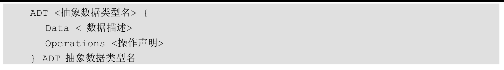
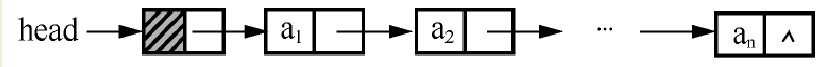
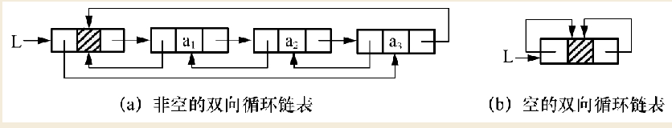
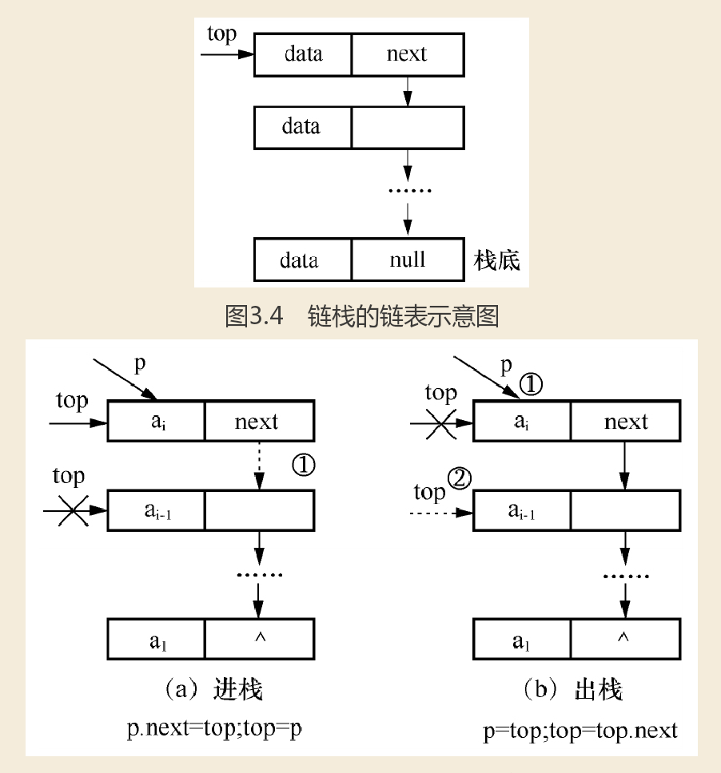
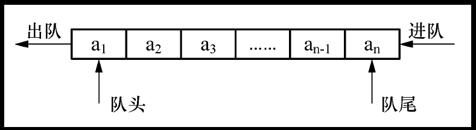
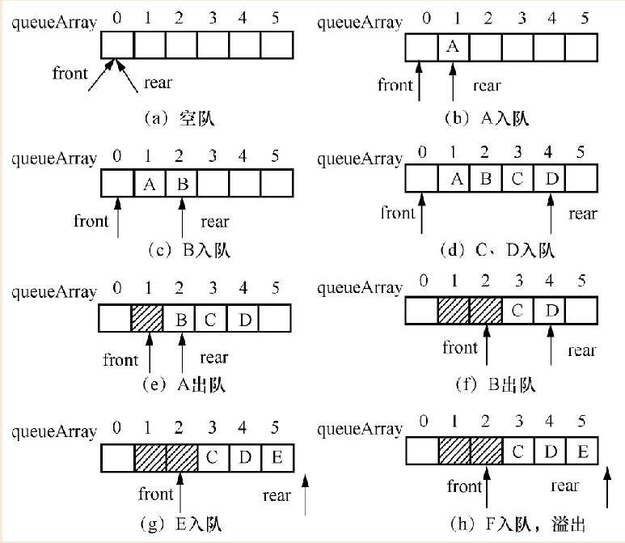
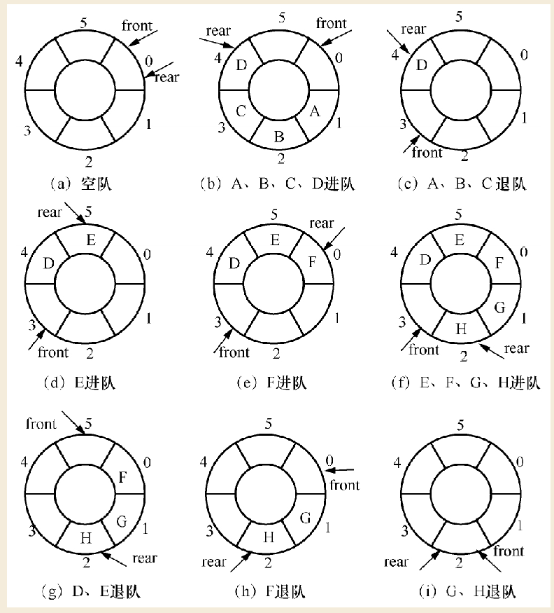
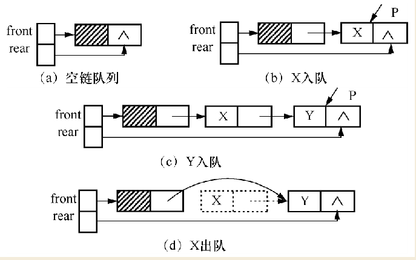

# 数据结构

**1、数据的逻辑结构**

逻辑结构是指数据元素之间的逻辑关系，即从逻辑关系上描述数据。它与数据的存储无关，是独立于计算机的。数据的逻辑结构分为线性结构和非线性结构，线性表是典型的线性结构；集合、树和图是典型的非线性结构。数据的逻辑结构分类见图1-1。

- 集合结构中的数据元素之间除了 “同属于一个集合”的关系外，别无其他关系。
- 线性结构结构中的数据元素之间只存在一对一的关系。
- 树形结构结构中的数据元素之间存在一对多的关系。
- 图状结构或网状结构结构中的数据元素之间存在多对多的关系。


**2、数据的存储结构**

存储结构是指数据结构在计算机中的表示（又称映像），也称物理结构。它包括数据元素的表示和关系的表示。数据的存储结构是逻辑结构用计算机语言的实现，它依赖于计算机语言。数据的存储结构主要有：顺序存储、链式存储、索引存储和散列存储。

1) 顺序存储：把逻辑上相邻的元素存储在物理位置上也相邻的存储单元里，元素之间的关系由存储单元的邻接关系来体现。其优点是可以实现随机存取，每个元素占用最少的存储空间；缺点是只能使用相邻的一整块存储单元，因此可能产生较多的外部碎片。

2) 链接存储：不要求逻辑上相邻的元素在物理位置上也相邻，借助指示元素存储地址的指针表示元素之间的逻辑关系。其优点是不会出现碎片现象，充分利用所有存储单元；缺点是每个元素因存储指针而占用额外的存储空间，并且只能实现顺序存取。

3) 索引存储：在存储元素信息的同时，还建立附加的索引表。索引表中的每一项称为索引项，索引项的一般形式是：（关键字，地址）。其优点是检索速度快；缺点是增加了附加的索引表，会占用较多的存储空间。另外，在增加和删除数据时要修改索引表，因而会花费较多的时间。

4) 散列存储：根据元素的关键字直接计算出该元素的存储地址，又称为Hash存储。其优点是检索、增加和删除结点的操作都很快；缺点是如果散列函数不好可能出现元素存储单元的冲突，而解决冲突会增加时间和空间开销。

**3、数据的运算**

施加在数据上的运算包括运算的定义和实现。运算的定义是针对逻辑结构的，指出运算的功能；运算的实现是针对存储结构的，指出运算的具体操作步骤。



逻辑结构是表示，存储结构是实现
算法：实现层面

## 算法效率分析

log函数就是次方函数的逆运算的。y=2^x,这就是一个次方函数。y=2^x的逆函数就是x=log2y。

**1、时间复杂度**

通常，用n作为表示问题规模的量。例如，树的问题中n是树的结点数，排序问题中n为所需排序元素的个数等。
我们把规模为n的算法的执行时间，称为时间复杂度（time complexity）。算法运行所需的时间T表示为n的函数，记为T(n)。为了便于比较同一问题的不同算法，通常把算法中基本操作重复执行的次数（频度）作为算法的时间复杂度。

记为：T(n)=f(n)

其中**f(n)是规模为n的算法**，重复执行基本操作的次数。大部分情况下要准确地计算T(n)是很困难的，一个算法的“运行工作量”通常随问题规模的增长而增长，因此比较不同算法的优劣主要应该以其“增长的趋势”为准则。我们往往研究所谓的“渐进时间复杂度”，即当n逐渐增大时T(n)的极限情况。一般把这种算法的渐进复杂度简称为时间复杂度。为了便于分析，时间复杂度常用数量级的形式来表示，

记为：T(n)=O(f(n))

其中大写字母O为Order（数量级）的第一个字母，f(n)为函数形式，如T(n)=O(n2)。一般用数量级的形式表示T(n)，当T(n)为多项式时，可只取其最高次幂，且其系数也可省略。例如：T(n)=8n3+15n2+3n+1时，可以表示为T(n)=O(n3)。

可以看出，时间复杂度往往不是精确的执行次数，而是估算的数量级，它着重体现的是随着问题规模n增大，算法执行时间的变化趋势。

实际上，在分析时间复杂度时，只需要关注随着问题规模n增大，语句执行次数变化最快的语句即可分析出，如本例中的x=x+1就是这样的语句。

**2、空间复杂性**

```c
void del_1(Sqlist &L,Elemtype x){
        int m;
        for(int i =0; i <L.length; i++){
                if(x == L.data[i])
                        m = i;
        }
        for(int j = m; j <L.length; j++){
                L.data[j] = L.data[j+1];
        }
}
```

```c
void del_2(Sqlist &L, Elemtype x){
    int k=0,i=0;
    while(i<L.length){
        if(L.data[i]==x)
            k++;
        else
            L.data[i-k]=L.data[i];
            i++;
        }
    L.length=L.length-k;
}
```

算法复杂度判断的是计算次数， 这个次数和数据的长度之间的关系
如果是固定的次数，和数据的长度没有关系， 无论这个次数是几， 复杂度都是O（1）
如果次数和长度n的一次方相关，那么无论是执行8n还是1000n+10000次，都是O（n）
如果次数和长度的平方相关， 10n^2 + 100000n + 100000, 也叫做O(n^2)
就是找影响最大的地方， 而且忽略固定的系数

空间的复杂度也是类似的关系

第一个图，虽然是for两次，每次都执行了Length次循环， 总计算量就是 2*length， 但是复杂度依然是O（n）
第二图同样的， while也是执行了Length次，复杂度也是O（n）

空间复杂度是同样的算法， 变量不管是1，2，还是10000个，只要是固定的数，他就是O（1）
如果你开个数组，数组大小和Length无关，那么依然是O（1）
数组大小是Length/1000， 那也要算做O（N）

## 线性表

线性结构的特点是：在数据元素的非空有限集中，（1）存在唯一的一个被称作“第一个”的数据元素；（2）存在唯一的一个被称作“最后一个”的数据元素；（3）除第一个之外，集合中的每个数据元素均只有一个前驱；（4）除最后一个之外，集合中每个数据元素均只有一个后继。

线性表（Linear List）是n个数据元素的有限序列，其元素可以是一个数、一个符号，也可以是由多个数据项组成的复合形式，甚至可以是一页书或其他更复杂的信息。例如，由26个大写英文字母组成的字母表
（A，B，C，…，X，Y，Z）

(a1,a2)称之为序偶，a1前驱，a2是后继

### 顺序表示

**定义：**线性表的顺序表示指的是用**一组地址连续的存储单元依次存储线性表的数据元素**。线性表的这种机内表示称作线性表的顺序存储结构或顺序映像（sequential mapping），通常，称这种存储结构的线性表为顺序表。以元素在计算机内“物理位置相邻”来表示线性表中数据元素之间的逻辑关系。

可以根据顺序表中数据元素的位序，随机访问表中的任一元素，也就是说，**顺序表是一种随机存取的存储结构**。顺序表和一维数组一样，都可以进行随机存取

### 链式表示

这两部分信息组成数据元素ai的存储映像，称为结点（Node）。如图2.6所示，它包括两个域，其中存储数据元素信息的域称为数据域，存储直接后继存放位置的域称为指针域。

线性表链式存储结构泛型类的定义如下，在**linkList类**中有两个成员变量。一个是指向头结点的指针head，习惯称head为头指针；另一个是length，用来存放单链表的长度。



- 单向链表
- 循环链表
- 双向链表



## 栈和队列

### 顺序栈

栈是限定仅在表尾进行插入和删除操作的线性表。允许插入、删除的一端称为栈顶（top），另一端称为栈底（bottom），不含任何数据元素的栈称为空栈。
假设栈S =（a1，a2，…，an），则称a1为栈底元素，an为栈顶元素。栈中元素按a1，a2，…，an的顺序进栈，退栈从栈顶元素开始出栈。所以，栈的修改是按后进先出的原则进行的。因此，栈又称为后进先出（LIFO，last in first out）的线性表。

### 链栈

栈的链接存储结构称为链栈。利用链表实现，链表中的每个数据元素由两部分信息组成，一部分是存储其本身的信息，一部分是存储一个指示其直接后继的信息，即直接后继的存储位置。我们称它有两个域，其中存储数据元素信息的域为数据域，存储直接后继存储位置的域为指针域。

对于链式栈，无栈满问题，空间可扩充，插入与删除仅在栈顶处执行，链式栈的栈顶在链头。



### 队列

队列是一种运算受限制的线性表，元素的添加操作在表的一端进行，而元素的删除操作在表的另一端进行。允许插入的一端称为队尾（rear），允许删除的一端称为队头（front）。



> 顺序队列

和顺序栈相类似，队列也可以简单地用一维数组表示。设数组名为queueArray，其下标下界为0，上界为n-1。在队列的顺序存储结构中，除了用一组地址连续的存储单元依次存放从队列头到队列尾的元素以外，还需要设置两个指针front和rear分别指示队列的队头元素和队尾元素的位置。



虽然队列中还有三个位置（索引值为0、1、2）有剩余空间，但无法插入新入队元素。这种情况称为假溢出。

**1、循环队列**

对于这个问题，我们提出了两种解决办法。
（1）每次删除一个元素后，将整个队列向前移动一个单元，保持队列头总固定在数组的第一个单元。只是这样的话，我们每次删除元素时，都要执行一次循环操作，移动队列中所有元素向前一个单元，那样造成了系统的额外开销。
（2）将顺序队列的存储区假想为是一个头尾相连的圆环，当队尾指示器rear到达数组的上限时，如果还有数据元素入队并且数组的第0个空间空闲时，队尾指示器rear指向数组的0端，



> 链队列

用链表表示的队列称为链队列，如图3.10所示。链式队列不存在假溢出的问题，所以，本节给出的是一般的（非循环）队列。一个链队列需要两个分别指示队头和队尾的指针才能唯一确定。和线性表的单链表一样，为了操作方便，我们在链队列中添加一个头结点，并令头指针指向头结点。由此，空的链队列的判决条件为头指针和尾指针均指向头结点。

private Node<T> front,rear;



## 串、矩阵和广义表

### 串

串（或字符串），是由零个或多个字符组成的有限序列。一般记为：
**s='a1a2...an' (n≥0)**
其中s是串的名字，用单引号括起来的字符序列是串的值，串中字符的个数n称为串的长度。零个字符的串称为空串，通常用符号“∅”来表示，它的长度为零。

串中任意个连续的字符组成的子序列称为该串的子串。包含子串的串相应地称为主串。通常称字符在序列中序号为字符位置。子串在主串中的位置则以子串的第一个字符在主串中的位置来表示，称为子串位置。
**例：a='cheng'，b='du'，c='chengdu'，d='cheng du'**
串长分别为5、2、7、8，且a、b都是c、d的子串。a在c和d中的位置都是1，而b在c中的位置是6，在d中的位置则是7。

称两个串是相等的，当且仅当这两个串的值相等，即只有当两个串的长度相等，并且各个对应位置的字符都相等时才相等。
在我们描述串时，要求串的值必须用一对单引号括起来，但单引号本身不属于串，它的作用只是为了避免与变量名或常量混淆而已。

> 1、串的顺序存储

类似于线性表的顺序存储结构，串的顺序存储结构是用数组来存储串中的字符序列。在串的顺序存储中，一般有三种方法表示串的长度。

（1）用一个变量来表示串的长度

（2）在串尾存储一个不会在串中出现的特殊字符作为串的终结符

（2）在串尾存储一个不会在串中出现的特殊字符作为串的终结符

### 矩阵

一般在高级程序语言中，我们使用二维数组来存储矩阵，有的程序设计语言还专门提供了各种矩阵运算，方便用户使用。
但是，在数值分析中经常出现一些阶数很高的矩阵，同时在矩阵中有很多值相同的元素或者是零元素。有时候为了节省存储空间，可以对这类矩阵进行压缩存储。所谓压缩存储是指：为多个值相同的元素只分配一个存储空间，对零元素不分配存储空间。我们对下面两类矩阵讨论它们的压缩存储。

**特殊矩阵**：矩阵中有很多值相同的元素并且它们的分布有一定的规律。

- 对称矩阵
- 三角矩阵

**稀疏矩阵**：矩阵中有很多零元素。在实际应用中，还经常遇到一些含有大量零元素，非零元素很少，且零元素分布没有规律的矩阵，假设m行n列的矩阵含t个非零元素，则非零元素的比例称为稀疏因子，通常认为δ≤0.05的矩阵为稀疏矩阵。

