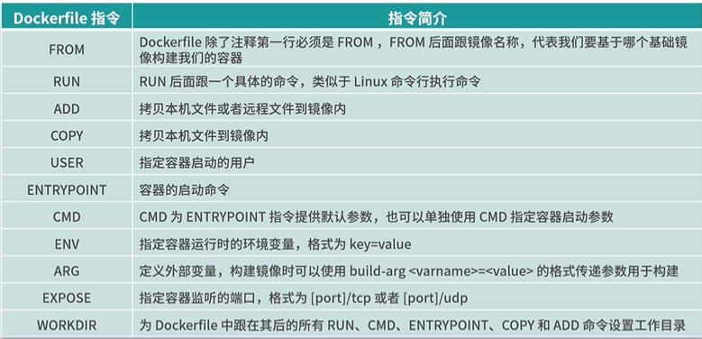
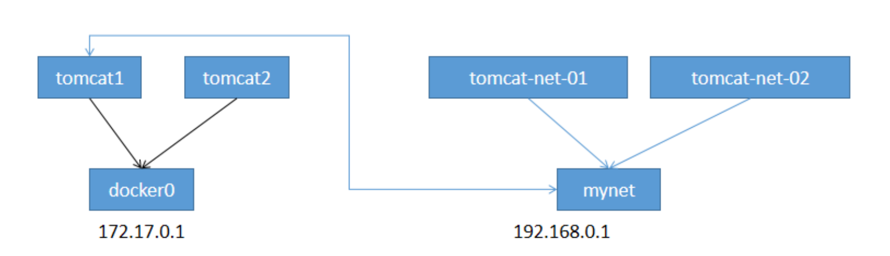
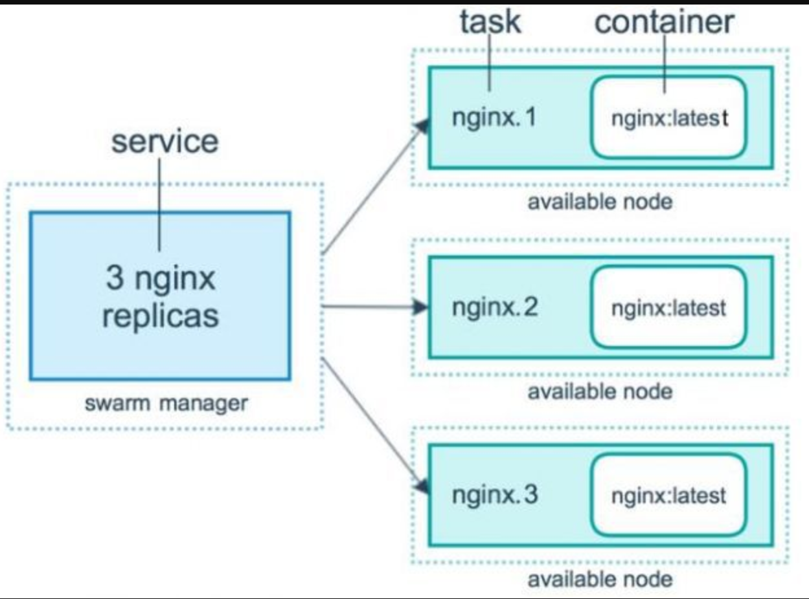

# Docker

## docker安装

官网安装参考手册：https://docs.docker.com/engine/install/centos/

yum安装gcc相关环境（需要确保 虚拟机可以上外网 ） 

yum -y install gcc 

yum -y install gcc-c++

> 与官网不同的两步

1、镜像仓库时，用国内的，阿里云

\# 正确推荐使用国内的 

yum-config-manager  --add-repo  http://mirrors.aliyun.com/docker-ce/linux/centos/docker-ce.repo

启动docker：systemctl start docker 

设置自启动：systemctl enable docker

 关闭dokcer：systemctl stop docker 或 service docker stop  

2、阿里云镜像加速 介绍：https://www.aliyun.com/product/acr

位置：产品与服务 -> 弹性计算 -> 容器服务 -> 容器镜像服务 ->镜像加速

```shell
sudo mkdir -p /etc/docker
sudo tee /etc/docker/daemon.json <<-'EOF'
{
  "registry-mirrors": ["https://eh5354dt.mirror.aliyuncs.com"]
}
EOF
sudo systemctl daemon-reload
sudo systemctl restart docker
```

设置自启动后，关闭docker服务后，使用docker命令或应用会自动启动

如果不想被访问时自动启动服务
输入命令：sudo systemctl stop docker.socket

> 安装失败（解决方案）

进入 `/etc/yum.repos.d` 目录下，将所有有关 docker 的 repo 全部删掉

## 帮助命令

docker version	显示docker版本信息

docker info	显示docker系统信息，包括镜像和容器数

docker --help	帮助，不知道的命令，会告诉你可用参数

## 镜像命令

docker images	显示本地主机上的镜像

docker search	到dockerhub上搜索镜像

docker pull	下载镜像

docker rmi	删除镜像

## 容器命令（注：有镜像才能创建容器）

docker run -it 容器名 /bin/bash	使用centos进行交互模式启动容器，在容器内执行/bin/bash,-d是后台运行

当运行容器时，使用的镜像如果在本地中不存在，docker 就会自动从 docker 镜像仓库中下载，默认是从 Docker Hub 公共镜像源下载。

docker ps	列出所有运行的容器，参数见--help

> 退出容器

exit	容器停止退出

ctrl+p+q	容器不停止退出

> 启动停止容器

docker start (容器id or 容器名)

docker restart

docker stop

docker kill

> 删除容器

docker rm 容器id

docker rm -f $(docker ps -a -q)

## 常用命令

docker run -d 容器名	后台运行容器

docker logs -f -t --tail 容器id	

docker top 容器id	查看容器中运行的进程信息

docker inspect 容器id	查看容器/镜像的元数据

docker exec -it 容器id /bin/bash	进入正在运行的容器，会启动新的进程

docker attach 容器id	直接进入容器启动命令的终端

> 从容器内拷贝文件到主机上

docker cp 容器id:容器内路径 目的主机路径


## 容器数据卷

为了容器持久化，以及容器之间的继承和数据共享

> 方法一：容器中直接使用命令来添加

挂载：docker run -it -v 宿主机绝对路径目录:容器内目录 镜像名

测试：docker run -it -v /home/ceshi:/home centos /bin/bash 

在dockerfile文件中使用VOLUME指令可以给镜像添加多个挂在目录

> 匿名和具名挂载

匿名挂载 -v 容器内路径 

docker run -d -P --name nginx01 -v /etc/nginx nginx 

\# 匿名挂载的缺点，就是不好维护，通常使用命令 docker volume维护 

docker volume ls  

具名挂载 -v 卷名:/容器内路径 

docker run -d -P --name nginx02 -v nginxconfig:/etc/nginx nginx 

\# 查看挂载的路径 

[root@kuangshen ~]# docker volume inspect nginxconfig 

## 数据卷容器

命名的容器挂载数据卷，其他容器通过挂载这个（父容器）实现数据共享，挂载数据卷的容器，称之为数据卷容器。

docker run -it --name docker02 --volumes-from docker01 kuangshen/centos 

## DockerFile

dockerfifile是用来构建Docker镜像的构建文件，是由一系列命令和参数构成的脚本。

构建步骤：

1、编写DockerFile文件

2、docker build 构建镜像

3、docker run

执行构建命令： docker build -t second:v1.0 **.**

**注意最后有个点**，默认使用 “上下文目录（Context）下的名为Dockerfile 的文件作为 Dockerfile”，

在此，即用当前路径的 Dockerfile 进行构建 。

-t  second : v1.0  给新构建的镜像取名为 second， 并设定版本为 v1.0 。

> DockerFile构建过程

**基础知识：**

1、每条保留字指令都必须为大写字母且后面要跟随至少一个参数

2、指令按照从上到下，顺序执行

3、# 表示注释

4、每条指令都会创建一个新的镜像层，并对镜像进行提交

**流程：**

1、docker从基础镜像运行一个容器

2、执行一条指令并对容器做出修改

3、执行类似 docker commit 的操作提交一个新的镜像层

4、Docker再基于刚提交的镜像运行一个新容器

5、执行dockerfifile中的下一条指令直到所有指令都执行完成！

> DockerFile命令

博客：
https://blog.csdn.net/y472360651/article/details/81289141?ops_request_misc=%257B%2522request%255Fid%2522%253A%2522162824109916780271543525%2522%252C%2522scm%2522%253A%252220140713.130102334..%2522%257D&request_id=162824109916780271543525&biz_id=0&utm_medium=distribute.pc_search_result.none-task-blog-2~all~sobaiduend~default-2-81289141.pc_search_result_control_group&utm_term=dockerfile%E5%91%BD%E4%BB%A4&spm=1018.2226.3001.4187




## docker网络

### 理解docker0

查看本地ip	**ip addr**

lo 127.0.0.1 # 本机回环地址 

eth0 172.17.90.138 # 阿里云的私有IP 

docker0 172.18.0.1 # docker网桥 

\# 问题：Docker 是如何处理容器网络访问的？

docker会给每个容器都分配一个ip！

> 原理

1、每一个安装了Docker的linux主机都有一个docker0的虚拟网卡。这是个桥接网卡，使用了veth-pair

技术！

2、每启动一个容器，linux主机就会多了一个虚拟网卡。通过这个虚拟网卡和docker0网卡进行交换连接

### --Link

思考一个场景，我们编写一个微服务，数据库连接地址原来是使用ip的，如果ip变化就不行了，那我们

能不能使用服务名访问呢？

> 使用tomcat1 ping tomcat2

\# 我们使用tomcat02，直接通过容器名ping tomcat01，不使用ip 

docker exec -it tomcat02 ping tomcat01 

ping不通

**docker run -d -P --name tomcat03 --link tomcat02 tomcat**

这个时候直接ping服务，就可以联通

> 原理

docker exec -it tomcat03 cat /etc/hosts 	查看一下配置文件

发现配置了一行 172.18.0.3 tomcat02 b80da266a3ad # 发现tomcat2直接被写在这里 

相当于windows的hosts文件中配置的映射，一旦ip改变，就无效了。

### 自定义网络

> 查看所有网络

docker network ls

| 网络模式      | 配置                    | 说明                                                         |
| ------------- | ----------------------- | ------------------------------------------------------------ |
| bridge模式    | --net=bridge            | 默认值，在Docker网桥docker0上为容器创建新的网络栈            |
| none模式      | --net=none              | 不配置网络，用户可以稍后进入容器，自行配置                   |
| container模式 | --net=container:name/id | 容器和另外一个容器共享Network namespace。kubernetes中的pod就是多个容器共享一个Network namespace。 |
| host模式      | --net=host              | 容器和宿主机共享Network namespace                            |
| 用户自定义    | --net=自定义网络        | 用户自己使用network相关命令定义网络，创建容器的时候可以指定为自己定义的网络 |

> 查看一个网络具体信息

docker network inspect 容器id

> 自定义网卡

\# 默认我们不配置网络，也就相当于默认值 --net bridge 使用的docker0 

docker run -d -P --name tomcat01 --net bridge tomcat 

```
# docker0网络的特点 

1.它是默认的 

2.域名访问不通 

3.--link 域名通了，但是删了又不行 
```

**docker network create** --driver bridge --subnet 192.168.0.0/16 --gateway 192.168.0.1 mynet 

添加两个容器进行试验

docker run -d -P --name tomcat-net-01 **--net mynet** tomcat

docker run -d -P --name tomcat-net-02 **--net mynet** tomcat 

> 查看网络

 docker network inspect mynet

会发现Containers后面多了两个刚刚添加的容器

docker exec -it tomcat-net-01 ping 192.168.0.3/容器名	

这个时候发现，无论是ping容器名还是ip地址都ok

### 网络互通



docker0和自定义网络肯定不通，我们使用自定义网络的好处就是网络隔离：不打通网卡之间连接，通过容器连接网卡

 docker network --help 

发现命令connect Connect a container to a network # 连接一个容器到一个网络

格式： **docker network connect [OPTIONS] NETWORK CONTAINER**

使用：docker network connect mynet tomcat01

> 查看网卡信息

docker network inspect mynet

发现多了tomcat01容器

## IDEA整合Docker

将项目进行maven打包成jar，在target目录中

> 编写DockerFile文件

```shell
FROM java:8 

# 服务器只有dockerfile和jar在同级目录 

COPY *.jar /app.jar 

CMD ["--server.port=8080"] 

# 指定容器内要暴露的端口 

EXPOSE 8080 

ENTRYPOINT ["java","-jar","/app.jar"] 
```

将dockerfile和jar上传到linux服务器，构建运行

[root@文件所在目录]# docker build -t idea-ks 

## Docker Compose

> 简介

Compose is a tool for defining and running multi-container Docker applications. With Compose, you use a YAML file to configure your application’s services. Then, with a single command, you create and start all the services from your configuration. To learn more about all the features of Compose, see [the list of features](https://docs.docker.com/compose/#features).

Compose works in all environments: production, staging, development, testing, as well as CI workflows. You can learn more about each case in [Common Use Cases](https://docs.docker.com/compose/#common-use-cases).

Using Compose is basically a three-step process:

1. Define your app’s environment with a `Dockerfile` so it can be reproduced anywhere.
2. Define the services that make up your app in `docker-compose.yml` so they can be run together in an isolated environment.
3. Run `docker compose up` and the [Docker compose command](https://docs.docker.com/compose/cli-command/) starts and runs your entire app. You can alternatively run `docker-compose up` using the docker-compose binary.

安装：

If you installed Docker Desktop/Toolbox for either Windows or Mac, you already have Docker Compose! Play-with-Docker instances already have Docker Compose installed as well. If you are on a Linux machine, you will need to [install Docker Compose](https://docs.docker.com/compose/install/).

```shell
docker-compose version	使用命令查看是否安装
```

### Compose安装

1、下载

```shell
 sudo curl -L "https://github.com/docker/compose/releases/download/1.29.2/docker-compose-$(uname -s)-$(uname -m)" -o /usr/local/bin/docker-compose
 
 用这个可能快点
 curl -L https://get.daocloud.io/docker/compose/releases/download/1.25.5/docker- compose-`uname -s`-`uname -m` > /usr/local/bin/docker-compose
```

2、授权

```shell
 sudo chmod +x /usr/local/bin/docker-compose
```

> 官网的getting started

https://docs.docker.com/compose/gettingstarted/

1、创建文件夹composetest

2、新建一个app.py文件，应用

3、新建Dokcerfile文件

4、在docker-compose.yml中定义服务

5、使用docker-compose up构建和运行app


### yaml规则

https://docs.docker.com/compose/compose-file/compose-file-v3/

```yaml
#三层

version: ''
services:
	服务1: web
		images
		build
		network
	服务2: redis
	...
#第三层：其他配置 网络/卷、全局规则
volumes:
networks:
configs:
```

> 部署wordpress博客系统

https://docs.docker.com/samples/wordpress/

## Docker Swarm


1、初始化swarm节点为manager

docker swarm init --advertise-addr 192.168.106.10

2、获得令牌

docker swarm join-token manager 

docker swarm join-token worker 

3、使用令牌加入即可

docker node ls 查看节点，只有manager节点才可以使用该命令

### Raft协议

Raft协议： 保证大多数节点存活才可以用。 只要>1 ，集群至少大于3台！

如果只有两台，一台挂了，另外一台无法判断是自己挂了还是另一台挂了，所以直接失效

### service



弹性、扩缩容！集群！

前提：在swarm 集群下

以后告别 docker run！

docker-compose up！ 启动一个项目。单机！

> 命令

1、docker service create -p 8888:80 --name my-nginx  nginx    #根据nginx镜像创建一个服务

```shell
docker run 容器启动！不具有扩缩容器 
docker service 服务！ 具有扩缩容器，滚动更新！
```

服务有点像容器，是通过服务来进行replicas，根据要求的数量生成对应的task，进行动态的扩缩容和弹性。可以理解服务为特殊的容器。

2、查看服务replicas

```shell
docker service ps 服务名如：my-nginx
```

查看正在运行的task

```shell
docker service ls	#查看正在运行的服务
```

3、动态扩缩容

docker service update --replicas 3 my-nginx

docker service scale my-nginx=3

这两条命令等效

## Docker Stack

docker-compose 单机部署项目！

Docker Stack部署，集群部署！

```shell
# 单机 
docker-compose up -d wordpress.yaml 
# 集群 
docker stack deploy wordpress.yaml 
```

## Docker Secret

配置安全、密码、证书

## Docker Config

docker 一些配置
