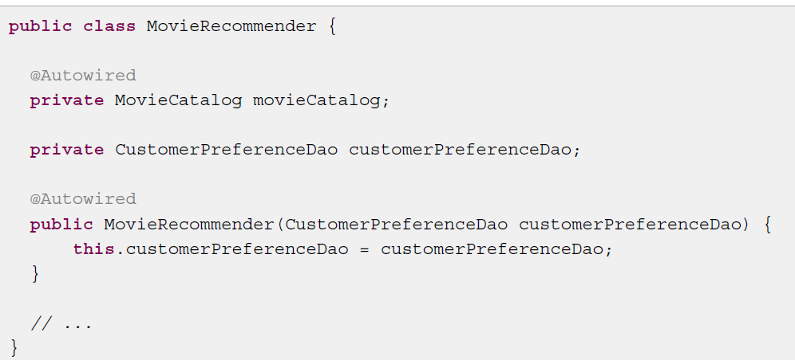
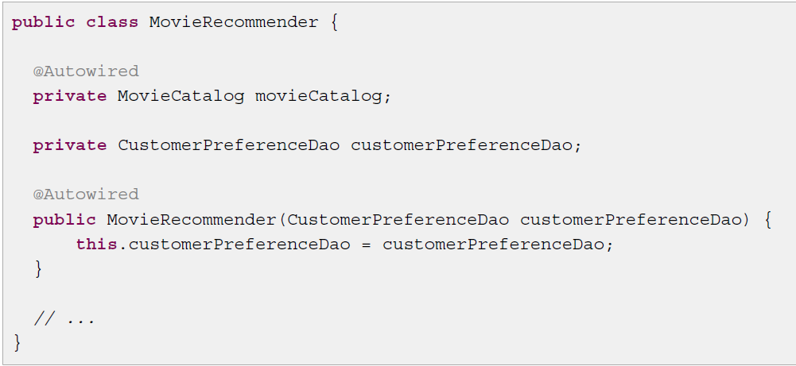
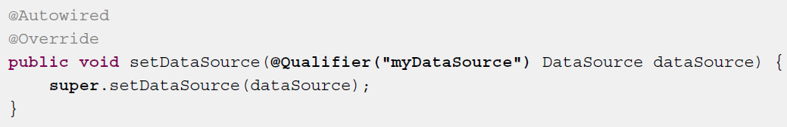
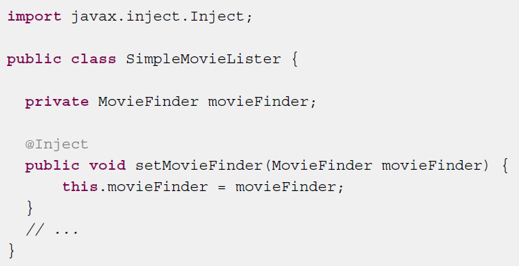
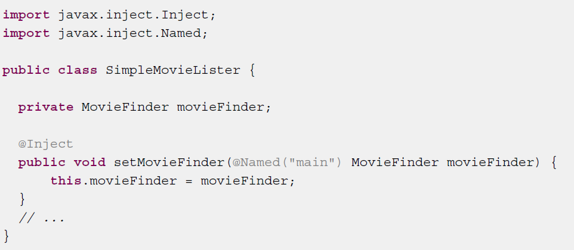
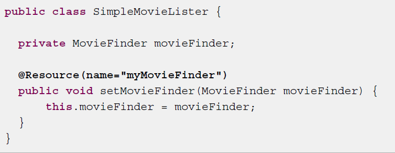

# **annotation之@Autowired、@Inject、@Resource三者区别**

## **一、@Autowired**

1、@Autowired是spring自带的注解，通过‘AutowiredAnnotationBeanPostProcessor’ 类实现的依赖注入；

2、@Autowired是根据**类型**进行自动装配的，如果找到多个类型相同的，会按照名称进行匹配，如果名称相同，会报错，如果需要按指定名称进行装配，则需要配合@Qualifier；

3、@Autowired有个属性为required，可以配置为false，如果配置为false之后，当没有找到相应bean的时候，系统不会抛错；

4、@Autowired可以作用在变量、setter方法、构造函数上。

 

**a、**将@autowored写在被注入的成员变量上，就不用再xml文件中配置了，在程序中去掉相应的setter和getter方法，

 

**b、**还可以写在构造方法上、setter方法上

 

**c、@Qualifier**

@Qualifier("XXX") 中的 XX是 Bean 的名称，所以 @Autowired 和 @Qualifier 结合使用时，自动注入的策略就从 byType 转变成 byName 了。

不过需要注意的是@Autowired 可以对成员变量、方法以及构造函数进行注释，而 @Qualifier 的标注对象是成员变量、方法**入参**、构造函数**入参**。

 

## **二、@Inject**

1、@Inject是JSR330 (Dependency Injection for Java)中的规范，需要导入javax.inject.Inject;实现注入。

2、@Inject是根据**类型**进行自动装配的，如果需要按名称进行装配，则需要配合@Named；

3、@Inject可以作用在变量、setter方法、构造函数上。

 

**a、**将@Inject可以作用在变量、setter方法、构造函数上，和@Autowired一样

 

**b、@Named**

**@\**Named\**("XXX") 中的 XX是 Bean 的名称，所以 @\**Inject\**和 @\**Named\**结合使用时，自动注入的策略就从 byType 转变成 byName 了。**

 

## **三、@Resource**

1、@Resource是JSR250规范的实现，需要导入javax.annotation实现注入。

2、@Resource是根据**名称**进行自动装配的，一般会指定一个name属性

3、@Resource可以作用在变量、setter方法上。

 

**a、@Resource实例**

 

**总结：**

1、@Autowired是spring自带的，@Inject是JSR330规范实现的，@Resource是JSR250规范实现的，需要导入不同的包

2、@Autowired、@Inject用法基本一样，不同的是@Autowired有一个request属性

3、@Autowired、@Inject是默认按照类型匹配的，@Resource是按照名称匹配的

4、@Autowired如果需要按照名称匹配需要和@Qualifier一起使用，@Inject和@Name一起使用

