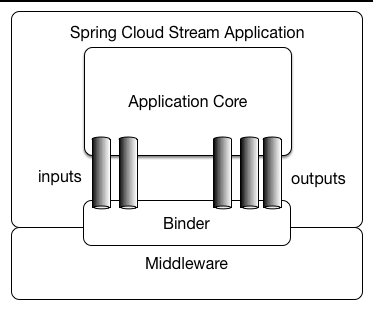

# SpringCloud

SpringCloud官网：https://spring.io/projects/spring-cloud

http://www.macrozheng.com/#/

## SpringCloud总览

服务注册与发现组件：Eureka、Zookeeper、Consul、Nacos等

服务调用组件：Hystric、Ribbon和OpenFeign

路由和过滤组件：Zuul和Spring Cloud Gateway

配置中心组件：Spring Cloud Config

消息组件：Stream和Bus

安全控制组件：Security基于OAuth2.0

链路监控组件：Sleuth

> 1、Bootstrap上下文

**Bootstrap** 上下文是Spring Cloud新引入的，与传统的Spring 上下文相同，系 ConfigurableApplicationContext 实例，由 BootstrapApplicationListener 在监听 ApplicationEnvironmentPreparedEvent 时创建。
了解了Spring 事件/监听器模式，再来看看Spring boot中该模式的应用：
  SpringApplication 是Spring Boot 引导启动类，与 Spring 上下文、事件、监听器以及环境等组件关系紧密，其中提供了控制Spring Boot应用特征的行为方法。

Spring Boot 上下文：

非Web应用：AnnotationConfigApplicationContext
Web应用：AnnotationConfigEmbeddedWebApplicationContext

Spring Boot 事件触发器：EventPublishingRunListener
Spring Boot 应用运行监听器：SpringApplicationRunListener

Bootstrap上下文使用与主程序不同的规则来加载外部配置。因此bootstrap.yml用于为Bootstrap上下文加载外部配置。

> 2、Spring Cloud Commons：公共抽象

springcloud将服务发现、负载均衡和断路器等通用模型封装在一个公共抽象中，可以被所有的SpringCloud客户端发现。

1、@EnableDiscoveryClient注解

2、服务注册(ServiceRegistry)

3、RestTemplate的负载均衡

4、RestTemplate的失败重试

## Spring Cloud的基础：SpringBoot

### 自制Starter(日志打印过滤器)

LogFilter

```java
public class LogFilter implements Filter {
    private Logger logger = LoggerFactory.getLogger(LogFilter.class);

    @Override
    public void init(FilterConfig filterConfig) throws ServletException {
        logger.info("logFilter init ...");
    }

    @Override
    public void doFilter(ServletRequest servletRequest, ServletResponse servletResponse, FilterChain filterChain) throws IOException, ServletException {
        HttpServletRequest request = (HttpServletRequest) servletRequest;
        logger.info("uri {} is working.", request.getRequestURI());
        filterChain.doFilter(servletRequest, servletResponse);
    }

    @Override
    public void destroy() {
        logger.info("logFilter destroy ...");
    }
}
```

LogFilterRegistrationBean(注册该过滤器)

```java
public class LogFilterRegistrationBean extends FilterRegistrationBean<LogFilter> {
    public LogFilterRegistrationBean(){
        super();
        this.setFilter(new LogFilter());
        this.addUrlPatterns("/*");
        this.setName("LogFilter");
        this.setOrder(1);//设置过滤器顺序
    }
}
```

LogFilterAutoConfiguration(自动配置类)

```java
@Configuration
@ConditionalOnClass({LogFilterRegistrationBean.class, LogFilter.class})
public class LogFilterAutoConfiguration {

    @Bean
    @ConditionalOnMissingBean(LogFilterRegistrationBean.class)
    public LogFilterRegistrationBean logFilterRegistrationBean(){
        return new LogFilterRegistrationBean();
    }
}
```

EnableLogFilter注解

```java
@Target({ElementType.TYPE})
@Retention(RetentionPolicy.RUNTIME)
//@Import(LogFilterAutoConfiguration.class)//方法一:直接引入配置类
@Import(EnableLogFilterImportSelector.class)
public @interface EnableLogFilter {

}
```

方法二：使用spring.factories加载

定义META-INF文件夹存放spring.factories

```
com.example.filterlogstarter.config.EnableLogFilter=\
com.example.filterlogstarter.config.LogFilterAutoConfiguration
```

EnableLogFilterImportSelector(读取自动配置类进行加载)

```java
public class EnableLogFilterImportSelector
        implements DeferredImportSelector, BeanClassLoaderAware, EnvironmentAware {

    private static final Logger logger = LoggerFactory.getLogger(EnableLogFilterImportSelector.class);

    private ClassLoader beanClassLoader;

    private Class annotationClass = EnableLogFilter.class;

    private Environment environment;


    @Override
    public String[] selectImports(AnnotationMetadata metadata) {
        // 是否生效，默认为true
        if (!isEnabled()) {
            return new String[0];
        }
        // 获取注解中的属性
        AnnotationAttributes attributes = AnnotationAttributes.fromMap(
                metadata.getAnnotationAttributes(this.annotationClass.getName(), true));

        Assert.notNull(attributes, "No " + getSimpleName() + " attributes found. Is "
                + metadata.getClassName() + " annotated with @" + getSimpleName() + "?");
        // 从spring.factories中获取所有通过EnableLogFilter注解引入的自动配置类，并进行去重操作
        List<String> factories = new ArrayList<>(new LinkedHashSet<>(SpringFactoriesLoader
                .loadFactoryNames(this.annotationClass, this.beanClassLoader)));

        if (factories.isEmpty() && !hasDefaultFactory()) {
            throw new IllegalStateException("Annotation @" + getSimpleName()
                    + " found, but there are no implementations. Did you forget to include a starter?");
        }

        if (factories.size() > 1) {

            logger.warn("More than one implementation " + "of @" + getSimpleName()
                    + " (now relying on @Conditionals to pick one): " + factories);
        }

        return factories.toArray(new String[factories.size()]);
    }

    protected boolean hasDefaultFactory() {
        return false;
    }

    protected boolean isEnabled() {
        return true;
    }

    ;

    protected String getSimpleName() {
        return this.annotationClass.getSimpleName();
    }

    protected Class<EnableLogFilter> getAnnotationClass() {
        return this.annotationClass;
    }

    protected Environment getEnvironment() {
        return this.environment;
    }

    @Override
    public void setEnvironment(Environment environment) {
        this.environment = environment;
    }

    @Override
    public void setBeanClassLoader(ClassLoader classLoader) {
        this.beanClassLoader = classLoader;
    }


}
```

## 服务注册与发现

> Eureka

Eureka Client通过starter的方式引入依赖：

EurekaClientAutoConfiguration：Eureka client自动配置类

RibbonEurekaAutoConfiguration

EurekaDiscoveryClientConfiguration

**Eureka Client的工作**

- 应用启动阶段
  1. 读取与server交互的配置信息，封装成EurekaClientConfig
  2. 读取自身服务实例配置信息，封装成EurekaInstanceConfig
  3. 从Eureka Server中拉取注册表信息并缓存到本地
  4. 服务注册
  5. 初始化发送心跳，缓存刷新.......

- 应用执行阶段
  1. 定时发送心跳到server中进行续租
  2. 定时拉取注册表
  3. 监控应用自身信息变化，需要重新发起服务注册

- 应用销毁阶段
  1. 从server注销自身服务实例	

> consul

## Spring Cloud OpenFeign


Feign是声明式的服务调用工具，我们只需创建一个接口并用注解的方式来配置它，就可以实现对某个服务接口的调用，简化了直接使用RestTemplate来调用服务接口的开发量。Feign具备可插拔的注解支持，同时支持Feign注解、JAX-RS注解及SpringMvc注解。当使用Feign时，Spring Cloud集成了Ribbon和Eureka以提供负载均衡的服务调用及基于Hystrix的服务容错保护功能。

## 熔断与限流

### 断路器：Hystrix

在微服务架构中，服务与服务之间通过远程调用的方式进行通信，一旦某个被调用的服务发生了故障，其依赖服务也会发生故障，此时就会发生故障的蔓延，最终导致系统瘫痪。Hystrix实现了断路器模式，当某个服务发生故障时，通过断路器的监控，给调用方返回一个错误响应，而不是长时间的等待，这样就不会使得调用方由于长时间得不到响应而占用线程，从而防止故障的蔓延。Hystrix具备服务降级、服务熔断、线程隔离、请求缓存、请求合并及服务监控等强大功能。

```java
@HystrixCommand(fallbackMethod = "instanceInfoGetFail",
        threadPoolProperties = {
                @HystrixProperty(name = "allowMaximumSizeToDivergeFromCoreSize", value = "true"),
                @HystrixProperty(name = "maximumSize", value = "20")
        }

)
```

OpenFeign是自带hystrix的

```yml
feign:
  hystrix:
    enabled: true
```

**雪崩效应**

服务雪崩效应是一种因为服务提供者不可用导致服务调用者的不可用，从而将不可用逐渐放大，导致整体瘫痪。

**服务降级**

通过提供回调方法fallback，当服务提供者延迟升高或失败时，断路器打开，后面不再是真实调用，而是快速失败，直接执行fallback的逻辑。

**资源隔离**

1、线程和线程池

Hystrix将调用服务的线程与服务访问的线程隔离开，相当一次服务访问是两件事情。这样的话调用线程就可以空出时间做别的事情，而不会因为等待服务响应而不可用。

Hystrix，将使用独立的线程池对应每一个服务提供者。于是某个服务提供者的高延迟和饱和资源受限只会发生在该服务提供者的线程池中。


2、信号量


#### @HystrixCommand详解

@HystrixCommand中的常用参数

- fallbackMethod：指定服务降级处理方法；
- ignoreExceptions：忽略某些异常，不发生服务降级；
- commandKey：命令名称，用于区分不同的命令；
- groupKey：分组名称，Hystrix会根据不同的分组来统计命令的告警及仪表盘信息；
- threadPoolKey：线程池名称，用于划分线程池。

#### Hystrix请求缓存

> 当系统并发量越来越大时，我们需要使用缓存来优化系统，达到减轻并发请求线程数，提供响应速度的效果。

**相关注解**

- @CacheResult：开启缓存，默认所有参数作为缓存的key，cacheKeyMethod可以通过返回String类型的方法指定key；
- @CacheKey：指定缓存的key，可以指定参数或指定参数中的属性值为缓存key，cacheKeyMethod还可以通过返回String类型的方法指定；
- @CacheRemove：移除缓存，需要指定commandKey。

**在缓存的使用过程中问题**

- 在缓存使用过程中，我们需要在每次使用缓存的请求前后对HystrixRequestContext进行初始化和关闭，否则会出现如下异常：

```java
java.lang.IllegalStateException: Request caching is not available. Maybe you need to initialize the HystrixRequestContext?
    at com.netflix.hystrix.HystrixRequestCache.get(HystrixRequestCache.java:104) ~[hystrix-core-1.5.18.jar:1.5.18]
    at com.netflix.hystrix.AbstractCommand$7.call(AbstractCommand.java:478) ~[hystrix-core-1.5.18.jar:1.5.18]
    at com.netflix.hystrix.AbstractCommand$7.call(AbstractCommand.java:454) ~[hystrix-core-1.5.18.jar:1.5.18]
```

- 这里我们通过使用过滤器，在每个请求前后初始化和关闭HystrixRequestContext来解决该问题：

```java
/**
 * Created by macro on 2019/9/4.
 */
@Component
@WebFilter(urlPatterns = "/*",asyncSupported = true)
public class HystrixRequestContextFilter implements Filter {
    @Override
    public void doFilter(ServletRequest servletRequest, ServletResponse servletResponse, FilterChain filterChain) throws IOException, ServletException {
        HystrixRequestContext context = HystrixRequestContext.initializeContext();
        try {
            filterChain.doFilter(servletRequest, servletResponse);
        } finally {
            context.close();
        }
    }
}
```

#### 请求合并

>微服务系统中的服务间通信，需要通过远程调用来实现，随着调用次数越来越多，占用线程资源也会越来越多。Hystrix中提供了@HystrixCollapser用于合并请求，从而达到减少通信消耗及线程数量的效果。

**@HystrixCollapser的常用属性**

- batchMethod：用于设置请求合并的方法；
- collapserProperties：请求合并属性，用于控制实例属性，有很多；
- timerDelayInMilliseconds：collapserProperties中的属性，用于控制每隔多少时间合并一次请求；

**功能演示**

- 在UserHystrixController中添加testCollapser方法，这里我们先进行两次服务调用，再间隔200ms以后进行第三次服务调用：

```java
@GetMapping("/testCollapser")
public CommonResult testCollapser() throws ExecutionException, InterruptedException {
    Future<User> future1 = userService.getUserFuture(1L);
    Future<User> future2 = userService.getUserFuture(2L);
    future1.get();
    future2.get();
    ThreadUtil.safeSleep(200);
    Future<User> future3 = userService.getUserFuture(3L);
    future3.get();
    return new CommonResult("操作成功", 200);
}
```

- 使用@HystrixCollapser实现请求合并，所有对getUserFuture的的多次调用都会转化为对getUserByIds的单次调用：

```java
@HystrixCollapser(batchMethod = "getUserByIds",collapserProperties = {
    @HystrixProperty(name = "timerDelayInMilliseconds", value = "100")
})
public Future<User> getUserFuture(Long id) {
    return new AsyncResult<User>(){
    @Override
    public User invoke() {
        CommonResult commonResult = restTemplate.getForObject(userServiceUrl + "/user/{1}", CommonResult.class, id);
        Map data = (Map) commonResult.getData();
        User user = BeanUtil.mapToBean(data,User.class,true);
        LOGGER.info("getUserById username:{}", user.getUsername());
        return user;
        }
    };
}

@HystrixCommand
public List<User> getUserByIds(List<Long> ids) {
    LOGGER.info("getUserByIds:{}", ids);
    CommonResult commonResult = restTemplate.getForObject(userServiceUrl + "/user/getUserByIds?ids={1}", CommonResult.class, CollUtil.join(ids,","));
    return (List<User>) commonResult.getData();
}
```

- 访问接口测试http://localhost:8401/user/testCollapser，由于我们设置了100毫秒进行一次请求合并，前两次被合并，最后一次自己单独合并了。

#### Hystrix的常用配置

```yaml
hystrix:
  command: #用于控制HystrixCommand的行为
    default:
      execution:
        isolation:
          strategy: THREAD #控制HystrixCommand的隔离策略，THREAD->线程池隔离策略(默认)，SEMAPHORE->信号量隔离策略
          thread:
            timeoutInMilliseconds: 1000 #配置HystrixCommand执行的超时时间，执行超过该时间会进行服务降级处理
            interruptOnTimeout: true #配置HystrixCommand执行超时的时候是否要中断
            interruptOnCancel: true #配置HystrixCommand执行被取消的时候是否要中断
          timeout:
            enabled: true #配置HystrixCommand的执行是否启用超时时间
          semaphore:
            maxConcurrentRequests: 10 #当使用信号量隔离策略时，用来控制并发量的大小，超过该并发量的请求会被拒绝
      fallback:
        enabled: true #用于控制是否启用服务降级
      circuitBreaker: #用于控制HystrixCircuitBreaker的行为
        enabled: true #用于控制断路器是否跟踪健康状况以及熔断请求
        requestVolumeThreshold: 20 #超过该请求数的请求会被拒绝
        forceOpen: false #强制打开断路器，拒绝所有请求
        forceClosed: false #强制关闭断路器，接收所有请求
      requestCache:
        enabled: true #用于控制是否开启请求缓存
  collapser: #用于控制HystrixCollapser的执行行为
    default:
      maxRequestsInBatch: 100 #控制一次合并请求合并的最大请求数
      timerDelayinMilliseconds: 10 #控制多少毫秒内的请求会被合并成一个
      requestCache:
        enabled: true #控制合并请求是否开启缓存
  threadpool: #用于控制HystrixCommand执行所在线程池的行为
    default:
      coreSize: 10 #线程池的核心线程数
      maximumSize: 10 #线程池的最大线程数，超过该线程数的请求会被拒绝
      maxQueueSize: -1 #用于设置线程池的最大队列大小，-1采用SynchronousQueue，其他正数采用LinkedBlockingQueue
      queueSizeRejectionThreshold: 5 #用于设置线程池队列的拒绝阀值，由于LinkedBlockingQueue不能动态改版大小，使用时需要用该参数来控制线程数
```

### Sentinel实现熔断与限流

> Spring Cloud Alibaba 致力于提供微服务开发的一站式解决方案，Sentinel 作为其核心组件之一，具有熔断与限流等一系列服务保护功能，本文将对其用法进行详细介绍。

#### Sentinel简介

随着微服务的流行，服务和服务之间的稳定性变得越来越重要。 Sentinel 以流量为切入点，从流量控制、熔断降级、系统负载保护等多个维度保护服务的稳定性。

Sentinel具有如下特性:

- 丰富的应用场景：承接了阿里巴巴近 10 年的双十一大促流量的核心场景，例如秒杀，可以实时熔断下游不可用应用；
- 完备的实时监控：同时提供实时的监控功能。可以在控制台中看到接入应用的单台机器秒级数据，甚至 500 台以下规模的集群的汇总运行情况；
- 广泛的开源生态：提供开箱即用的与其它开源框架/库的整合模块，例如与 Spring Cloud、Dubbo、gRPC 的整合；
- 完善的 SPI 扩展点：提供简单易用、完善的 SPI 扩展点。您可以通过实现扩展点，快速的定制逻辑。

#### 安装Sentinel控制台

> Sentinel控制台是一个轻量级的控制台应用，它可用于实时查看单机资源监控及集群资源汇总，并提供了一系列的规则管理功能，如流控规则、降级规则、热点规则等。

- 我们先从官网下载Sentinel，这里下载的是`sentinel-dashboard-1.6.3.jar`文件，下载地址：https://github.com/alibaba/Sentinel/releases
- 下载完成后在命令行输入如下命令运行Sentinel控制台：

```bash
java -jar sentinel-dashboard-1.6.3.jarCopy to clipboardErrorCopied
```

- Sentinel控制台默认运行在8080端口上，登录账号密码均为`sentinel`，通过如下地址可以进行访问：[http://localhost:8080](http://localhost:8080/)

#### 限流功能

> Sentinel Starter 默认为所有的 HTTP 服务提供了限流埋点，我们也可以通过使用@SentinelResource来自定义一些限流行为。

```java
/**
 * 限流功能
 * Created by macro on 2019/11/7.
 */
@RestController
@RequestMapping("/rateLimit")
public class RateLimitController {

    /**
     * 按资源名称限流，需要指定限流处理逻辑
     */
    @GetMapping("/byResource")
    @SentinelResource(value = "byResource",blockHandler = "handleException")
    public CommonResult byResource() {
        return new CommonResult("按资源名称限流", 200);
    }

    /**
     * 按URL限流，有默认的限流处理逻辑
     */
    @GetMapping("/byUrl")
    @SentinelResource(value = "byUrl",blockHandler = "handleException")
    public CommonResult byUrl() {
        return new CommonResult("按url限流", 200);
    }

    public CommonResult handleException(BlockException exception){
        return new CommonResult(exception.getClass().getCanonicalName(),200);
    }

}
```

##### 根据资源名称限流

> 我们可以根据@SentinelResource注解中定义的value（资源名称）来进行限流操作，但是需要指定限流处理逻辑。

- 流控规则可以在Sentinel控制台进行配置，由于我们使用了Nacos注册中心，我们先启动Nacos和sentinel-service；
- 由于Sentinel采用的懒加载规则，需要我们先访问下接口，Sentinel控制台中才会有对应服务信息，我们先访问下该接口：http://localhost:8401/rateLimit/byResource
- 在Sentinel控制台配置流控规则，根据@SentinelResource注解的value值：


- 资源名：唯一名称，默认请求路径
  针对来源：Sentinel可以针对调用者进行限流，填写微服务名，指定对哪个微服务进行限流 ，默认default(不区分来源，全部限制)
  阈值类型/单机阈值：
  1、QPS(每秒钟的请求数量)：当调用该接口的QPS达到了阈值的时候，进行限流；
  2、线程数：当调用该接口的线程数达到阈值时，进行限流
  是否集群：不需要集群
  流控模式：
  1、直接：接口达到限流条件时，直接限流
  2、关联：当关联的资源达到阈值时，就限流自己
  3、链路：只记录指定链路上的流量（指定资源从入口资源进来的流量，如果达到阈值，就可以限流）[api级别的针对来源]
  流控效果
  1、快速失败：直接失败
  2、Warm Up：即请求 QPS 从 threshold / 3 开始，经预热时长逐渐升至设定的 QPS 阈值
  3、排队等待
- 快速访问上面的接口，可以发现返回了自己定义的限流处理信息：

##### 根据URL限流

> 我们还可以通过访问的URL来限流，会返回默认的限流处理信息

- 在Sentinel控制台配置流控规则，使用访问的URL：


- 多次访问该接口，会返回默认的限流处理结果：http://localhost:8401/rateLimit/byUrl

##### 自定义限流处理逻辑

> 我们可以自定义通用的限流处理逻辑，然后在@SentinelResource中指定。

@SentinelResource 注解包含以下属性：

value: 资源名称，必需项（不能为空）
entryType: 入口类型，可选项（默认为 EntryType.OUT）
blockHandler:blockHandlerClass中对应的异常处理方法名。参数类型和返回值必须和原方法一致
blockHandlerClass：自定义限流逻辑处理类

- 创建CustomBlockHandler类用于自定义限流处理逻辑(处理方法**必须是静态方法**)：

```java
/**
 * Created by macro on 2019/11/7.
 */
public class CustomBlockHandler {

    public static CommonResult handleException(BlockException exception){
        return new CommonResult("自定义限流信息",200);
    }
}
```

- 在RateLimitController中使用自定义限流处理逻辑：

```java
/**
 * 限流功能
 * Created by macro on 2019/11/7.
 */
@RestController
@RequestMapping("/rateLimit")
public class RateLimitController {

    /**
     * 自定义通用的限流处理逻辑
     */
    @GetMapping("/customBlockHandler")
    @SentinelResource(value = "customBlockHandler", blockHandler = "handleException",blockHandlerClass = CustomBlockHandler.class)
    public CommonResult blockHandler() {
        return new CommonResult("限流成功", 200);
    }

}
```

#### 熔断功能

> Sentinel 支持对服务间调用进行保护，对故障应用进行熔断操作，这里我们使用RestTemplate来调用nacos-user-service服务所提供的接口来演示下该功能。

- 首先我们需要使用**@SentinelRestTemplate**来包装下RestTemplate实例：

  ```java
  /**
   * Created by macro on 2019/8/29.
   */
  @Configuration
  public class RibbonConfig {
  
      @Bean
      @SentinelRestTemplate
      public RestTemplate restTemplate(){
          return new RestTemplate();
      }
  }
  ```

- 添加CircleBreakerController类，定义对nacos-user-service提供接口的调用：

```java
    @RequestMapping("/fallback/{id}")
    @SentinelResource(value = "fallback",fallback = "handleFallback")
    public CommonResult fallback(@PathVariable Long id) {
        return restTemplate.getForObject(userServiceUrl + "/user/{1}", CommonResult.class, id);
    }
```

#### 与Feign结合使用

> Sentinel也适配了Feign组件，我们使用Feign来进行服务间调用时，也可以使用它来进行熔断。

- 首先我们需要在pom.xml中添加Feign相关依赖
- 在application.yml中打开Sentinel对Feign的支持：

```yaml
feign:
  sentinel:
    enabled: true #打开sentinel对feign的支持
```

- 在应用启动类上添加@EnableFeignClients启动Feign的功能；
- 创建一个UserService接口，用于定义对nacos-user-service服务的调用;
- 创建UserFallbackService类实现UserService接口，用于处理服务降级逻辑;

总结：直接使用feign的服务降级，实现接口或者fallbackFactory

#### 使用Nacos存储规则

> 默认情况下，当我们在Sentinel控制台中配置规则时，控制台推送规则方式是通过API将规则推送至客户端并直接更新到内存中。一旦我们重启应用，规则将消失。下面我们介绍下如何将配置规则进行持久化，以存储到Nacos为例。

**原理示意图**


- 首先我们直接在配置中心创建规则，配置中心将规则推送到客户端；
- Sentinel控制台也从配置中心去获取配置信息。

**功能演示**

- 先在pom.xml中添加相关依赖：

```xml
<dependency>
    <groupId>com.alibaba.csp</groupId>
    <artifactId>sentinel-datasource-nacos</artifactId>
</dependency>
```

- 修改application.yml配置文件，添加Nacos数据源配置：

```yaml
spring:
  cloud:
    sentinel:
      datasource:
        ds1:
          nacos:
            server-addr: localhost:8848
            dataId: ${spring.application.name}-sentinel
            groupId: DEFAULT_GROUP
            data-type: json
            rule-type: flow
```

- 在Nacos中添加配置：


- 添加配置信息如下：

```json
[
    {
        "resource": "/rateLimit/byUrl",
        "limitApp": "default",
        "grade": 1,
        "count": 1,
        "strategy": 0,
        "controlBehavior": 0,
        "clusterMode": false
    }
]
```

- 相关参数解释：
  - resource：资源名称；
  - limitApp：来源应用；
  - grade：阈值类型，0表示线程数，1表示QPS；
  - count：单机阈值；
  - strategy：流控模式，0表示直接，1表示关联，2表示链路；
  - controlBehavior：流控效果，0表示快速失败，1表示Warm Up，2表示排队等待；
  - clusterMode：是否集群。

- 发现Sentinel控制台已经有了如下限流规则：


- 快速访问测试接口，可以发现返回了限流处理信息;

## Spring Cloud Gateway

那得看你的函数是用什么修饰的了,java.util.function.Predicate中的Predicate接口它定义的方法的格式是使用的default或static修饰的，具体的你可以去那个类中查看Java源代码对函数式接口的定义方式,http://www.matools.com/api/java8

1、引入依赖

2、路由断言

```java
@Bean
public RouterFunction<ServerResponse> testFunRouterFunction() {
    RouterFunction<ServerResponse> route = RouterFunctions.route(
            RequestPredicates.path("/testfun"),
            request -> ServerResponse.ok().body(BodyInserters.fromObject("hello")));
    return route;
}
```

3、过滤器

```java
@Bean
public RouteLocator customRouteLocator(RouteLocatorBuilder builder) {
    //@formatter:off
    return builder.routes()
            .route("image_png", r -> r.path("/image/png")
                    .filters(f ->
                            f.addResponseHeader("X-TestHeader", "foobar"))
                    .uri("http://httpbin.org:80")
            )
            .build();
}
```

设置网关可以对路由请求进行过滤，对/image/png请求，添加响应头，请求转发到http://httpbin.org:80

4、自定义路由

在yml中进行配置

```yaml
spring:
  cloud:
    gateway:
      locator:
        enabled: true
      default-filters:
      - AddResponseHeader=X-Response-Default-Foo, Default-Bar
      - RemoveRequestHeader=Origin
      routes:
      # =====================================
      - id: route_retry
        uri: lb://user
        predicates:
        - Path=/test/**
        filters:
        - Retry
```

## Spring Cloud Config

### 1、配置客户端

```yaml
spring:
  application:
    name: config-client
  cloud:
    config:
      label: master
      discovery:
        enabled: true
        service-id: config-server
      enabled: true
      fail-fast: true
      profile: dev
    consul:
      host: localhost
      port: 8500
      discovery:
        ip-address: ${HOST_ADDRESS:localhost}
        port: ${SERVER_PORT:${server.port}}
        instance-id: config-client-${server.port}
        service-name: config-client
```

### 2、配置仓库

> 由于Spring Cloud Config 需要一个存储配置信息的Git仓库，这里我们先在Git仓库中添加好配置文件再演示其功能，Git仓库地址为：https://gitee.com/w-kyrie/Config-Repo.git。

**获取配置文件信息的访问格式：**

- /{application}/{profile}[/{label}]
- /{application}-{profile}.yml
- /{label}/{application}-{profile}.yml
- /{application}-{profile}.properties
- /{label}/{application}-{profile}.properties

**占位符相关解释**

- application：代表应用名称，默认为配置文件中的spring.application.name，如果配置了spring.cloud.config.name，则为该名称；
- label：代表分支名称，对应配置文件中的spring.cloud.config.label；
- profile：代表环境名称，对应配置文件中的spring.cloud.config.profile。

### 3、配置服务端

```yaml
spring:
  application:
    name: config-server
  cloud:
    consul:
      host: localhost
      port: 8500
      discovery:
        ip-address: localhost
        port: ${server.port}
        instance-id: config-server-${server.port}
        service-name: config-server
server:
  port: 8888
---
spring:
  cloud:
    config:
      server:
        git:
          uri: https://gitee.com/w-kyrie/Config-Repo.git
          searchPaths: ${APP_LOCATE:dev}
```

## Spring Cloud Stream

spring Cloud Stream是一个用来为微服务应用构建消息驱动能力的框架。它可以基于Spring Boot来创建独立的、可用于生产的Spring应用程序。它通过使用Spring Integration来连接消息代理中间件以实现消息事件驱动的微服务应用。Spring Cloud Stream为一些供应商的消息中间件产品提供了个性化的自动化配置实现，并且引入了发布-订阅、消费组以及消息分区这三个核心概念。简单的说，Spring Cloud Stream本质上就是整合了Spring Boot和Spring Integration，实现了一套轻量级的消息驱动的微服务框架。通过使用Spring Cloud Stream，可以有效地简化开发人员对消息中间件的使用复杂度，让系统开发人员可以有更多的精力关注于核心业务逻辑的处理。由于Spring Cloud Stream基于Spring Boot实现，所以它秉承了Spring Boot的优点，实现了自动化配置的功能帮忙我们可以快速的上手使用，但是目前为止Spring Cloud Stream只支持下面两个著名的消息中间件的自动化配置：

- `RabbitMQ`
- `Kafka`

快速入门：https://blog.didispace.com/spring-cloud-starter-dalston-7-1/

中文指导手册：https://m.wang1314.com/doc/webapp/topic/20971999.html

### 概述

对于每一个Spring Cloud Stream的应用程序来说，它不需要知晓消息中间件的通信细节，它只需要知道`Binder`对应用程序提供的概念去实现即可，而这个概念就是在快速入门中我们提到的消息通道：`Channel`。如下图案例，在应用程序和Binder之间定义了两条输入通道和三条输出通道来传递消息，而绑定器则是作为这些通道和消息中间件之间的桥梁进行通信。



#### 绑定器

`Binder`绑定器是Spring Cloud Stream中一个非常重要的概念。通过定义绑定器作为中间层，完美地实现了应用程序与消息中间件细节之间的隔离。通过向应用程序暴露统一的`Channel`通道，使得应用程序不需要再考虑各种不同的消息中间件实现。当我们需要升级消息中间件，或是更换其他消息中间件产品时，我们要做的就是更换它们对应的`Binder`绑定器而不需要修改任何Spring Boot的应用逻辑。

便于我们更换消息队列，只需要修改binder即可，无需更改应用程序的代码

#### 发布-订阅模式

在Spring Cloud Stream中的消息通信方式遵循了发布-订阅模式，当一条消息被投递到消息中间件之后，它会通过共享的`Topic`主题进行广播，消息消费者在订阅的主题中收到它并触发自身的业务逻辑处理。

RabbitMQ常用的交换器类型有：

- fanout：类似于广播
- direct：根据键值路由消息
- topic：direct的升级版，添加模糊查询
- headers：类似于http的headers

使用：https://blog.csdn.net/pan_junbiao/article/details/112838589

#### 消费组

虽然Spring Cloud Stream通过发布-订阅模式将消息生产者与消费者做了很好的解耦，基于相同主题的消费者可以轻松的进行扩展，但是这些扩展都是针对不同的应用实例而言的，在现实的微服务架构中，我们每一个微服务应用为了实现高可用和负载均衡，实际上都会部署多个实例。

如果在同一个主题上的应用需要启动多个实例的时候，我们可以通过`spring.cloud.stream.bindings.input.group`属性为应用指定一个组名，这样这个应用的多个实例在接收到消息的时候，只会有一个成员真正的收到消息并进行处理。如下图所示，我们为Service-A和Service-B分别启动了两个实例，并且根据服务名进行了分组，这样当消息进入主题之后，Group-A和Group-B都会收到消息的副本，但是在两个组中都只会有一个实例对其进行消费。


- **（生产者把消息发布到交换器上，消息从交换器到达特定的队列需要进行绑定，消息最终到达队列并被消费者接收。）**

默认情况下，当我们没有为应用指定消费组的时候，Spring Cloud Stream会为其分配一个独立的匿名消费组。所以，每一个实例都在一个独立的消费组中。简单来说，消费组就是为了解决负载均衡

#### 消息分区

通过引入消费组的概念，我们已经能够在多实例的情况下，保障每个消息只被组内一个实例进行消费。通过上面对消费组参数设置后的实验，我们可以观察到，消费组并无法控制消息具体被哪个实例消费。对于一些特定的场景，为了控制一些特定的消息只能被指定的实例消费。

分区概念的引入就是为了解决这样的问题：当生产者将消息数据发送给多个消费者实例时，保证拥有共同特征的消息数据始终是由同一个消费者实例接收和处理。

### 设计思想

#### 1、标准MQ

生产者/消费组靠消息（Message）媒介传递信息内容

消息必须走特点的通道（MessageChannel）

消息通道里的消息如何被消费呢，谁负责收法处理(消息通道MessageChannel的子接口SubscribeChannel，由MessageHandler消息处理器所订阅)


#### 2、stream中的消息通信方式遵循了发布-订阅模式

Topic主题进行广播

1. 在rabbitmq就是exchange
2. 在kafka中就是Topic

#### 3、springcloud stream标准流程套路


1. Binder：很方便的连接中间件，屏蔽差异

2. channel：通道，是队列Queue的一种抽象，在消息通通讯系统中就是实现存储和转发的媒介，通过Channel对队列进行配置

3. Source和Sink：简单的可理解为参照对象是Springcloud stream自身，从stream发布消息就是输出，接收消息就是输入

#### 4、编码APi和常用注解


### 常用配置

例：rabbitmq的配置

```yaml
#springboot包含了对RabbitMQ的自动化配置等内容
spring
  rabbitmq:
    host: local.rabbitmq.com
    port: 5672
    username: username
    password: password
```

给消费者设置消费组和主题

1. 设置消费组： `spring.cloud.stream.bindings.<通道名>.group=<消费组名>`
2. 设置主题： `spring.cloud.stream.bindings.<通道名>.destination=<主题名>`

给生产者指定通道的主题：`spring.cloud.stream.bindings.<通道名>.destination=<主题名>`

消费者开启分区，指定实例数量与实例索引

1. 开启消费分区： `spring.cloud.stream.bindings.<通道名>.consumer.partitioned=true`
2. 消费实例数量： `spring.cloud.stream.instanceCount=1` (具体指定)
3. 实例索引： `spring.cloud.stream.instanceIndex=1` #设置当前实例的索引值

生产者指定分区键

1. 分区键： `spring.cloud.stream.bindings.<通道名>.producer.partitionKeyExpress=<分区键>`
2. 分区数量： `spring.cloud.stream.bindings.<通道名>.producer.partitionCount=<分区数量>`

一般最简单的应用只要配置spring.cloud.stream.bindings.开头的项即可

### 消息组

> 使用消费组实现消息消费的负载均衡

通常在生产环境，我们的每个服务都不会以单节点的方式运行在生产环境，当同一个服务启动多个实例的时候，这些实例都会绑定到同一个消息通道的目标主题（Topic）上。

默认情况下，当生产者发出一条消息到绑定通道上，这条消息会产生多个副本被每个消费者实例接收和处理，但是有些业务场景之下，我们希望生产者产生的消息只被其中一个实例消费，这个时候我们需要为这些消费者设置消费组来实现这样的功能，实现的方式非常简单，我们只需要在服务消费者端设置`spring.cloud.stream.bindings.input.group`属性即可，比如我们可以这样实现：

- 先创建一个消费者应用`SinkReceiver`，实现了`greetings`主题上的输入通道绑定，它的实现如下：

```java
@EnableBinding(ExampleBinder.class)
public class ExampleReceiver {

    private static Logger logger = LoggerFactory.getLogger(ExampleReceiver.class);

    @StreamListener(ExampleBinder.NAME)
    public void receive(String payload) {
        logger.info("Received: " + payload);
    }

}
```

- 为了将`SinkReceiver`的输入通道目标设置为`greetings`主题，以及将该服务的实例设置为同一个消费组，做如下设置：

```properties
spring.cloud.stream.bindings.input.group=Service-A
#spring.cloud.stream.bindings.通道名.destination=exchange名
spring.cloud.stream.bindings.input.destination=greetings
```

- 完成了消息消费者之后，我们再来实现一个消息生产者应用`SinkSender`，具体如下：

```java
//@EnableBinding(TestTopic.class)放到application启动类中
@Slf4j
@RestController
public class TestController {

    @Autowired
    private TestTopic testTopic;

    @GetMapping("/sendMessage")
    public String messageWithMQ(@RequestParam String message) {
        testTopic.output().send(MessageBuilder.withPayload(message).build());
        return "ok";
    }

}
public interface TestTopic {

    String OUTPUT = "example-topic";

    @Output(OUTPUT)
    MessageChannel output();

}
```

- 为消息生产者`SinkSender`做一些设置，让它的输出通道绑定目标也指向`greetings`主题，具体如下：

```properties
spring.cloud.stream.bindings.example-topic.destination=greetings
```

到这里，对于消费分组的示例就已经完成了。分别运行上面实现的生产者与消费者，其中消费者我们启动多个实例。通过控制台，我们可以发现每个生产者发出的消息，会被启动的消费者**以轮询的方式**进行接收和输出。

### 消息分区

> 对于一些特殊场景，除了要保证单一实例消费之外，还希望那些具备相同特征的消息都能够被同一个实例进行消费。这时候我们就需要对消息进行分区处理。

在Spring Cloud Stream中实现消息分区非常简单，我们可以根据消费组示例做一些配置修改就能实现，具体如下：

- 在消费者应用`SinkReceiver`中，我们对配置文件做一些修改，具体如下：

```properties
spring.cloud.stream.bindings.example-topic.group=Service-A
spring.cloud.stream.bindings.example-topic.destination=greetings

spring.cloud.stream.bindings.example-topic.consumer.partitioned=true
spring.cloud.stream.instanceCount=2
spring.cloud.stream.instanceIndex=1
```

从上面的配置中，我们可以看到增加了这三个参数：

1. `spring.cloud.stream.bindings.input.consumer.partitioned`：通过该参数开启消费者分区功能；
2. `spring.cloud.stream.instanceCount`：该参数指定了当前消费者的总实例数量；
3. `spring.cloud.stream.instanceIndex`：该参数设置当前实例的索引号，从0开始，最大值为`instanceCount`参数 - 1。我们试验的时候需要启动多个实例，可以通过运行参数来为不同实例设置不同的索引值。

在生产者应用`SinkSender`中，我们对配置文件也做一些修改，具体如下

```properties
spring.cloud.stream.bindings.output.producer.partitionKeyExpression=payload
spring.cloud.stream.bindings.output.producer.partitionCount=2
```

从上面的配置中，我们可以看到增加了这两个参数：

1. `spring.cloud.stream.bindings.output.producer.partitionKeyExpression`：通过该参数指定了分区键的表达式规则，我们可以根据实际的输出消息规则来配置SpEL来生成合适的分区键；
2. `spring.cloud.stream.bindings.output.producer.partitionCount`：该参数指定了消息分区的数量。

**注：**根据payload的规则指定一个实例发送消息，后续的消息都是发送给该消费实例。

**问题：**设置了0的消费实例导致一直无法获得消息。因为只设置了instanceIndex=0，但选择的是instanceIndex=1实例，所以一直给1发送消息，而1并没有设置导致消息被无效消费。

