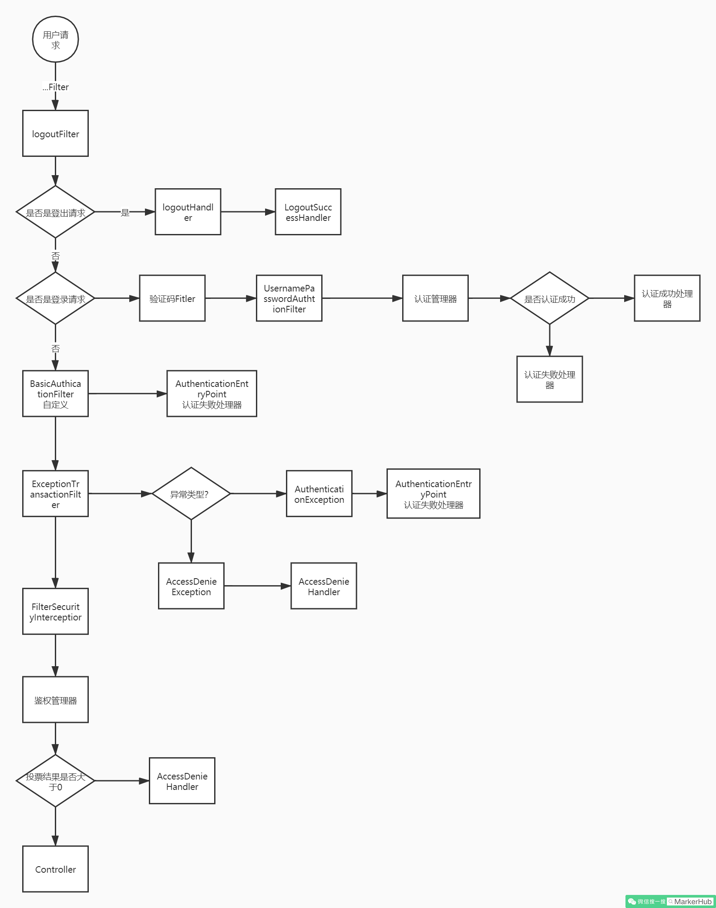
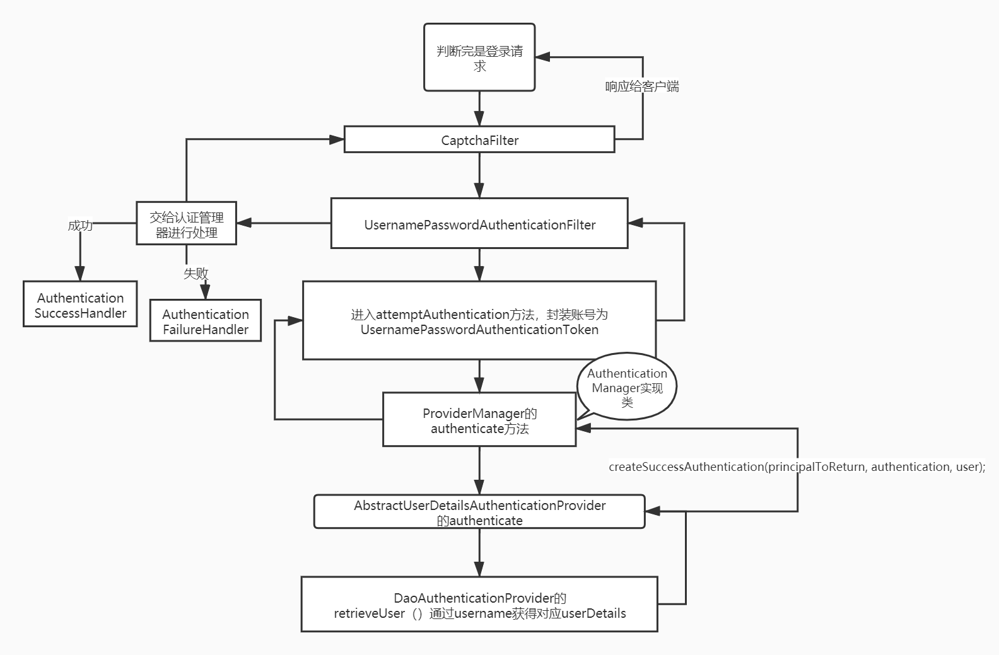

# VueAdmin后端+security+jwt

## 整合MyBatisPlus

> 代码生成

```java
 // 策略配置
        StrategyConfig strategy = new StrategyConfig();
        strategy.setNaming(NamingStrategy.underline_to_camel);
        strategy.setColumnNaming(NamingStrategy.underline_to_camel);
        strategy.setSuperEntityClass("BaseEntity");
        strategy.setEntityLombokModel(true);
        strategy.setRestControllerStyle(true);
        // 公共父类
        strategy.setSuperControllerClass("BaseController");
        // 写于父类中的公共字段
        strategy.setSuperEntityColumns("id", "created", "updated", "statu");
        strategy.setInclude(scanner("表名，多个英文逗号分割").split(","));
        strategy.setControllerMappingHyphenStyle(true);
//        strategy.setTablePrefix("sys_");//动态调整
        mpg.setStrategy(strategy);
        mpg.setTemplateEngine(new FreemarkerTemplateEngine());
```

## 全局异常处理

```java
package com.markerhub.common.exception;

import com.markerhub.common.lang.Result;
import lombok.extern.slf4j.Slf4j;
import org.springframework.http.HttpStatus;
import org.springframework.validation.BindingResult;
import org.springframework.validation.ObjectError;
import org.springframework.web.bind.MethodArgumentNotValidException;
import org.springframework.web.bind.annotation.ExceptionHandler;
import org.springframework.web.bind.annotation.ResponseStatus;
import org.springframework.web.bind.annotation.RestControllerAdvice;

@Slf4j
@RestControllerAdvice
public class GlobalExceptionHandler {

   //

   // 实体校验异常捕获
   @ResponseStatus(HttpStatus.BAD_REQUEST)
   @ExceptionHandler(value = MethodArgumentNotValidException.class)
   public Result handler(MethodArgumentNotValidException e) {

      BindingResult result = e.getBindingResult();
      ObjectError objectError = result.getAllErrors().stream().findFirst().get();

      log.error("实体校验异常：----------------{}", objectError.getDefaultMessage());
      return Result.fail(objectError.getDefaultMessage());
   }

   @ResponseStatus(HttpStatus.BAD_REQUEST)
   @ExceptionHandler(value = IllegalArgumentException.class)
   public Result handler(IllegalArgumentException e) {
      log.error("Assert异常：----------------{}", e.getMessage());
      return Result.fail(e.getMessage());
   }

   @ResponseStatus(HttpStatus.BAD_REQUEST)
   @ExceptionHandler(value = RuntimeException.class)
   public Result handler(RuntimeException e) {
      log.error("运行时异常：----------------{}", e.getMessage());
      return Result.fail(e.getMessage());
   }

}
```

上面我们捕捉了几个异常：

- ShiroException：shiro抛出的异常，比如没有权限，用户登录异常

- IllegalArgumentException：处理Assert的异常

- MethodArgumentNotValidException：处理实体校验的异常

- RuntimeException：捕捉其他异常

## 整合Spring Security



流程说明：

1. 客户端发起一个请求，进入 Security 过滤器链。
2. 当到 LogoutFilter 的时候判断是否是登出路径，如果是登出路径则到 logoutHandler ，如果登出成功则到 logoutSuccessHandler 登出成功处理。如果不是登出路径则直接进入下一个过滤器。
3. 当到 UsernamePasswordAuthenticationFilter 的时候判断是否为登录路径，如果是，则进入该过滤器进行登录操作，如果登录失败则到 AuthenticationFailureHandler ，登录失败处理器处理，如果登录成功则到 AuthenticationSuccessHandler 登录成功处理器处理，如果不是登录请求则不进入该过滤器。
4. 进入认证BasicAuthenticationFilter进行用户认证，成功的话会把认证了的结果写入到SecurityContextHolder中SecurityContext的属性authentication上面。如果认证失败就会交给AuthenticationEntryPoint认证失败处理类，或者抛出异常被后续ExceptionTranslationFilter过滤器处理异常，如果是AuthenticationException就交给AuthenticationEntryPoint处理，如果是AccessDeniedException异常则交给AccessDeniedHandler处理。
5. 当到 FilterSecurityInterceptor 的时候会拿到 uri ，根据 uri 去找对应的鉴权管理器，鉴权管理器做鉴权工作，鉴权成功则到 Controller 层，否则到 AccessDeniedHandler 鉴权失败处理器处理。

Spring Security 实战干货：必须掌握的一些内置 Filter：https://blog.csdn.net/qq_35067322/article/details/102690579

`FilterComparator` 维护了一个顺序的注册表 `filterToOrder` 。

> 需要了解的几个组件：

- LogoutFilter  - 登出过滤器

- logoutSuccessHandler - 登出成功之后的操作类

- UsernamePasswordAuthenticationFilter  - from提交用户名密码登录认证过滤器

- AuthenticationFailureHandler  - 登录失败操作类

- AuthenticationSuccessHandler  - 登录成功操作类

- BasicAuthenticationFilter - Basic身份认证过滤器

- SecurityContextHolder - 安全上下文静态工具类

- AuthenticationEntryPoint - 认证失败入口

- ExceptionTranslationFilter - 异常处理过滤器

- AccessDeniedHandler - 权限不足操作类

- FilterSecurityInterceptor - 权限判断拦截器、出口

### 引入Security与jwt

```xml
		<!-- springboot security -->
        <dependency>
            <groupId>org.springframework.boot</groupId>
            <artifactId>spring-boot-starter-security</artifactId>
        </dependency>
        <dependency>
            <groupId>org.springframework.boot</groupId>
            <artifactId>spring-boot-starter-data-redis</artifactId>
        </dependency>
        <!-- jwt -->
        <dependency>
            <groupId>io.jsonwebtoken</groupId>
            <artifactId>jjwt</artifactId>
            <version>0.9.1</version>
        </dependency>
        <dependency>
            <groupId>com.github.axet</groupId>
            <artifactId>kaptcha</artifactId>
            <version>0.0.9</version>
        </dependency>
        <!-- hutool工具类-->
        <dependency>
            <groupId>cn.hutool</groupId>
            <artifactId>hutool-all</artifactId>
            <version>5.3.3</version>
        </dependency>
        <dependency>
            <groupId>org.apache.commons</groupId>
            <artifactId>commons-lang3</artifactId>
            <version>3.11</version>
        </dependency>
```

通过配置文件来设置默认的用户名和密码

```yml
spring:
  security:
    user:
      name: user
      password: 111111
```

在UsernamePasswordAuthenticationFilter之前自定义一个图片过滤器CaptchaFilter，提前校验验证码是否正确，这样我们就可以使用UsernamePasswordAuthenticationFilter了，然后登录正常或失败我们都可以通过对应的Handler来返回我们特定格式的封装结果数据。

### 生成验证码

首先我们先生成验证码，之前我们已经引用了google的验证码生成器，我们先来配置一下图片验证码的生成规则：

- com.markerhub.config.KaptchaConfig

```java
@Configuration
public class KaptchaConfig {

   @Bean
   DefaultKaptcha producer() {
      Properties properties = new Properties();
      properties.put("kaptcha.border", "no");
      properties.put("kaptcha.textproducer.font.color", "black");
      properties.put("kaptcha.textproducer.char.space", "4");
      properties.put("kaptcha.image.height", "40");
      properties.put("kaptcha.image.width", "120");
      properties.put("kaptcha.textproducer.font.size", "30");

      Config config = new Config(properties);
      DefaultKaptcha defaultKaptcha = new DefaultKaptcha();
      defaultKaptcha.setConfig(config);

      return defaultKaptcha;
   }

}
```

```java
@Autowired
Producer producer;

@GetMapping("/captcha")
public Result captcha() throws IOException {

   String key = UUID.randomUUID().toString();
   String code = producer.createText();

   // 为了测试
   key = "aaaaa";
   code = "11111";

   BufferedImage image = producer.createImage(code);
   ByteArrayOutputStream outputStream = new ByteArrayOutputStream();
   ImageIO.write(image, "jpg", outputStream);

   BASE64Encoder encoder = new BASE64Encoder();
   String str = "data:image/jpeg;base64,";

   String base64Img = str + encoder.encode(outputStream.toByteArray());

   redisUtil.hset(Const.CAPTCHA_KEY, key, code, 120);

   return Result.succ(
         MapUtil.builder()
               .put("token", key)
               .put("captchaImg", base64Img)
               .build()

   );
}
```

### 身份认证



> 封装权限

- UserDetailsServiceImpl

```java
@Override
public UserDetails loadUserByUsername(String username) throws UsernameNotFoundException {

   SysUser sysUser = sysUserService.getByUsername(username);
   if (sysUser == null) {
      throw new UsernameNotFoundException("用户名或密码不正确");
   }
   return new AccountUser(sysUser.getId(), sysUser.getUsername(), sysUser.getPassword(), getUserAuthority(sysUser.getId()));
}
```

- JWTAuthenticationFilter(每次请求根据token获得用户信息和权限)

```java
@Override
protected void doFilterInternal(HttpServletRequest request, HttpServletResponse response, FilterChain chain) throws IOException, ServletException {

   String jwt = request.getHeader(jwtUtils.getHeader());
   if (StrUtil.isBlankOrUndefined(jwt)) {
      chain.doFilter(request, response);
      return;
   }

   Claims claim = jwtUtils.getClaimByToken(jwt);
   if (claim == null) {
      throw new JwtException("token 异常");
   }
   if (jwtUtils.isTokenExpired(claim)) {
      throw new JwtException("token已过期");
   }

   String username = claim.getSubject();
   // 获取用户的权限等信息

   SysUser sysUser = sysUserService.getByUsername(username);
   UsernamePasswordAuthenticationToken token
         = new UsernamePasswordAuthenticationToken(username, null, userDetailService.getUserAuthority(sysUser.getId()));

   SecurityContextHolder.getContext().setAuthentication(token);

   chain.doFilter(request, response);
}
```

最后通过@PreAuthorize("hasAuthority('sys:user:list')")实现接口的权限控制

## 部署项目

> 编写DockerFile

```dockerfile
FROM java:8

EXPOSE 8081

#默认路径是根目录
ADD vueadmin-java-0.0.1-SNAPSHOT.jar app.jar
RUN bash -c 'touch /app.jar'

ENTRYPOINT ["java", "-jar", "/app.jar", "--spring.profiles.active=link"]
```

> 配置nginx

配置挂载目录

1. 设置html目录(将前端项目打包放进去)
2. 配置nginx.conf

```nginx

worker_processes  1;

events {
    worker_connections  1024;
}


http {
    include       mime.types;
    default_type  application/octet-stream;

    sendfile        on;
    keepalive_timeout  65;
    server {
        listen       80;
        server_name  localhost;

        location / {
            root   /usr/share/nginx/html;
	   		try_files $uri $uri/ /index.html last;
            index  index.html index.htm;

        }
        error_page   500 502 503 504  /50x.html;
        location = /50x.html {
            root   html;
        }

    }
}
```

> 配置docker-compose.yml

```yml
version: "3"
services:
  nginx:
    image: nginx:latest
    ports:
      - 80:80
    volumes:
      - /root/nginx/html:/usr/share/nginx/html
      - /root/nginx/nginx.conf:/etc/nginx/nginx.conf
    privileged: true
  mysql:
    image: mysql:5.7.27
    ports:
      - 3306:3306
    environment: # 指定用户root的密码
      - MYSQL_ROOT_PASSWORD=admin
  redis:
    image: redis:latest
  vueadmin:
    image: vueadmin:latest
    build: . # 表示以当前目录下的Dockerfile开始构建镜像
    ports:
      - 8081:8081
    depends_on:
      - mysql
      - redis
```

更改项目中的mysql和redis路径，使用服务名进行访问

运行docker-compose up -d

docker run --restart=always --add-host nacos.sqkf.vip:192.10.10.21 --add-host sentinel.sqkf.vip:192.10.10.21 -it -p 56079:56080 --name 名字 镜像名
