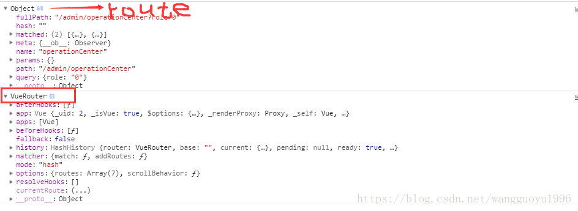
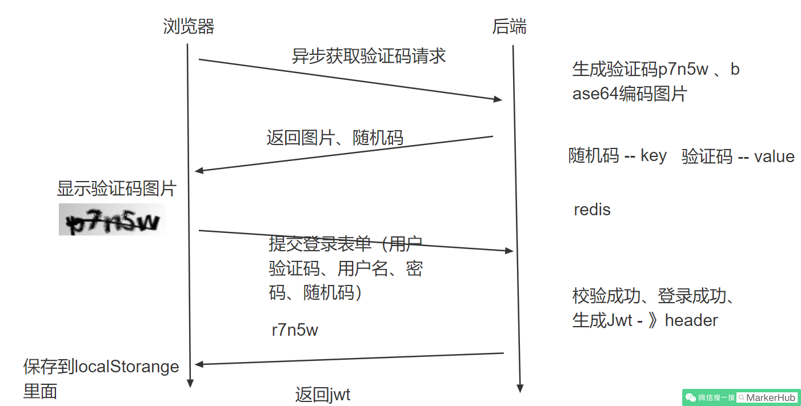
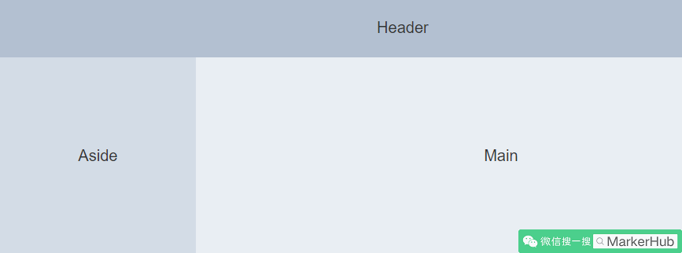

# Vueadmin开发记录

## 配置环境

> 安装node.js

1、首先我们上node.js官网([https://nodejs.org/zh-cn/](https://nodejs.org/zh-cn/?fileGuid=HXqVy6jx8qkWKPJq))，下载最新的长期版本，直接运行安装完成之后，我们就已经具备了node和npm的环境啦。

2、接下来，我们安装vue的环境

```shell
# 安装淘宝npm
npm install -g cnpm --registry=https://registry.npm.taobao.org
# vue-cli 安装依赖包
cnpm install --g vue-cli
# 打开vue的可视化管理工具界面vue ui
vue ui
```

上面我们分别安装了淘宝npm，cnpm是为了提高我们安装依赖的速度。vue ui是@vue/cli3.0增加一个可视化项目管理工具，可以运行项目、打包项目，检查等操作。对于初学者来说，可以少记一些命令，哈哈。 

可以在vue ui里进行创建项目

> 安装Element

接下来我们引入element-ui组件（[https://element.eleme.cn](https://element.eleme.cn/#/zh-CN/component/installation?fileGuid=HXqVy6jx8qkWKPJq)），这样我们就可以获得好看的vue组件，开发好看的后台管理系统的界面啦。

cnpm install element-ui --save

在main.js中引入

import Element from 'element-ui'

import "element-ui/lib/theme-chalk/index.css"

Vue.use(Element)

组件库： https://element.eleme.cn/#/zh-CN/component/layout

> 安装axios、qs、mockjs

- **axios**：一个基于 promise 的 HTTP 库，类ajax

- **qs**：查询参数序列化和解析库

- **mockjs**：为我们生成随机数据的工具库

cnpm install axios --save

import axios from 'axios'

Vue.prototype.$axios = axios 

安装qs，mockjs

cnpm install qs --save

cnpm install mockjs --save-dev

require("./mock") //引入mock数据，关闭则注释该行

## 配置路由

类似controller的mapper路径进行页面跳转

```js
import Vue from 'vue'
import VueRouter from 'vue-router'
import Home from '../views/Home.vue'
import axios from '../axios'
import store from '../store/index'

Vue.use(VueRouter)

const routes = [
  {
    path: '/',
    name: 'Home',
    component: Home,
    children: [
      {
        path: '/index',
        name: 'Index',
        component: () => import('@/views/Index')
      },
      {
        path: '/userCenter',
        name: 'UserCenter',
        component: () => import('@/views/UserCenter')
      }
    ]
  },
  {
    path: '/login',
    name: 'Login',
    component: () => import('@/views/Login')
  }
]

const router = new VueRouter({
  mode: 'history',
  base: process.env.BASE_URL,
  routes
})
```

main.js中引入即可使用，外壳页面App.vue是所有页面最初的渲染页面，App.vue被main.js中挂载到index.html进行渲染

```vue
<!-- router-link相当于a标签进行页面跳转，但是是根据router编写的路由进行跳转 -->
<router-link to="/index" >
  <el-menu-item index="Index" @click="selectMenu({name: 'Index', title: '首页'})">
    <template slot="title">
      <i class="el-icon-s-home"></i>
      <span slot="title">首页</span>
    </template>
  </el-menu-item>
</router-link>
<!-- 用来显示路由内容，app.vue只需要写这一个标签 -->
<router-view/>
```

> home.vue的路由使用

在home.vue中将sideMenu和tabs抽出作为组件，home只需要引入即可

在element组件库挑选需要的布局容器

main中的页面就是根据sideMenu的按钮进行router-link的跳转，home页面中只需要写

```vue
<el-main>
    <Tabs></Tabs>
    <div style="margin: 0 15px;">
        <router-view/>
    </div>
</el-main>
```

> router.beforeEach

router.beforeEach((to, from, next) => { })

可以使用该方法在每次路由前进行判断，或者绑定动态路由

router.options.routes	可以获取当前绑定的路由，就是传入的routes

router.addRoutes(newRoutes)进行绑定即可

```js
//VueRouter的源码
export declare class VueRouter {
  constructor(options?: RouterOptions)
//这些都是router的配置参数，		
  app: Vue
  options: RouterOptions
  mode: RouterMode
  currentRoute: Route
  
  beforeEach(guard: NavigationGuard): Function
  afterEach(hook: (to: Route, from: Route) => any): Function
  push(location: RawLocation): Promise<Route>
  replace(location: RawLocation): Promise<Route>
  addRoutes(routes: RouteConfig[]): void
  addRoute(route: RouteConfig): void
  getRoutes(): RouteRecordPublic[]
}
```

> $route与$router

$router就是全局路由对象，在router(index.js)中

```js
const router = new VueRouter({
  mode: 'history',
  base: process.env.BASE_URL,
  routes
})
```

$route作为vue实例的一个响应式属性

route相当于当前正在跳转的路由对象。。可以从里面获取name,path,params,query等。。



| 声明式                    | 编程式             |
| ------------------------- | ------------------ |
| `<router-link :to="...">` | `router.push(...)` |

可以在跳转路由是进行传递参数，这样route就可以获取

具体用法： https://router.vuejs.org/zh/guide/essentials/navigation.html

## 登录界面

- 获取登录验证码

- 提交登录表单完成登录



> mock.js给假数据

```js
// 引入mockjsconst
const Mock = require('mockjs')

const Random = Mock.Random

let Result = {
    code: 200,
    msg: '操作成功',
    data: null
}

Mock.mock('/captcha','get',()=>{
    Result.data = {
        token: Random.string(32),
        captchaImg: Random.dataImage('100x40','p1ns4')
    }
    return Result
})

Mock.mock('/login','post',()=>{
    Result.code = 200
    Result.msg = '登录成功'
    return Result
})
```

具体用法

http://mockjs.com/examples.html

https://github.com/nuysoft/Mock/wiki/Mock.Random

> 登录界面

使用element的表单组件,选择自己需要的

```vue
<el-form :model="ruleForm" :rules="rules" ref="ruleForm" label-width="100px" class="demo-ruleForm">
  <el-form-item label="活动名称" prop="name">
    <el-input v-model="ruleForm.name"></el-input>
  </el-form-item>
  <el-form-item label="活动区域" prop="region">
    <el-select v-model="ruleForm.region" placeholder="请选择活动区域">
      <el-option label="区域一" value="shanghai"></el-option>
      <el-option label="区域二" value="beijing"></el-option>
    </el-select>
  </el-form-item>
  <el-form-item label="活动时间" required>
    <el-col :span="11">
      <el-form-item prop="date1">
        <el-date-picker type="date" placeholder="选择日期" v-model="ruleForm.date1" style="width: 100%;"></el-date-picker>
      </el-form-item>
    </el-col>
    <el-col class="line" :span="2">-</el-col>
    <el-col :span="11">
      <el-form-item prop="date2">
        <el-time-picker placeholder="选择时间" v-model="ruleForm.date2" style="width: 100%;"></el-time-picker>
      </el-form-item>
    </el-col>
  </el-form-item>
  <el-form-item label="即时配送" prop="delivery">
    <el-switch v-model="ruleForm.delivery"></el-switch>
  </el-form-item>
  <el-form-item label="活动性质" prop="type">
    <el-checkbox-group v-model="ruleForm.type">
      <el-checkbox label="美食/餐厅线上活动" name="type"></el-checkbox>
      <el-checkbox label="地推活动" name="type"></el-checkbox>
      <el-checkbox label="线下主题活动" name="type"></el-checkbox>
      <el-checkbox label="单纯品牌曝光" name="type"></el-checkbox>
    </el-checkbox-group>
  </el-form-item>
  <el-form-item label="特殊资源" prop="resource">
    <el-radio-group v-model="ruleForm.resource">
      <el-radio label="线上品牌商赞助"></el-radio>
      <el-radio label="线下场地免费"></el-radio>
    </el-radio-group>
  </el-form-item>
  <el-form-item label="活动形式" prop="desc">
    <el-input type="textarea" v-model="ruleForm.desc"></el-input>
  </el-form-item>
  <el-form-item>
    <el-button type="primary" @click="submitForm('ruleForm')">立即创建</el-button>
    <el-button @click="resetForm('ruleForm')">重置</el-button>
  </el-form-item>
</el-form>
<script>
  export default {
    data() {
      return {
        ruleForm: {
          name: '',
          region: '',
          date1: '',
          date2: '',
          delivery: false,
          type: [],
          resource: '',
          desc: ''
        },
        rules: {
          name: [
            { required: true, message: '请输入活动名称', trigger: 'blur' },
            { min: 3, max: 5, message: '长度在 3 到 5 个字符', trigger: 'blur' }
          ],
          region: [
            { required: true, message: '请选择活动区域', trigger: 'change' }
          ],
          date1: [
            { type: 'date', required: true, message: '请选择日期', trigger: 'change' }
          ],
          date2: [
            { type: 'date', required: true, message: '请选择时间', trigger: 'change' }
          ],
          type: [
            { type: 'array', required: true, message: '请至少选择一个活动性质', trigger: 'change' }
          ],
          resource: [
            { required: true, message: '请选择活动资源', trigger: 'change' }
          ],
          desc: [
            { required: true, message: '请填写活动形式', trigger: 'blur' }
          ]
        }
      };
    },
    methods: {
      submitForm(formName) {
        this.$refs[formName].validate((valid) => {
          if (valid) {
            alert('submit!');
          } else {
            console.log('error submit!!');
            return false;
          }
        });
      },
      resetForm(formName) {
        this.$refs[formName].resetFields();
      }
    }
  }
</script>
```

> 获得验证码

```js
getCaptcha() {
    this.$axios.get("/captcha").then(res => {
        this.loginForm.token = res.data.data.token;
        this.captchaImg = res.data.data.captchaImg;
    })
}
```

> 存放token

```js
submitForm(formName) {
    this.$refs[formName].validate((valid) => {
        if (valid) {
            this.$axios.post("/login",this.loginForm).then(res => {
                const jwt = res.headers['authorization']

                this.$store.commit('SET_TOKEN', jwt)
                this.$router.push('/index')
            })
        } else {
            console.log('error submit!!');
            return false;
        }
    });
},
```

### 使用store(Vuex)

```js
import Vue from 'vue'
import Vuex from 'vuex'
import menus from "./modules/menus";

Vue.use(Vuex)

export default new Vuex.Store({
  state: {
    token: ''
  },
  mutations: {
    SET_TOKEN: ((state, token) => {
      state.token = token
      localStorage.setItem('token',token)
    })
  },
  actions: {
  },
  modules: {
    menus
  }
})
```

用来管理状态，如token，菜单，权限等

```js
//获取
this.$store.state.token
//修改，通过mutations中定义的方法
this.$store.commit('SET_TOKEN', jwt)
```

模块化时，在index.js的modules中引入

获取的时候需要变为：**this.$store.state.模块名.menulist**

### 定义axios拦截器

这里有个问题，那么如果登录失败，我们是需要弹窗显示错误的，比如验证码错误，用户名或密码不正确等。不仅仅是这个登录接口，所有的接口调用都会有这个情况，所以我们想做个拦截器，对返回的结果进行分析，如果是异常就直接弹窗显示错误，这样我们就省得每个接口都写一遍了。

```js
import axios from "axios";
import router from "./router";
import Element from "element-ui";

// axios.defaults.baseURL = "http://localhost:8081"

const request = axios.create({
    timeout: 5000,
    headers: {
        'Content-Type': 'application/json; charset=utf-8'
    }
})
//在每次请求时，都添加token
request.interceptors.request.use(config => {
    config.headers['Authorization'] = localStorage.getItem("token")
    return config
})

request.interceptors.response.use(response => {
    let res = response.data
    if (res.code === 200) {
        return response
    } else {
        Element.Message.error(res.msg ? res.msg : '系统异常')
        return Promise.reject(res.msg)
    }
}, error => {
        if (error.response.data) {
            error.massage = error.response.data.msg
        }
        if (error.response.status === 401) {
            router.push("/login")
        }
        if (error.response.status === 400) {
            Element.Message.error('dfsasfa')
        }

        Element.Message.error(error.massage, {duration:3000})
        return Promise.reject(error)
    }
)

export default request
```

## 后台管理页面开发

一般来说，管理系统的页面我们都是头部是一个简单的信息展示系统名称和登录用户信息，然后中间的左边是菜单导航栏，右边是内容，对应到elementui的组件中，我们可以找到这个Container 布局容器用于布局，方便快速搭建页面的基本结构。

而我们采用这个布局：



一般来说Header和Aside都是不会变化的，只有Main部分会跟着链接变化而变化，所以我们可以提炼公共部分出来，放在Home.vue中，然后Main部分放在Index.vue中

那么问题来了，我们如何才能做到点击左边的Aside，然后局部刷新Main中的内容呢？在Vue中，我们可以通过嵌套路由（子路由）的形式。也就是我们需要重新定义路由，一级路由是Home.vue，Index.vue是作为Home.vue页面的子路由，然后Home.vue中我们通过**router-view**来展示Index.vue的内容即可。

```js
{
  path: '/',
  name: 'Home',
  component: Home,
//只需要在home里添加子路由，在访问index的时候，相当于访问home，home里的router-view进行显示
  children: [
    {
      path: '/index',
      name: 'Index',
      component: () => import('@/views/Index')
    },
    {
      path: '/userCenter',
      name: 'UserCenter',
      component: () => import('@/views/UserCenter')
    }
  ]
}
```

### tabs

先到element中挑选可删减的tab

```js
editableTabsValue: '2',//当前选择的tab
editableTabs: [{//所有tab
 title: 'Tab 1',
 name: '1',
 content: 'Tab 1 content'
}]
```

将以上tab的值作为状态存在store的menu.js中，通过sidemenu的菜单按钮依次添加到editableTabs

在使用menu的默认active属性绑定tabs的选择值，实现menu和tab的联动，再根据menu的路由将main区域的内容变为对应的views

```js
<el-menu
	:default-active="editableTabsValue"
```

### 按钮权限控制

上面的菜单、角色、用户有增删改查操作，但是不是每个用户都有权限的，没权限的用户我们应该隐藏按钮，因此我们需要通过条件来判断按钮是否应该显示，那么应该怎么定义一个方法可以让全局都能使用呢？

我们再src下面新建一个js文件用于定义一个全局使用的方法：

- src/globalFun.js

  ```js
  import Vue from 'vue'
  Vue.mixin({
      methods: {
          hasAuth(perm) {
              let authority = this.$store.state.menus.permList
              return authority.indexOf(perm) > -1
          }
      }
  })
  ```

- src\main.js

```
import gobal from "./globalFun"
```

这样全局就可以使用啦，比如我们在新增按钮这里做判断：

- src/views/sys/Menu.vue

```vue
<el-button type="primary" @click="dialogFormVisible = true" v-if="hasAuth('sys:menu:save')">
    新增
</el-button>
```

通过v-if来判断返回是否为true从而判断是否显示。

