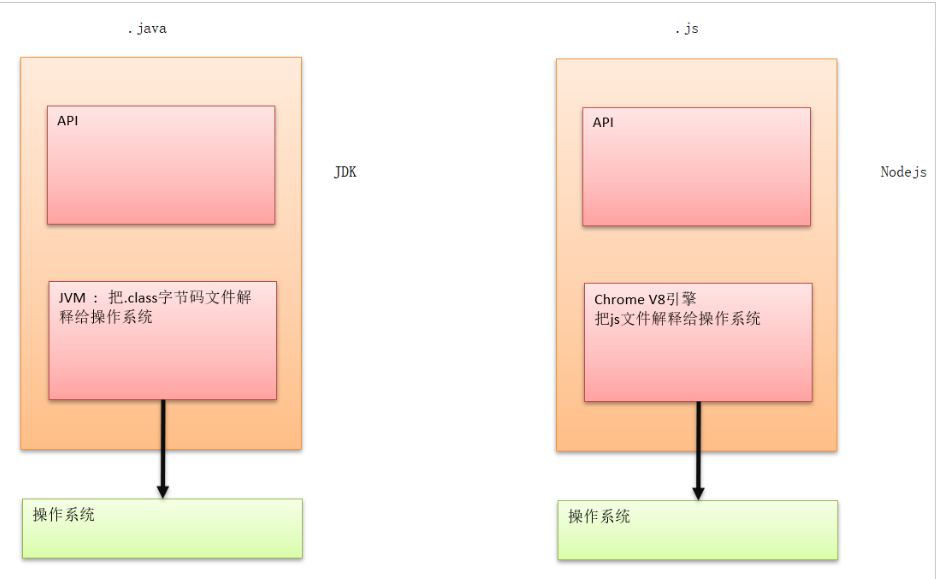
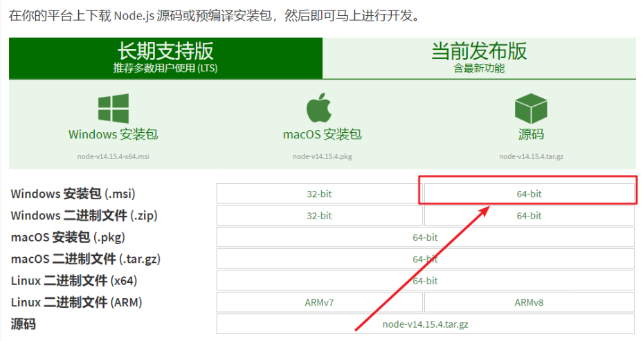
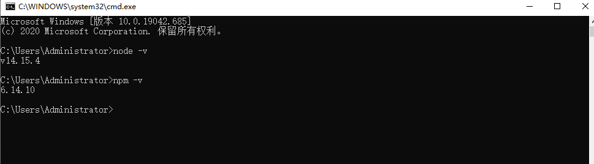
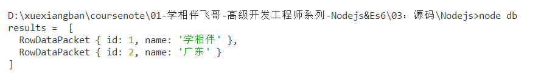
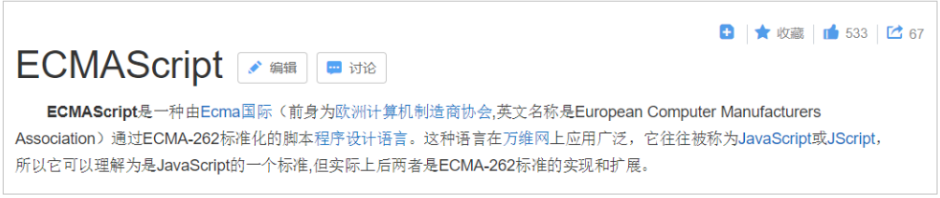
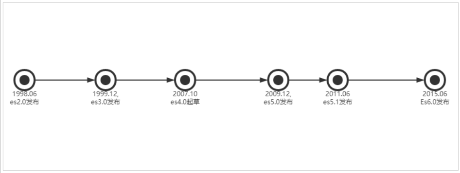
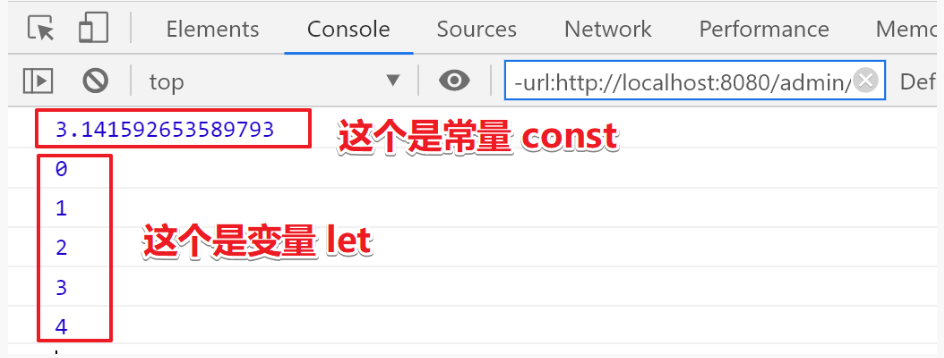
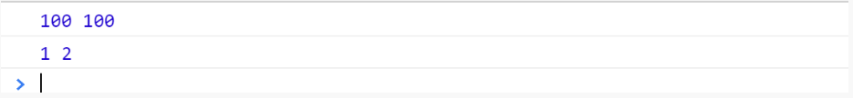
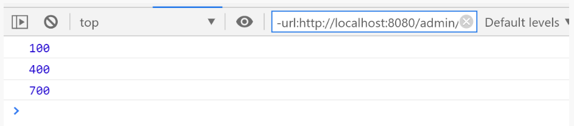
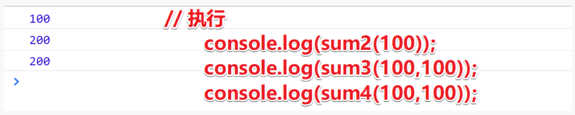

# 1、Nodejs

## 1.1、Nodejs介绍与安装

目标： 了解nodejs、并且在本地安装好这个软件
官网： http://nodejs.cn/     http://nodejs.cn/api/

介绍：

```
Node 是一个让 JavaScript 运行在服务端的开发平台，它让 JavaScript 成为与PHP、Python、Perl、Ruby 等服务端语言平起平坐的脚本语言。  发布于2009年5月，由Ryan Dahl开发，实质是对Chrome V8引擎进行了封装。
简单的说 Node.js 就是运行在服务端的 JavaScript。 Node.js 是一个基于Chrome JavaScript 运行时建立的一个平台。底层架构是：javascript. 文件后缀：.js
Node.js是一个事件驱动I/O服务端JavaScript环境，基于Google的V8引擎，V8引擎执行Javascript的速度非常快，性能非常好。
```



下载对应你系统的Node.js版本:
下载地址：https://nodejs.org/zh-cn/download
帮助文档：https://nodejs.org/zh-cn/docs
关于Nodejs：https://nodejs.org/zh-cn/about



安装默认安装即可，安装完成之后，查看是否安装成功：

```
node -v
```


**小结**

> Nodejs是一门计算机语言，运行在系统中的v8（jvm）引擎中。文件后缀是 `js` 运行的命令是：node

## 1.2、Nodejs入门

目标： 控制台输出字符串、使用函数、进行模块化编程

### 1.2.1、快速入门-Hello World

1、创建文件夹 nodejs
2、创建 helloworld.js

> 类似于java中的`System.out.println("")`

```
console.log('Hello World!!!')
```

运行：`node helloworld.js`

结果：hello world!!!

3、打开命令行终端：Ctrl + Shift + y

浏览器的内核包括两部分核心：

- DOM渲染引擎；
- java script 解析器（js引擎）
- js运行在浏览器内核中的js引擎内部

**小结**

==Node.js是脱离浏览器环境运行的JavaScript程序，基于V8 引擎==

### 1.2.2、Node - 实现请求响应

1、创建 httpserver.js ；

```js
// 导入模块是require 就类似于import java.io 
const http = require('http');
// 1: 创建一个httpserver服务
http.createServer(function(request,response){
    // 浏览器怎么认识hello server!!! 
    response.writeHead(200,{'Content-type':'text/plain'}); //这句话的含义是：告诉浏览器将
    // 以text-plain去解析hello server 这段数据。
    // 给浏览器输出内容
    response.end("<strong>hello server!!!</strong>");
}).listen(8888);
console.log("你启动的服务是：http://localhpst:8888以启动成功!!");
// 2: 监听一端口8888
// 3: 启动运行服务 node httpserver.js
// 4: 在浏览器访问http://localhost:8888
```

2、运行服务器程序；

```
node httpserver.js
```

3、服务器启动成功后，在浏览器中输入：http://localhost:8888/ 查看webserver成功运行，并输出html页面
4、停止服务：ctrl + c

### 1.2.3、Node-操作MYSQL数据库

参考：https://www.npmjs.com/package/mysql

1：安装mysql依赖

```
npm install mysql
```

2：定义db.js进行操作

```js
//1: 导入mysql依赖包,  mysql属于第三方的模块就类似于 java.sql一样的道理
var mysql = require("mysql");
// 1: 创建一个mysql的Connection对象
// 2: 配置数据连接的信息 
var connection =mysql.createConnection({
    host:"127.0.0.1",
    port:3306,
    user:"root",
    password:"mkxiaoer",
    database:"testdb"
});
// 3：开辟连接
connection.connect();
// 4: 执行curd
connection.query("select * from kss_user",function(error,results,fields){
    // 如果查询出错，直接抛出
    if(error)throw error;
    // 查询成功
    console.log("results = ",results);
});
// 5: 关闭连接
connection.end();
// 最后一步：运行node db.js 查看效果
```

3：新建数据库:`db_test`和表`kss_user`表

```js 
/*
 Navicat MySQL Data Transfer
 Source Server         : localhost
 Source Server Type    : MySQL
 Source Server Version : 60011
 Source Host           : localhost:3306
 Source Schema         : testdb
 Target Server Type    : MySQL
 Target Server Version : 60011
 File Encoding         : 65001
 Date: 20/01/2021 21:38:55
*/
SET NAMES utf8mb4;
SET FOREIGN_KEY_CHECKS = 0;
-- ----------------------------
-- Table structure for kss_user
-- ----------------------------
DROP TABLE IF EXISTS `kss_user`;
CREATE TABLE `kss_user`  (
  `id` int(11) NOT NULL,
  `name` varchar(255) CHARACTER SET utf8 COLLATE utf8_general_ci NULL DEFAULT NULL,
  PRIMARY KEY (`id`) USING BTREE
) ENGINE = InnoDB CHARACTER SET = utf8 COLLATE = utf8_general_ci ROW_FORMAT = Compact;
-- ----------------------------
-- Records of kss_user
-- ----------------------------
INSERT INTO `kss_user` VALUES (1, '学相伴');
INSERT INTO `kss_user` VALUES (2, '广东');
SET FOREIGN_KEY_CHECKS = 1;
```

4、运行db.js

```
node db
```



> **如果想开发更复杂的基于Node.js的应用程序后台，需要进一步学习Node.js的Web开发相关框架 express，art-template、koa等**

# 03、Es6

## 3.1、ES6的概述



**ECMAScript的快速发展：**



编程语言JavaScript是ECMAScript的实现和扩展 。ECMAScript是由ECMA（一个类似W3C的标准组织）参与进行标准化的语法规范。ECMAScript定义了：

[语言语法] – 语法解析规则、关键字、语句、声明、运算符等。

[类型]– 布尔型、数字、字符串、对象等。

[原型和继承]

内建对象和函数的

[标准库] – [JSON]、[Math]、[数组方法]、[对象自省方法]等。

ECMAScript标准不定义HTML或CSS的相关功能，也不定义类似DOM（文档对象模型）的[Web API]，这些都在独立的标准中进行定义。ECMAScript涵盖了各种环境中JS的使用场景，无论是浏览器环境还是类似[node.js]的非浏览器环境。

ECMAScript标准的历史版本分别是1、2、3、5。

那么为什么没有第4版？其实，在过去确实曾计划发布提出巨量新特性的第4版，但最终却因想法太过激进而惨遭废除（这一版标准中曾经有一个极其复杂的支持泛型和类型推断的内建静态类型系统）。

ES4饱受争议，当标准委员会最终停止开发ES4时，其成员同意发布一个相对谦和的ES5版本，随后继续制定一些更具实质性的新特性。这一明确的协商协议最终命名为“Harmony”，因此，ES5规范中包含这样两句话

ECMAScript是一门充满活力的语言，并在不断进化中。

未来版本的规范中将持续进行重要的技术改进

2009年发布的改进版本ES5，引入了[Object.create()]、[Object.defineProperty()]、[getters]和[setters]、[严格模式]以及[JSON]对象。

ES6: 是JavaScript语言的下一代标准，2015年6月正式发布。它的目标，是使得JavaScript语言可以用来编写复杂的大型应用程序，成为企业级开发语言。

**小结**：

ECMAScript是前端js的语法规范；可以应用在各种js环境中。如：浏览器或者node.js环境。
它有很多版本：es1/2/3/5/6，很多新特性，可以在js环境中使用这些新特性。

## 3.2、ES6的语法：let和const命令

> 变量和常量的严格区分。

**核心代码：**

新建`espro6\demo01.html`如下

```js
<!DOCTYPE html>
<html lang="en">
<head>
    <meta charset="UTF-8">
    <meta name="viewport" content="width=device-width, initial-scale=1.0">
    <meta http-equiv="X-UA-Compatible" content="ie=edge">
    <title>Document</title>
</head>
<body>
    <script>
         // 1： 在javascrit定义数据类型只有一种标识 - var
         // 灵活拷问：js有数据类型吗？
         // 有，string,number,Object, boolean, undefined
         // 什么是语言：电脑内存中，人通过代码和电脑沟通。
         let name = "zhangsan";
         let age = 100;
         let flag = false;   
         //js被骂没常量
         const PI = Math.PI;
         // 修改会报错
         //PI = 1245;
         console.log(PI)
         //var或造成变量穿透
         for(let i=0;i<5;i++){
             console.log(i);
         };
         //console.log("===这里就是变量穿透===>" + i)
    </script>
</body>
</html>
```

双击`espro6/demo01.html`运行如下：



**小结**
let : 可变变量
const 是常量
var：最原始。

## 3.3、ES6的语法：模板字符串

以前： 我们都是使用 ‘’ 或者 “” 来把字符串套起来

现在： `` 【反引号】


第一个用途：基本的字符串格式化。将表达式嵌入字符串中进行拼接。用${}来界定。

```js
//es5    
let name = 'itcast'    
console.log('hello ' + name)    //es6    
const name = 'itcast'    
console.log(`hello ${name}`) //hello itcast
```

第二个用途：在ES5时我们通过反斜杠()来做多行字符串或者字符串一行行拼接。ES6反引号(``)直接搞定。

- 新建一个`espro6\demo02.html`如下：

```html
<!DOCTYPE html>
<html lang="en">
<head>
    <meta charset="UTF-8">
    <meta name="viewport" content="width=device-width, initial-scale=1.0">
    <meta http-equiv="X-UA-Compatible" content="ie=edge">
    <title>模板字符串</title>
</head>
<body>
    <script>
        var username = "张三";
        var age = 30;
        // 1: 原始的做法就是去拼接字符串
        var str = "我名字叫 " + username+",年龄是: "+age;
        console.log(str);  
        // 2:用模板字符串来拯救 注意：这里是 `（飘键） (tab键盘的上面那个键)
        // jdk1.9 
        var str2 = `我名字叫 ${username},年龄是: ${age}`;
        console.log(str2);
    </script>
</body>
</html>
```

## 3.4、ES6的语法：函数默认参数与箭头函数

**函数默认参数**
在方法的参数后面加上一个默认值即可
**核心代码**
双击`espro6/demo03.html`运行如下：

```html
<!DOCTYPE html>
<html lang="en">
<head>
    <meta charset="UTF-8">
    <meta name="viewport" content="width=device-width, initial-scale=1.0">
    <meta http-equiv="X-UA-Compatible" content="ie=edge">
    <title>Document</title>
</head>
<body>
    <script>
        // 默认参数 给参数列表设定初始值
        function add(a =100,b=100) {
            console.log(a,b);    
        }
        // 执行方法，会用默认值填充，打印出来100,200
        add();
        // 覆盖默认值打印  结果是1，2      
        add(1,2);
    </script>
</body>
</html>
```



==**箭头函数**==

箭头函数简化函数的定义，可以让我们不用使用function关键字

```
/*
箭头函数最直观的三个特点。
    1不需要function关键字来创建函数
    2省略return关键字
    3继承当前上下文的 this 关键字
*/
```

<font color=red><b>核心代码</b></font>

双击`espro6/demo04.html`运行如下：

```html
<!DOCTYPE html>
<html lang="en">
<head>
    <meta charset="UTF-8">
    <meta name="viewport" content="width=device-width, initial-scale=1.0">
    <meta http-equiv="X-UA-Compatible" content="ie=edge">
    <title>箭头函数</title>
</head>
<body>
    <script>
        // 箭头函数
        // 它也是一种函数的定义，它简化定义仅此而已。
        // 步骤：1：去掉function  2: 括号后面加箭头。
        // 1:声明式的定义
        function add (){
        };
        // 2:表达式的定义
        var add2 = function(){
        }     
        // 3:箭头函数的定义
        var sum = (a = 100,b = 300)=>{
            console.log(a+b);
        };
        // 这里执行箭头函数
        sum(50,50);
        // 这里执行箭头函数
        sum();
        // 这里执行箭头函数
        sum(400);
    </script>
</body>
</html>
```



**箭头函数深度学习**

双击`espro6/demo05.html`运行如下：

```html
<!DOCTYPE html>
<html lang="en">
<head>
    <meta charset="UTF-8">
    <meta name="viewport" content="width=device-width, initial-scale=1.0">
    <meta http-equiv="X-UA-Compatible" content="ie=edge">
    <title>箭头函数</title>
</head>
<body>
    <script>
        // 箭头函数
        // 它也是一种函数的定义，它简化定义仅此而已。
        // 步骤：1：去掉function  2: 括号后面加箭头。
        // 无参数的函数
        //var sum = function(){
        //}
        // 箭头改造如下
        //var sum = ()=>{}
        // 有参数
        // 第一种情况  一个参数的如下
        //var sum2 = function(a){
        //};
        // 箭头改造如下
        var sum2 = (a)=>{};
        var sum2 = a=>{
            return a;
        };
        // 第二种情况 二个参数的以上,记住括号一定要加
        //var sum3 = function(a,b){
        //    return a + b;
        //};
        // 箭头改造如下
        var sum3 = (a,b)=>{
            return a + b;
        };
        // 第三种情况，如果没有逻辑体，只有返回值可以简化如下
        //var sum4 = function(a,b){
        //    return a + b;
        //};
        // 箭头改造如下
        var sum4 = (a,b)=>a+b
        // 执行
        console.log(sum2(100));
        console.log(sum3(100,100));
        console.log(sum4(100,100));
    </script>
</body>
</html>
```



## 3.5、ES6的语法：对象初始化简写

<font color=red><b>核心代码</b></font>

> 它是指：如果一个对象中的key和value的名字一样的情况下可以定义成一个。

- 双击`espro6\demo06.html`

```html
<!DOCTYPE html>
<html lang="en">
<head>
<meta charset="UTF-8">
<meta name="viewport" content="width=device-width, initial-scale=1.0">
<meta http-equiv="X-UA-Compatible" content="ie=edge">
<title>对象简写</title>
</head>
<body>
<script>
    function person(name, age) {
        //return {name:name,age:age};
        // 对象简写
        return { name, age };
    };
    // 调用和执行
    var json = person("小花花美美", 20);
    console.log(json.name, json.age);
    //========================= 实战应用 =========================
    //<button onclick="login()">登录</button>
    function login() {
        var username = $("#username").val();
        var password = $("#password").val();
        // 发送ajax
        $.ajax({
            type: "post",
            // 对象简写
            data: { username, password },
            // 原始写分
            //data:{username:username,password:password},
            success() {
            }
        });
    }
</script>
</body>
</html>
```

## 3.6、ES6的语法：对象解构

<font color=red><b>核心代码</b></font>

>  对象解构 —- es6提供一些获取快捷获取对象属性和行为方式

双击`espro6\demo07.html`

```html
<!DOCTYPE html>
<html lang="en">
<head>
    <meta charset="UTF-8">
    <meta name="viewport" content="width=device-width, initial-scale=1.0">
    <meta http-equiv="X-UA-Compatible" content="ie=edge">
    <title>对象解构</title>
</head>
<body>
    <script>
        // 对象解构 --- es6提供一些获取快捷获取对象属性和行为方式
        var person = {
            name:'zhangsan',
            age:32,
            language:"cn",
            // 函数也有处理
            /* say:function(){
                console.log(this.name+"年龄是：" + this.age);
            }   */
            /* say:()=>{
                console.log(this.name+"年龄是：" + this.age);
            }  */
            say(){
                console.log(this.name+"年龄是：" + this.age);
            } 
        };
        // ===========================传统的做法========================
        var name = person.name;
        var age = person.age;
        person.say();
        // ===========================对象解构做法========================
        //es6的做法 前提：默认情况name,age必须是jsonkey.
        var {name,age} = person;
        console.log(name,age);
        // 可以用冒号取小名
        var {name,age,language:lan} = person;
        console.log(name,age,lan);
    </script>
</body>
</html>
```

## 3.7、ES6的语法：传播操作符【…】

> 把一个对象的属性传播到另外一个对象中

**Spread Operator**

<font color=red><b>核心代码</b></font>

双击`espro6\demo08.html`

```html
<!DOCTYPE html>
<html lang="en">
<head>
    <meta charset="UTF-8">
    <meta name="viewport" content="width=device-width, initial-scale=1.0">
    <meta http-equiv="X-UA-Compatible" content="ie=edge">
    <title>ES6的语法：传播操作符【...】</title>
</head>
<body>
    <script>
        // 1： 定义一个对象
        var person1 = {
            name: '小飞飞',
            age: 16,
        };
        // 2： 对象解构
        var {name,age} = person1;
        // =========================== ... 对象融合=====================
        var person2 = {
            ...person1,
            gender:1,
            tel:13478900
        };
        console.log(person2);
        // =========================== ... 对象取值=====================
        // ... 对象取值
        var person3 = {
            name:"李四",
            gender:1,
            tel:"11111",
            address:'广州'
        };
        // ...person4 把剩下没取走给我。
        var {name,gender,...person4} = person3;
        console.log(name)
        console.log(age)
        console.log(person4)
        // =================场景分析 -----伪代码========================
        // 模拟后台：异步查询返回用户数据 如下：
        function findUsers(){
            $.get("xxxxx",function(res){
                var res = {
                    pages:11,
                    pageSize:10,
                    pageNo:1,
                    firstFlag:true,
                    lastFlag:false,
                    total:123,
                    data:[{},{},{},{}],
                };
                // ==========================对象 ... 取值===============
                var {data:users,...pagesjon} = res;
                //等价于
                /*  var users = res.data;
                   var pagesjon = {
                    res = {
                        pages:11,
                        pageSize:10,
                        pageNo:1,
                        firstFlag:true,
                        lastFlag:false,
                        total:123,
                    }; */
            })
        }
    </script>
</body>
</html>
```

## 3.8、ES6的语法：数组map和reduce方法使用(**了解**)

**目标**：数组中map方法的应用场景

**讲解**：

数组中新增了map和reduce方法。

<strong style="font-size:24px">map()</strong>

方法可以将原数组中的所有元素通过一个函数进行处理并放入到一个新数组中并返回该新数组。

举例：有一个字符串数组，希望转为int数组

```html
<!DOCTYPE html>
<html lang="en">
<head>
    <meta charset="UTF-8">
    <meta name="viewport" content="width=device-width, initial-scale=1.0">
    <meta http-equiv="X-UA-Compatible" content="ie=edge">
    <title>数组方法的扩展-map reduce</title>
</head>
<body>
    <script>
        /*********************************map*********************/
        let arr = ['1', '20', '-5', '3'];
        console.log(arr)
        // 1:数据类型的更改 map自身循环的功能
        // 2:map方法可以将原数组中的所有元素通过一个函数进行处理并放入到一个新数组中并返回该新数组。
        var newarr = arr.map(function (value) {
            return parseInt(value) * 2;
        });
        /* 
        // 箭头简化01
        var newarr = arr.map(value=>{
            return parseInt(value) * 2;
        });
        // 箭头简化02
        var newarr = arr.map(value => parseInt(value) * 2);
        */
        console.log("原数组：", arr);
        console.log("map的newarr数组：", newarr); // 2 40 -10 6
        /*********************************end map*********************/
        /*********************************reduce*********************/
        //reduce 计算方法
        let arr2 = [1, 2, 3, 4, 5, 6, 7, 8, 9, 10];
        var result = arr2.reduce((a, b) => a + b);
        console.log(result);
        /*********************************end reduce*********************/
    </script>
</body>
</html>
```

<strong style="font-size:24px">reduce()</strong>

reduce(function(),初始值（可选）) ：

接收一个函数（必须）和一个初始值（可选），该函数接收两个参数：

- 第一个参数是上一次reduce处理的结果
- 第二个参数是数组中要处理的下一个元素
  reduce() 会从左到右依次把数组中的元素用reduce处理，并把处理的结果作为下次reduce的第一个参数。如果是 第一次，会把前两个元素作为计算参数，或者把用户指定的初始值作为起始参数

```html
<!DOCTYPE html>
<html lang="en">
<head>
    <meta charset="UTF-8">
    <meta name="viewport" content="width=device-width, initial-scale=1.0">
    <meta http-equiv="X-UA-Compatible" content="ie=edge">
    <title>数组方法的扩展-map reduce</title>
</head>
<body>
    <script>
        /*********************************reduce*********************/
        //reduce 计算方法 
        let arr2 = [1, 2, 3, 4, 5, 6, 7, 8, 9, 10];
        // 箭头写法 -- 1到10相加 
        var result = arr2.reduce((a, b) => a + b);
        // 原始写法  -- 1到10相加
        //var result = arr2.reduce(function(a,b){
        //    return a+b;
        //})
        console.log(result);
        /*********************************end reduce*********************/
    </script>
</body>
</html>
```